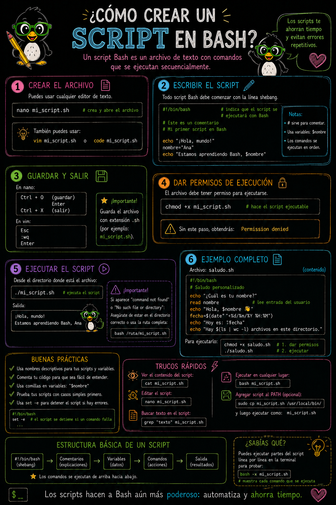
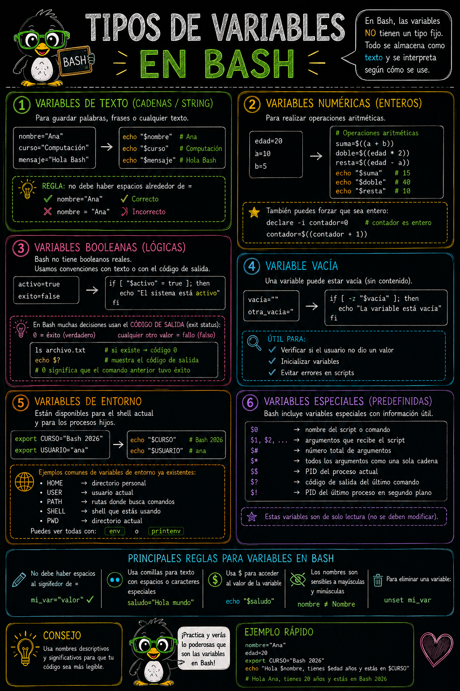

# Scripts en Bash

> **Fecha:** 29 de septiembre, 2026

## ¿Qué es un script de Bash?

Los `scripts` son archivos de texto que contienen instrucciones ejecutables por un intérprete de un lenguaje de programación para la ejecución de tareas. El formato `.sh` se utiliza para escribir `scripts ejecutables` por un intérprete como **Bash**.

En esta sección crearemos varios scripts de Bash y usaremos varios comandos y operadores.

::: {.callout-note icon="false"}
## Estructura básica de un script

Los script de Bash contiene al inicio esta descripción `#!bin/bash` y la extensión `.sh`

``` bash
#!/bin/bash
# Comentario: esto es un script básico

echo "Hola, mundo"
```
:::

### Componentes clave

**Shebang (`#!/bin/bash`)**

- Primera línea del script
- Indica al sistema que use Bash para ejecutar el archivo
- Debe estar en la primera línea, sin espacios antes

**Comentarios (`#`)**

- Líneas que comienzan con `#` son ignoradas
- Útiles para documentar el código

**Comandos**

- Instrucciones que se ejecutan línea por línea

### Crear y ejecutar un script

```         
# 1. Crear el archivo
nano mi_script.sh

# 2. Hacer el archivo ejecutable
chmod +x mi_script.sh

# 3. Ejecutar el script
./mi_script.sh

# O ejecutar sin permisos de ejecución
bash mi_script.sh
```

{fig-align="center"}

## Variables en Bash

### ¿Qué es una variable?

Un contenedor que almacena un valor (texto, números, etc.) que puede cambiar durante la ejecución del script.

### Declaración y asignación

``` bash
nombre="Juan"
edad=25
ciudad="Madrid"
```

**Reglas importantes:**

- ✅ Sin espacios alrededor del `=`
- ✅ Nombres en minúsculas (por convención)
- ✅ Pueden contener letras, números y guiones bajos
- ❌ No pueden comenzar con números

### Acceder a variables

``` bash
echo $nombre           # Imprime el valor
echo ${nombre}         # Forma alternativa (más segura)
echo "Hola, $nombre"   # Dentro de comillas dobles
```

### Tipos de variables

#### Variables de cadena (string)

``` bash
nombre="María"
mensaje="Bienvenido a Bash"
```

#### Variables numéricas

``` bash
edad=30
cantidad=100
```

#### Variables vacías

``` bash
variable=""
```

### Comillas simples vs. dobles

``` bash
nombre="Juan"
echo "Hola, $nombre"      # Hola, Juan (interpreta variables)
echo 'Hola, $nombre'      # Hola, $nombre (literal)
```

### Variables especiales

``` bash
$0      # Nombre del script
$1, $2  # Argumentos pasados al script
$#      # Número de argumentos
$?      # Código de salida del último comando
$$      # ID del proceso actual
```

{fig-align="center"}

## **Nivel 1: Scripts básicos**

### Primer script

Archivo: `saludo.sh`

``` bash
#!/bin/bash

echo "¡Bienvenido a Bash!"
echo "Este es mi primer script"
```

Ejecución:

``` bash
chmod +x saludo.sh
./saludo.sh
```

Esperando una salida como esta:

```         
¡Bienvenido a Bash!
Este es mi primer script
```

### Script con variables simples

Archivo: `presentacion.sh`

``` bash
#!/bin/bash

nombre="Carlos"
edad=28
ciudad="Barcelona"

echo "Mi nombre es $nombre"
echo "Tengo $edad años"
echo "Vivo en $ciudad"
```

Ejecución:

``` bash
chmod +x presentacion.sh
./presentacion.sh
```

Esperando una salida como esta:

```         
Mi nombre es Carlos
Tengo 28 años
Vivo en Barcelona
```

### Concatenación de variables

Archivo: `concatenar.sh`

``` bash
#!/bin/bash

nombre="Evelia"
apellido="Coss"
edad=32

echo "Nombre completo: $nombre $apellido"
echo "Información: $nombre tiene $edad años"
```

Ejecución:

``` bash
chmod +x concatenar.sh
./concatenar.sh
```

Esperando una salida como esta:

```         
Nombre completo: Evelia Coss
Información: Evelia tiene 32 años
```

## **Nivel 2: Entrada de datos**

### Leer entrada del usuario

Archivo: `leer_entrada.sh`

``` bash
#!/bin/bash

echo "¿Cuál es tu nombre?"
read nombre

echo "¿Cuál es tu edad?"
read edad

echo "Hola $nombre, tienes $edad años"
```

Ejecución:

``` bash
chmod +x leer_entrada.sh
./leer_entrada.sh
```

Esperando una salida como esta:

```         
¿Cuál es tu nombre? # Te va a preguntar 
Evelia
¿Cuál es tu edad?  # Te va a preguntar 
32
Hola Evelia, tienes 32 años
```

### Múltiples variables con `read`

Archivo: `datos_personales.sh`

``` bash
#!/bin/bash

echo "Ingresa tu nombre, edad y ciudad (separados por espacio):"
read nombre edad ciudad

echo "Datos ingresados:"
echo "Nombre: $nombre"
echo "Edad: $edad"
echo "Ciudad: $ciudad"
```

Ejecución:

``` bash
chmod +x datos_personales.sh
./datos_personales.sh
```

Esperando una salida como esta:

```         
Ingresa tu nombre, edad y ciudad (separados por espacio):
Evelia 32 Queretaro
Datos ingresados:
Nombre: Evelia
Edad: 32
Ciudad: Queretaro
```

### Leer con mensaje personalizado

Archivo: `leer_con_prompt.sh`

``` bash
#!/bin/bash

read -p "¿Cuál es tu nombre? " nombre
read -p "¿Cuál es tu email? " email

echo "Nombre: $nombre"
echo "Email: $email"
```

Ejecución:

``` bash
chmod +x leer_con_prompt.sh
./leer_con_prompt.sh
```

Esperando una salida como esta:

```         
¿Cuál es tu nombre? Evelia
¿Cuál es tu email? ecossnav@gmail.com
Nombre: Evelia
Email: ecossnav@gmail.com
```

## **Nivel 3: Argumentos del script**

### Usar argumentos

Archivo: `argumentos.sh`

``` bash
#!/bin/bash

echo "Primer argumento: $1"
echo "Segundo argumento: $2"
echo "Tercer argumento: $3"
echo "Total de argumentos: $#"
```

Ejecución:

``` bash
chmod +x argumentos.sh
./argumentos.sh Juan 25 Madrid
```

Esperando una salida como esta:

```         
Primer argumento: Juan
Segundo argumento: 25
Tercer argumento: Madrid
Total de argumentos: 3
```

### Script con argumentos obligatorios

::: {.callout-important icon="false"}
**Dobles paréntesis `(( ))`** indican que lo que está dentro es una expresión aritmética.
:::

Archivo: `sumar_argumentos.sh`

``` bash
#!/bin/bash

num1=$1
num2=$2

suma=$((num1 + num2))

echo "$num1 + $num2 = $suma"
```

Ejecución:

``` bash
chmod +x sumar_argumentos.sh
./sumar_argumentos.sh 10 20
```

Esperando una salida como esta:

```         
10 + 20 = 30
```

## Nivel 4: Operaciones con variables

### Operaciones aritméticas

Archivo: `operaciones.sh`

``` bash
#!/bin/bash

a=10
b=5

suma=$((a + b))
resta=$((a - b))
multiplicacion=$((a * b))
division=$((a / b))

echo "Suma: $suma"
echo "Resta: $resta"
echo "Multiplicación: $multiplicacion"
echo "División: $division"
```

Ejecución:

``` bash
chmod +x operaciones.sh
./operaciones.sh
```

Esperando una salida como esta:

```         
Suma: 15
Resta: 5
Multiplicación: 50
División: 2
```

### Incremento y decremento

Archivo: `incremento.sh`

``` bash
#!/bin/bash

contador=0

echo "Contador inicial: $contador"

contador=$((contador + 1))
echo "Después de incrementar: $contador"

contador=$((contador - 1))
echo "Después de decrementar: $contador"
```

Ejecución:

``` bash
chmod +x incremento.sh
./incremento.sh
```

Esperando una salida como esta:

```         
Después de incrementar: 1
Después de decrementar: 0
```

### Longitud de una cadena

Archivo: `longitud.sh`

``` bash
#!/bin/bash

texto="Hola Bash"
longitud=${#texto} # obtener la cantidad de caracteres que tiene una variable

echo "Texto: $texto"
echo "Longitud: $longitud caracteres"
```

Ejecución:

``` bash
chmod +x longitud.sh
./longitud.sh
```

Esperando una salida como esta:

```         
Texto: Hola Bash
Longitud: 9 caracteres
```

## Nivel 5. Variables de entorno

### Usar variables de entorno

Archivo: `variables_entorno.sh`

``` bash
#!/bin/bash

echo "Usuario actual: $USER"
echo "Directorio home: $HOME"
echo "Directorio actual: $PWD"
echo "Sistema operativo: $OSTYPE"
```

Ejecución:

``` bash
chmod +x variables_entorno.sh
./variables_entorno.sh
```

Esperando una salida como esta:

```         
Usuario actual: ecoss
Directorio home: /Users/ecoss
Directorio actual: /Users/ecoss/Documents/Mt_TallerComputo_ClaseBash
Sistema operativo: darwin25
```

### Crear y usar variables de entorno

Archivo: `crear_entorno.sh`

``` bash
#!/bin/bash

export MI_VARIABLE="Valor importante"

echo "Mi variable: $MI_VARIABLE"
```

Ejecución:

``` bash
chmod +x crear_entorno.sh
./crear_entorno.sh
```

Esperando una salida como esta:

```         
Mi variable: Valor importante
```

## Material suplementario

- RSG Ecuador. [Scripts en Bash](https://rsg-ecuador.github.io/unix.bioinfo.rsgecuador/content/Curso_avanzado/02_Bash/1_bash.html)
- RSG Ecuador. [Wildcards y Streams](https://rsg-ecuador.github.io/unix.bioinfo.rsgecuador/content/Curso_basico/03_Manejo_terminal/5_wildcards.html)
- RSG Ecuador. [Expresiones regulares (*regex*)](https://rsg-ecuador.github.io/unix.bioinfo.rsgecuador/content/Curso_basico/04_Procesamiento_ficheros_regex_pipes/3_Expresiones_regulares.html)
- [Wildcard Selection in Bash](https://pressbooks.senecapolytechnic.ca/uli101/chapter/wildcard-selection-in-bash/)
