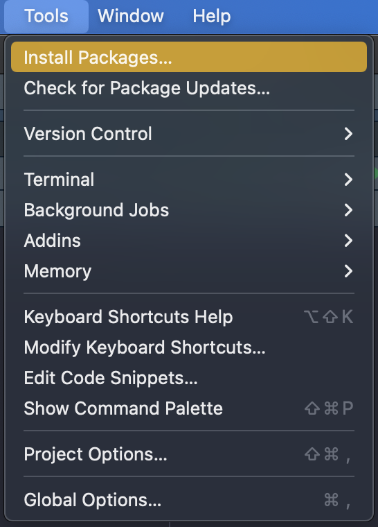
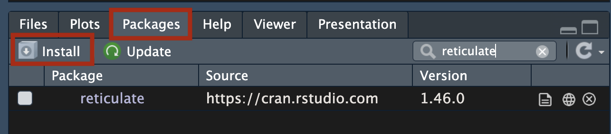
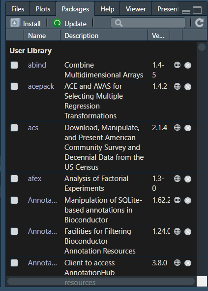
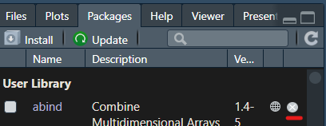
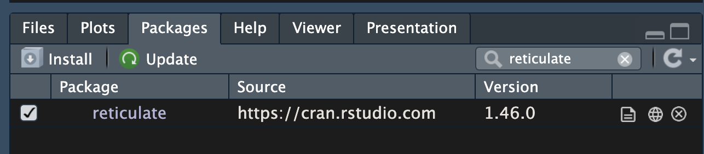

# Descargar y cargar Librerías en Rstudio

> **Fecha:** 06 de octubre, 2026

### ¿Qué es una librería?

En programación, una librería es una colección de código pre-escrito. Una librería contiene una "paquete" o "librería" de funciones que podemos utilizar si descargamos e importamos esa librería a nuestro programa.

Como mencioné anteriormente, al descargar R, también descargamos una serie de librerías, llamadas **base R packages**. Sin embargo, dependiendo del problema que queramos resolver con nuestro programa, necesitaremos librerías que nos permitan hacer otras cosas.

Existen distintas formas de instalar librerías.

### Instalar librerías: CRAN

1.  Instalación desde el repositorio de CRAN: podemos descargar paqueterías de CRAN de dos formas:

La primera, desde consola con el siguiente comando:

```{r, eval=FALSE}
install.packages("reticulate")
```

La segunda, desde el menú **Herramientas \> Instalar paqueterías**. En la ventana, ingresamos el nombre de la librería y click en **Instalar**.

{fig-align="center" width="273"}

La tercera opción es usar el botón "**Install**" dentro de la pestaña de Packages.



### ¿Cómo podemos verificar que paquetes tenemos?

En la ventana inferior derecha, existe una pestaña que se llama "**Packages**" que contendra la lista de paquetes instalados en tu computadora, su descripción corta y su versión.

Tambien en esta pestaña podemos instalar paquetes dandado click en **INSTALL**.

{fig-align="center"}

### Eliminación de paquetes

En algunas ocasiones vamos a tener que actualizar las versiones de los paquetes, pero primero dedes eliminar la versión anterior. Dando click en el botón que contiene una `X` que esta al final de la fila en cada programa.

{fig-align="center"}

También puedes usar codigo para eliminar el paquete:

```{r, eval=FALSE}
remove.packages("package-to-remove")
```

### Cargar paquetes en el ambiente de R

- **Opción A:** Emplear la función `library` para cargar en el ambiente el paquete.

```{r, eval=FALSE}
library(reticulate)
```

- **Opción B:** Dando click a la *casilla que indica el paquete*. Para dejar de usarlo da de nuevo click en esa casilla para que deje de estar marcada.

{fig-align="center"}
