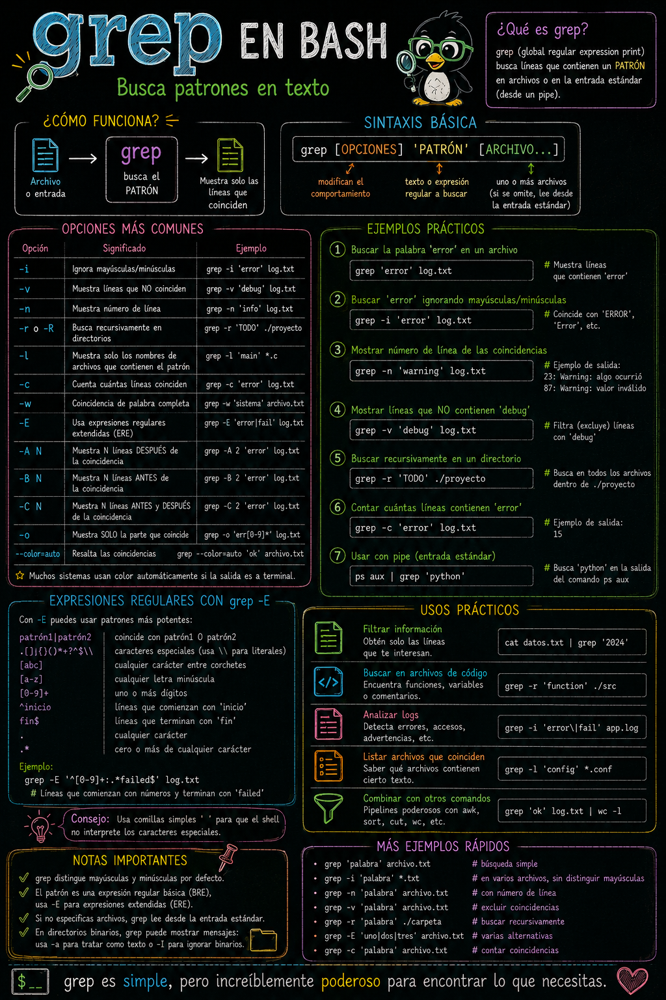
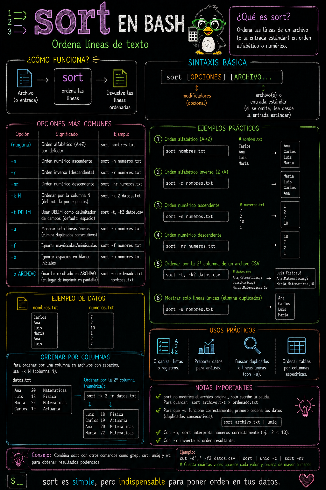
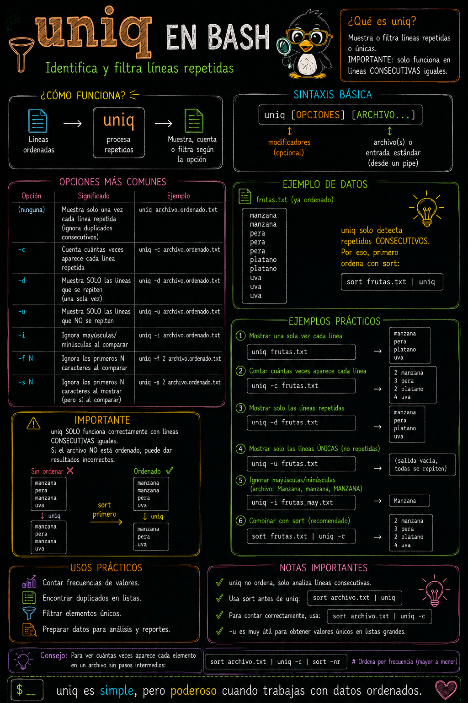
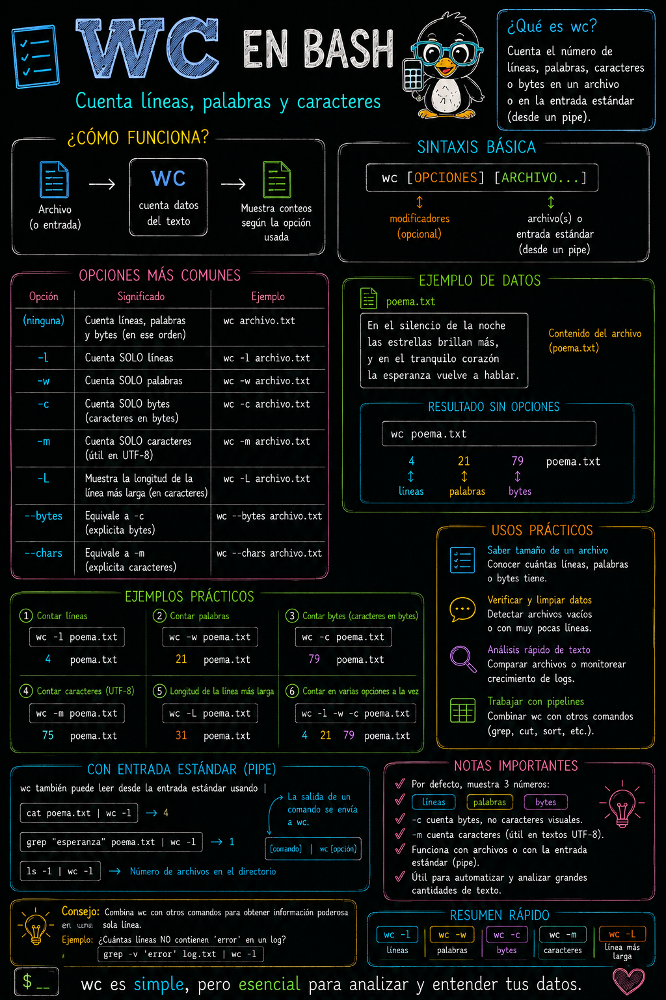
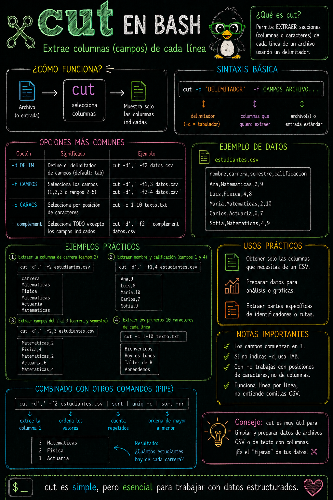

# Filtrado de texto (`grep, cut, sort, uniq, wc`)

> **Fecha:** 29 de septiembre, 2026

::: callout-warning
## En proceso de desarrollo
:::

Veamos ahora los comandos más usados en **pipelines o tuberías** de filtrado de texto en acción, haciendo uso de sólo algunas de las opciones más frecuentes listados en la sección anterior.

::: callout-important
La filosofía de un **pipeline o tubería** en Bash es que **la salida de un comando se convierte en la entrada del siguiente mediante `|` (pipe)**.
:::

Al final de esta clase podrás leer comandos como estos:

``` bash
grep "Aprobado" calificaciones.txt | cut -d',' -f2 | sort | uniq -c | sort -nr
```

No necesariamente memorizarlo de golpe, sino entender **qué aporta cada etapa**:

| Comando | ¿Para qué sirve?                     |
|---------|--------------------------------------|
| `grep`  | Buscar patrones en texto             |
| `cut`   | Extraer columnas o campos            |
| `sort`  | Ordenar líneas                       |
| `uniq`  | Eliminar/contar duplicados           |
| `wc`    | Contar líneas, palabras y caracteres |

Podemos crear 3 archivos:

1.  El archivo `nombres.txt`:

``` bash
echo -e "Sofía\nCarlos\nAna\nMiguel\nElena\nDiego\nBeatriz\nFernando\nLaura\nJorge" > ejercicios/BASH/nombres.txt
```

2.  El archivo `numeros.txt`:

``` bash
echo -e "42\n7\n100\n23\n5\n81\n16\n3\n55\n12" > ejercicios/BASH/numeros.txt
```

3.  El archivo `datos.txt`:

``` bash
echo -e "Ana 85\nLuis 72\nMaría 94\nCarlos 68\nSofía 91\nDiego 77\nElena 88\nPablo 63" > ejercicios/BASH/datos.txt
```

4.  El archivo `temas.txt`:

``` bash
echo -e "Álgebra\nCálculo\nÁlgebra\nGeometría\nCálculo\nÁlgebra\nEstadística" > ejercicios/BASH/temas.txt
```

5.  El archivo `alumnos.txt`:

``` bash
echo -e "Ana:85:Álgebra\nLuis:72:Cálculo\nMaría:94:Estadística\nCarlos:68:Geometría\nSofía:91:Cálculo" > ejercicios/BASH/alumnos.txt
```

## Repaso de `grep` - Buscar patrones en texto

**Sintaxis:**

```         
grep [opciones] "patrón" archivo
```

+-----------+------------------------------------------+---------------------------------+
| Argumento | Descripción                              | Ejemplo                         |
+===========+==========================================+=================================+
|           |                                          | ``` bash                        |
|           |                                          | grep ":[9][0-9]:" alumnos.txt   |
|           |                                          | ```                             |
+-----------+------------------------------------------+---------------------------------+
| `-i`      | Ignora mayúsculas y minúsculas           | ``` bash                        |
|           |                                          | grep -i "carlos" nombres.txt    |
|           |                                          | ```                             |
+-----------+------------------------------------------+---------------------------------+
| `-n`      | Muestra el número de línea               | ``` bash                        |
|           |                                          | grep -n "Miguel" nombres.txt    |
|           |                                          | ```                             |
+-----------+------------------------------------------+---------------------------------+
| `-c`      | Cuenta las líneas que coinciden          | ``` bash                        |
|           |                                          | grep -c "Cálculo"alumnos.txt    |
|           |                                          | ```                             |
+-----------+------------------------------------------+---------------------------------+
| `-v`      | Muestra líneas que **NO** coinciden      | ``` bash                        |
|           |                                          | grep -v "a" nombres.txt         |
|           |                                          | grep -v "Cálculo" alumnos.txt   |
|           |                                          | ```                             |
+-----------+------------------------------------------+---------------------------------+
| `-w`      | Coincidencia de palabra completa         | ``` bash                        |
|           |                                          | grep -w "Cálculo" alumnos.txt   |
|           |                                          | ```                             |
+-----------+------------------------------------------+---------------------------------+
| `-A n`    | Muestra `n` líneas **después** del match | ``` bash                        |
|           |                                          | grep -A 2 "Álgebra" alumnos.txt |
|           |                                          | ```                             |
+-----------+------------------------------------------+---------------------------------+

Durante la clase de ["Encontrar patrones con grep"](https://eveliacoss.github.io/Mt2026_Taller_Computo_libro/cap7.html) repasamos la siguiente infografía y realizamos algunos ejercicios.

[{fig-align="center"}](https://eveliacoss.github.io/Mt2026_Taller_Computo_libro/cap7.html)

## `sort` - Ordenar líneas de texto

**Sintaxis:**

```         
sort [opciones] archivo.txt
```

+-----------+-------------------------------------+-----------------------------+
| Argumento | Descripción                         | Ejemplo                     |
+===========+=====================================+=============================+
|           | Orden alfabético                    | ``` bash                    |
|           |                                     | sort nombres.txt            |
|           |                                     | sort temas.txt              |
|           |                                     | ```                         |
+-----------+-------------------------------------+-----------------------------+
| `-n`      | Ordena numéricamente                | ``` bash                    |
|           |                                     | sort -n numeros.txt         |
|           |                                     | ```                         |
+-----------+-------------------------------------+-----------------------------+
| `-r`      | Orden inverso (descendente)         | ``` bash                    |
|           |                                     | sort -r numeros.txt         |
|           |                                     | ```                         |
+-----------+-------------------------------------+-----------------------------+
| `-k`      | Ordena por columna específica       | ``` bash                    |
|           |                                     | sort -k2 datos.txt          |
|           |                                     | sort -k2nr datos.txt        |
|           |                                     | ```                         |
+-----------+-------------------------------------+-----------------------------+
| `-u`      | Elimina duplicados mientras ordena  | ``` bash                    |
|           |                                     | sort -u temas.txt           |
|           |                                     | ```                         |
+-----------+-------------------------------------+-----------------------------+
| `-t`      | Define separador de campos/columnas | ``` bash                    |
|           |                                     | sort -t":" -k2n alumnos.txt |
|           |                                     | sort -t":" -k3 alumnos.txt  |
|           |                                     | ```                         |
+-----------+-------------------------------------+-----------------------------+

{fig-align="center"}

## `uniq` - Identifica y filtra líneas repetidas

**Sintaxis:**

```         
uniq [opciones] archivo.txt
```

+-----------+----------------------------------+----------------------------+
| Argumento | Descripción                      | Ejemplo                    |
+===========+==================================+============================+
|           | Ordena y elimina duplicado       | ``` bash                   |
|           |                                  | sort temas.txt | uniq      |
|           |                                  | ```                        |
+-----------+----------------------------------+----------------------------+
| `-c`      | Cuenta ocurrencias de cada línea | ``` bash                   |
|           |                                  | sort datos.txt | uniq -c   |
|           |                                  | ```                        |
+-----------+----------------------------------+----------------------------+
| `-d`      | Muestra solo líneas duplicadas   | ``` bash                   |
|           |                                  | sort datos.txt | uniq -d   |
|           |                                  | ```                        |
+-----------+----------------------------------+----------------------------+
| `-u`      | Muestra solo líneas únicas       | ``` bash                   |
|           |                                  | sort datos.txt | uniq -u   |
|           |                                  | ```                        |
+-----------+----------------------------------+----------------------------+

{fig-align="center"}

## `wc` - Cuenta líneas, palabras y caracteres

**Sintaxis:**

```         
wc [opciones] archivo.txt
```

+-----------+---------------------------------+-------------------+
| Argumento | Descripción                     | Ejemplo           |
+===========+=================================+===================+
|           | Muestra líneas, palabras, bytes | ``` bash          |
|           |                                 | wc archivo.txt    |
|           |                                 | ```               |
+-----------+---------------------------------+-------------------+
| `-l`      | Cuenta líneas                   | ``` bash          |
|           |                                 | wc -l archivo.txt |
|           |                                 | wc -l *.txt       |
|           |                                 | ```               |
+-----------+---------------------------------+-------------------+
| `-w`      | Cuenta palabras                 | ``` bash          |
|           |                                 | wc -w archivo.txt |
|           |                                 | ```               |
+-----------+---------------------------------+-------------------+
| `-c`      | Cuenta bytes                    | ``` bash          |
|           |                                 | wc -c archivo.txt |
|           |                                 | ```               |
+-----------+---------------------------------+-------------------+
| `-w`      | Cuenta caracteres               | ``` bash          |
|           |                                 | wc -w archivo.txt |
|           |                                 | ```               |
+-----------+---------------------------------+-------------------+

{fig-align="center"}

## `cut` - Buscar patrones en texto

Aquí vamos a partir de **¿Qué hago si no quiero toda la línea, sino solamente una columna de un archivo?**

**Sintaxis:**

```         
cut [opciones] archivo.txt
```

+-----------+--------------------------------------------------+----------------------------+
| Argumento | Descripción                                      | Ejemplo                    |
+===========+==================================================+============================+
| `-c`      | Extrae caracteres por posición (ej: `-c1-5`)     | ``` bash                   |
|           |                                                  | cut -c1-2 archivo.txt      |
|           |                                                  | ```                        |
+-----------+--------------------------------------------------+----------------------------+
| `-f`      | Extrae campos específicos (ej: `-f1,3`)          | ``` bash                   |
|           |                                                  | cut -f1,3 -d: alumnos.txt  |
|           |                                                  | ```                        |
+-----------+--------------------------------------------------+----------------------------+
| `-d`      | Define separador de campos (default: tabulación) | ``` bash                   |
|           |                                                  | cut -f2 -d" " datos.txt    |
|           |                                                  | ```                        |
+-----------+--------------------------------------------------+----------------------------+

{fig-align="center"}

## Ejercicio integrador: `grep`, `cut`, `sort`, `uniq` y `wc`

:::: callout-note
## Ejercicio 10

Instrucciones

1.  Crea el archivo `materias.txt` ejercutando el siguiente comando:

    ``` bash
    echo -e "Álgebra Lineal:8:1\nCálculo Diferencial:10:1\nGeometría Analítica:8:1\nProbabilidad:6:3\nEstadística:6:3\nEcuaciones Diferenciales:8:4\nÁlgebra Abstracta:8:5\nTopología:6:6\nAnálisis Real:8:6\nProbabilidad:6:3" > ejercicios/BASH/materias.txt
    ```

    **Columna 1:** materias, **Columna 2:** créditos, **Columna 3:** semestre.

2.  Mostrar todas las materias que contienen la palabra Álgebra.

3.  Mostrar todas las materias de sexto semestre.

4.  Contar cuántas materias tienen 8 créditos.

5.  Mostrar únicamente los nombres de las materias.

6.  Mostrar únicamente los créditos.

7.  Ordenar las materias alfabéticamente.

8.  Ordenar los créditos de menor a mayor.

9.  Mostrar los semestres sin repetir.

10. Contar cuántas materias hay por semestre.

11. ¿Cuántas materias hay por número de créditos?

12. ¿Cuál es el número de créditos más frecuente?

::: {.callout-tip collapse="true" icon="false"}
## Solucion

``` {.bash eval="FALSE"}
2. grep "Álgebra" ejercicios/BASH/materias.txt
3. grep ":6$" ejercicios/BASH/materias.txt
4. grep ":8:" ejercicios/BASH/materias.txt | wc -l
5. cut -d":" -f1 ejercicios/BASH/materias.txt
6. cut -d":" -f2 ejercicios/BASH/materias.txt
7. cut -d":" -f1 ejercicios/BASH/materias.txt | sort
8. cut -d":" -f2 ejercicios/BASH/materias.txt | sort -n
9. cut -d":" -f3 ejercicios/BASH/materias.txt | sort | uniq
10. cut -d":" -f3 ejercicios/BASH/materias.txt | sort | uniq -c
11. cut -d":" -f2 ejercicios/BASH/materias.txt | sort | uniq -c
12. cut -d":" -f2 ejercicios/BASH/materias.txt | sort | uniq -c | sort -nr | head -1
```
:::
::::

## Referencias

- [Ejemplos de herramientas de filtrado de texto: *pipelines* con **grep**, **cut**, **sort**, **uniq**, **wc** en acción](https://vinuesa.github.io/intro2linux/index.html#ejemplos-de-herramientas-de-filtrado-de-texto-pipelines-con-grep-cut-sort-uniq-wc-en-acci%C3%B3n)
