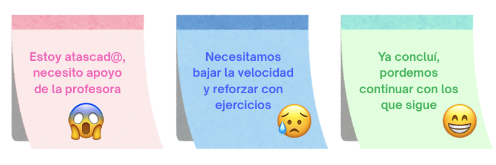

# Introducción e integración

> Fecha: martes 10 de agosto, 2026

::: content-box-gray
**Objetivos:**

1.  Presentar los lineamientos de la materia
2.  Dinámica de trabajo
3.  Introducir al curso.
4.  Romper el hielo
:::

### Descripción

El materia de **Taller de Cómputo** introduce a los estudiantes de primer semestre de la carrera de Matemáticas para el Desarrollo en la ENES Juriquilla–UNAM al uso de herramientas fundamentales de *programación, documentación, matemáticas y colaboración digital*.

- **Componentes de una computadora:** Se estudiarán los elementos básicos de hardware y software (CPU, memoria, almacenamiento, sistemas operativos) para comprender cómo funciona una computadora desde dentro.
- **Uso de la terminal:** Los alumnos aprenderán a interactuar con la computadora mediante comandos, gestionando archivos, directorios y procesos.
- **Programación en Bash:** Se enseñará a crear scripts sencillos para automatizar tareas, usar pipes y redirecciones, y desarrollar flujos de trabajo reproducibles.
- **Programación en Python:** Se abordarán los conceptos básicos de programación (variables, condicionales, bucles, funciones) y se aplicarán en proyectos prácticos como análisis de datos y generación de gráficas.
- **Documentación en Markdown:** elaboración de reportes técnicos claros y reproducibles.
- **Control de versiones con Git y GitHub:** trabajo colaborativo y organización de proyectos académicos.
- **Integración de herramientas:** combinación de *Bash, Python, Markdown y GitHub* en flujos de trabajo reproducibles.
- **Aplicaciones prácticas:** Los estudiantes podrán aplicar lo aprendido en investigación académica, proyectos personales y futuros trabajos profesionales, integrando programación y matemáticas con apoyo de agentes de AI.

## Dinámica de trabajo

### Notas adhesivas 📄

Entregamos a cada alumno **tres notas adhesivas** de distintos colores, por ejemplo, [**rosa/rojo**]{.text-pink}, [**verde**]{.text-green} y [**azul**]{.text-blueblack}. Se pueden sostener para votar, pero su uso real es como **banderas de estado**.

- [**Nota rosa/roja**]{.text-pink} 😱:
  - Acción explícita: Colócala en tu computadora cuando enfrentes un problema que no puedes resolver solo y necesites ayuda inmediata.
  - 👉 Significa: [*"Estoy atascado, necesito apoyo de la profesora"*]{.text-pink}.
- [**Nota azul**]{.text-blueblack} 😥:
  - Acción explícita: Úsala si la explicación va demasiado rápido, si no alcanzas a seguir el ritmo o si requieres más ejemplos prácticos.
  - 👉 Significa: [*"Necesitamos bajar la velocidad y reforzar con ejercicios"*]{.text-blueblack}, también puede relacionarse con [*"Aún no terminamos, necesitamos más tiempo"*]{.text-blueblack}.
- [**Nota verde**]{.text-green} 😁:
  - Acción explícita: Colócala cuando hayas terminado un ejercicio o quieras que la profesora revise tu trabajo.
  - 👉 Significa: [*"Ya concluí, podemos continuar con lo que sigue"*]{.text-green}.

{fig-align="center"}

Esto es mejor que hacer que la gente **levante la mano** porque:

- es más discreto (lo que significa que es más probable que realmente lo hagan),
- pueden seguir trabajando mientras su bandera está levantada, y
- el instructor puede ver rápidamente desde el frente de la sala en qué estado se encuentra la clase.

## Ronda de Presentaciones

::: {.callout-note icon="false"}
## Actividad: ¡Preséntate!

Para comenzar, haremos una breve ronda de presentaciones. Cada persona deberá compartir la siguiente información en voz alta, en **3 min**:

1.  **Nombre y apellido**

2.  **Preparatoria de procedencia**

3.  **Tu comida favorita 🍕🍜🍫**

👉 Ejemplo:\
"Hola, soy *Evelia Coss*, trabajo en uDocz (como programadora de agentes de AI) y soy profesora de la *ENES Juriquilla-UNAM* en el área de bioinformática, y mi comida favorita es el ceviche."

¡La idea es romper el hielo y conocernos un poco mejor! 😊
:::

## References

- [Plan de estudio de la materia](https://docs.google.com/document/d/17rDksWqGWQqDFUMFqzgVF_BXnBDP3KMUrysgxIPGv9U/edit?usp=sharing)
