# Introducción a R y Rstudio

## ¿Qué es R?

R es un entorno de desarrollo de software libre y lenguaje de programación.

::::: columns
::: {.column width="60%"}
**¿Por qué utilizar R?**

Es ampliamente utilizado para la *computación estadística, gráfica, y de machine learning*. Ofrece una amplia variedad de **funciones estadísticas** (modelos lineales y no lineales, pruebas estadísticas clásicas, análisis de series de tiempo, clasificación, agrupamiento, etc.), y para realizar gráficas.

Además, existen numerosas librerías que nos pemiten realizar análisis y más gráficas, incluyendo para análisis de datos genómicos.
:::

::: {.column width="40%"}
{fig-align="right" width="253"}
:::
:::::

## ¿Cómo instalamos R?

Para installar R, debemos de entrar a la página de [CRAN](https://cran.r-project.org/) "The Comprehensive R Archive Network". Al installar R, descargamos también \~ 25 paqueterías/librerías.

**CRAN** es una red en la que se archivan todas las versiones de R base, así como todos los paquetes para R que han pasado por un proceso de revisión riguroso, realizado por el CRAN Team.

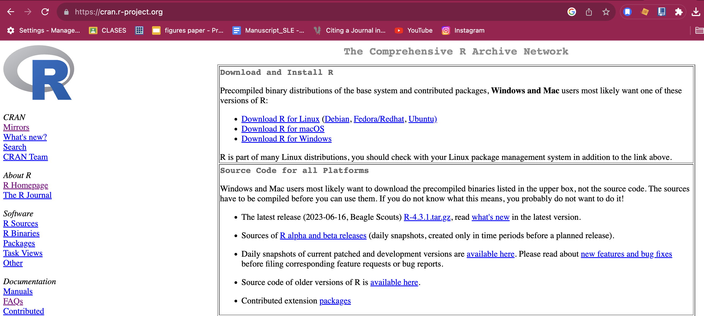

## ¿Qué es RStudio?

RStudio es un **entorno de desarrollo integrado (IDE)** para R. Un IDE es una aplicación que ayuda a los programadores a *desarrollar código de una manera eficiente*. Nos proporciona una interfaz para poder editar código fuente, herramientas de ambiente, visualización, terminal y consola.

**RStudio Desktop** es una aplicación que se utiliza ampliamente para desarrollar programas en R, pero también podemos accesar al IDE de RStudio a través con [RStudio Server](https://posit.co/download/rstudio-server/), a través de un navegador web.


## ¿Cómo descargamos RStudio?

Podemos descargar RStudio desde [esta página](https://posit.co/download/rstudio-desktop/). Ya realizamos el paso 1: Install R.

En el paso 2: Install R studio, nos debería detectar el sistema operativo, descarguemos la versión recomendada en el botón **azul** y sigamos las instrucciones de instalación.

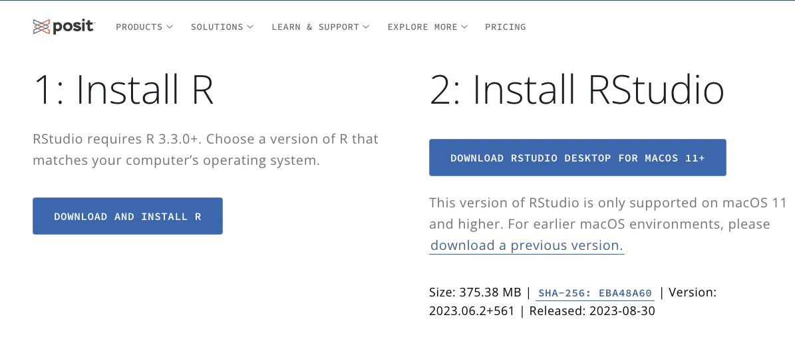

## Las partes de RStudio

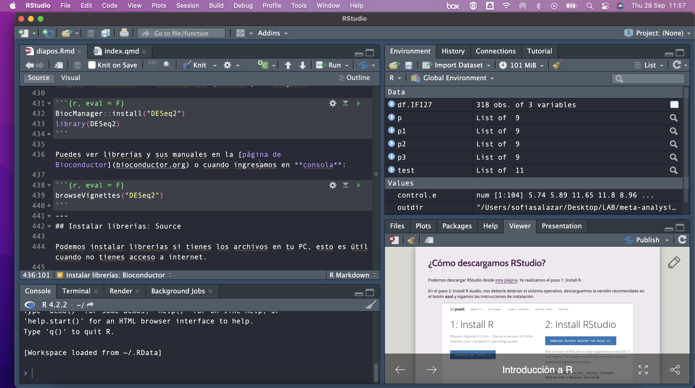

## Cambiando el aspecto de RStudio

Podemos cambiar la forma en que se ve la aplicación desde **Editar \> Preferencias \> Apariencia**, escogemos el tema que nos guste y damos click en **Aplicar** y luego **OK**

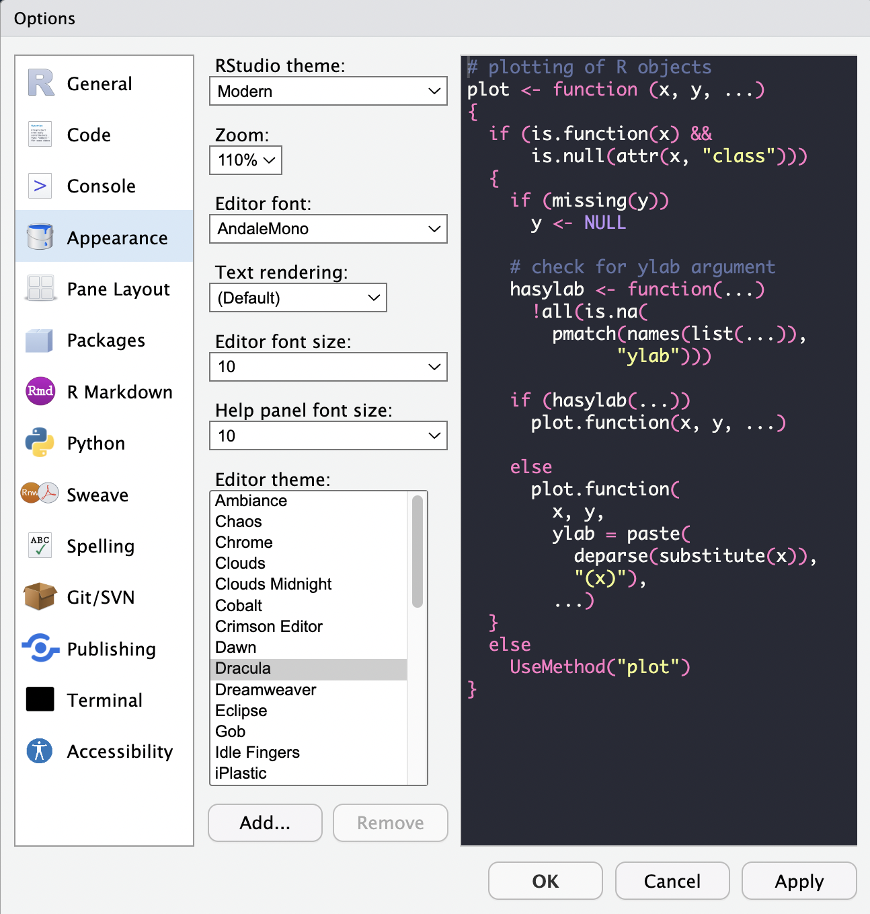

{fig-align="center"}

## Crear un R Project

Al comenzar a trabajar con R y RStudio, ya sea para crear un programa para un proyecto, crear una aplicación, presentación, blog, paquete, etc, es recomendado crear un **R project**.

### **¿Qué es un R Project y por qué usarlo?**

- **Carpeta de trabajo dedicada**: al crear un R Project, RStudio genera automáticamente una carpeta que contiene todos los archivos y configuraciones necesarias para tu proyecto.

- **Organización**: te permite mantener en un solo lugar tus scripts, datos, variables y documentos relacionados.

- **Reproducibilidad**: facilita que cualquier persona (incluido tú en el futuro) pueda abrir el proyecto y trabajar con el mismo entorno.

- **Integración con Git/GitHub**: al tener el mismo nombre que tu repositorio, se asegura una sincronización más clara y ordenada entre tu proyecto local y el repositorio remoto.

### **¿Cómo iniciamos un R project?**

1.  Vayamos en la parte superior al menú **Archivos \> Nuevo Proyecto**.

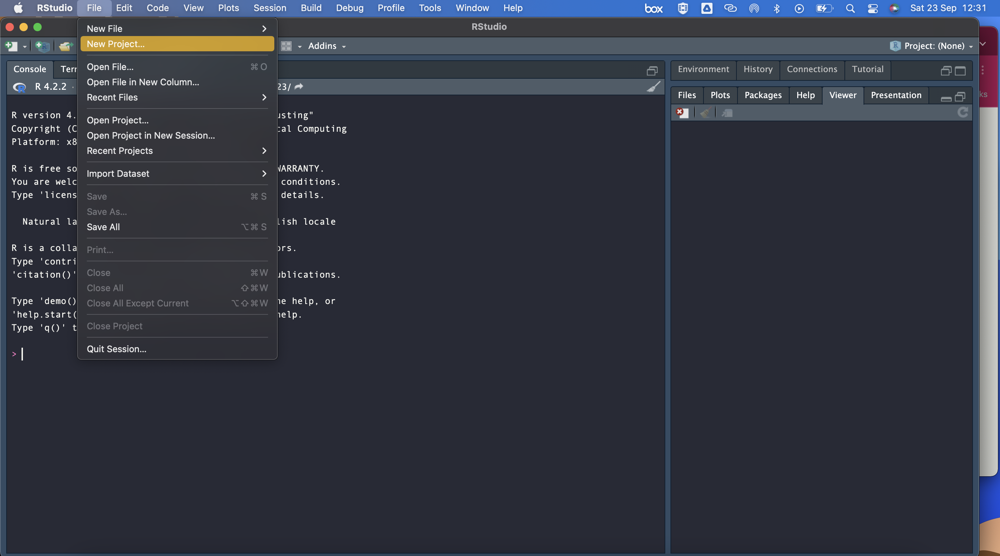

2.  Seleccionamos la opción de **Nuevo directorio**.

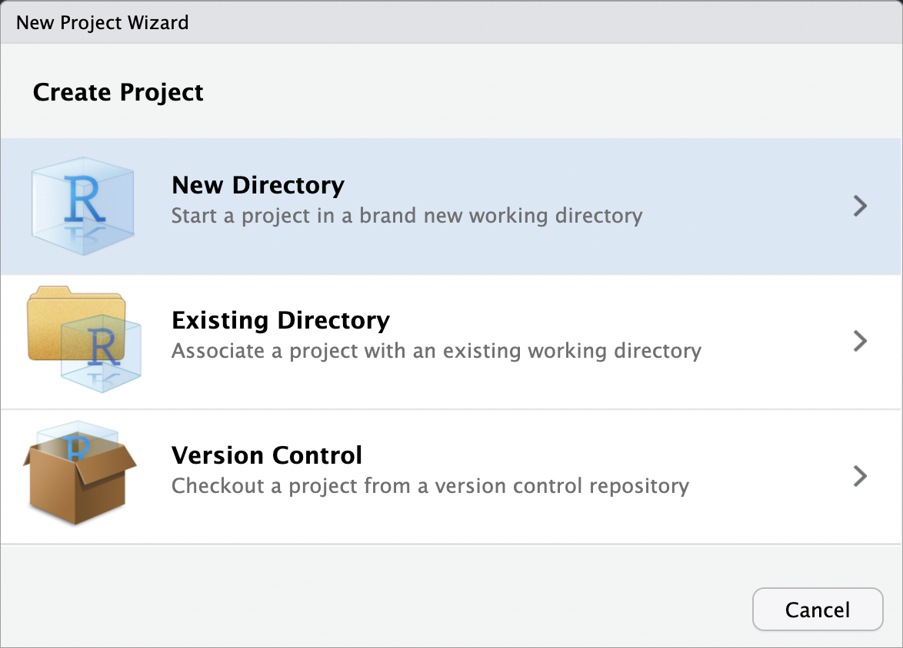

3.  Seleccionamos el tipo de projecto que vamos a iniciar, en nuestro caso **Nuevo proyecto**.

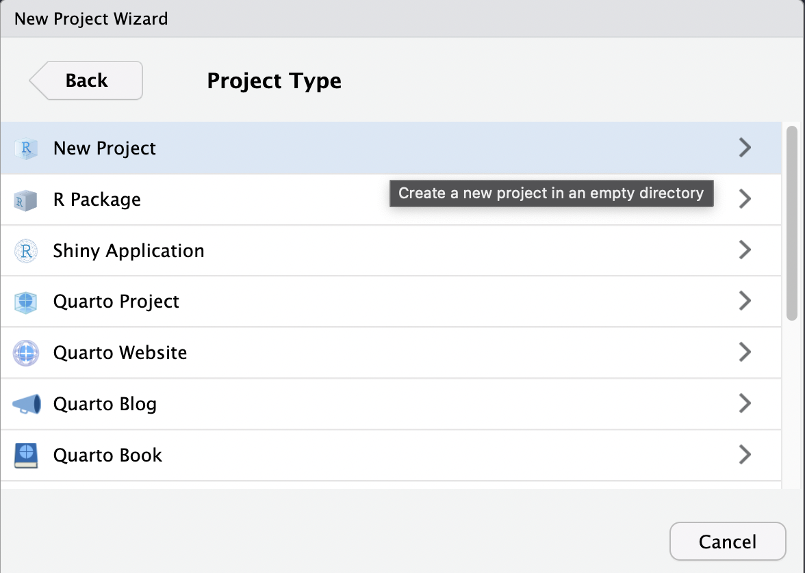

4.  Nombramos el folder que crearemos y seleccionamos en dónde queremos que se almacene.

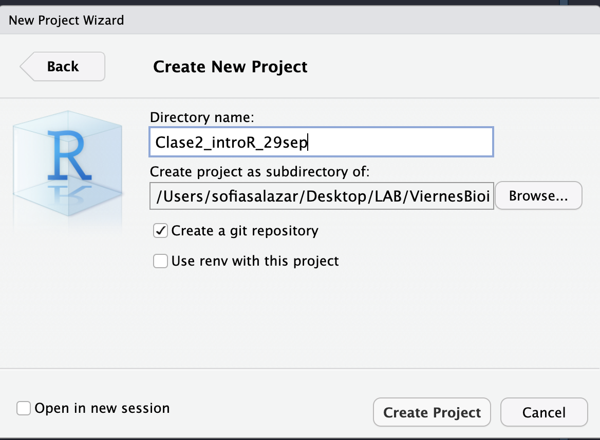

**¡Felicidades, acabas de crear un R project!** Si vamos al folder en donde creamos nuestro proyecto, podemos observar que se creó un archivo con terminación **Rproj**, este es un archivo que contiene la configuración específica para nuestro proyecto.

{fig-align="center" width="477"}

Imagen tomada de: [Allison Horst](https://allisonhorst.com/git-github)

### Directorio de trabajo

Este archivo (**Rproj**) también establece como **directorio de trabajo** el folder en donde iniciamos el proyecto (puedes comprobarlo desde la consola de RStudio, escribiendo el comando `getwd()`). Esto es muy conveniente puesto que así podemos asegurarnos de que vamos a acceder a los archivos que estén exclusivamente en nuestro entorno de trabajo.

Coloca en la consola dentro de Rstudio:

```{r}
getwd()
```

## Crear un Rscript

Para comenzar a trabajar en un proyecto, necesitamos crear un archivo para escribir nuestro programa. Entra en **Archivo \> Nuevo Archivo**.

Podemos ver que tenemos distintas opciones de archivos que podemos crear, en este caso vamos a crear nuestro primer **Rscript**.

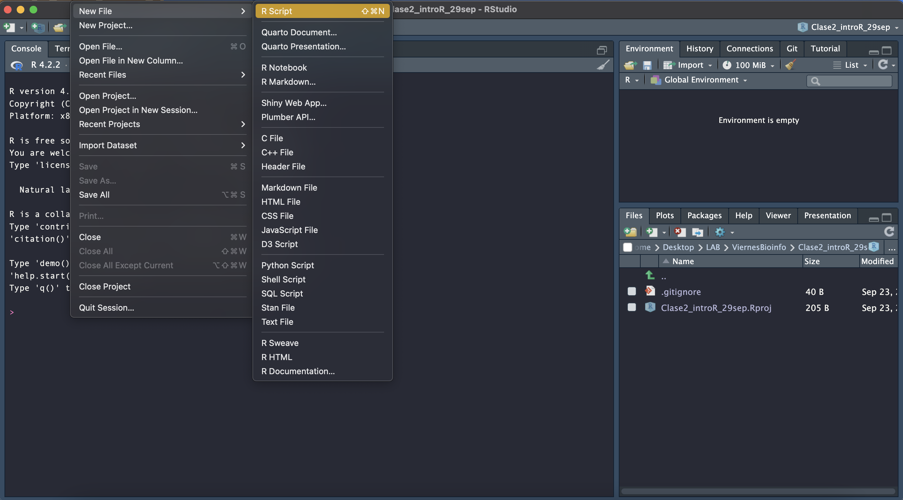

### **¿Qué es un Rscript?**

Es simplemente un archivo de texto con las instrucciones de nuestro algoritmo escritas en el lenguaje de R. También contiene nuestros comentarios escritos con `#`.

Intenta escribir tu primer Rscript en el **editor**, copiando el siguiente algoritmo para realizar una suma:

```{r}
a <- 2
b <- 3
suma = a + b
suma
```

### **¿Cómo ejecutamos el código?**

Selecciona todo el código, después ve a la parte superior de la ventana del **editor** y da click en el botón **Run**. También pueden ejecutar tu código línea por línea, poniendo tu cursor al principio o al final de la linea y presionando las teclas **Control + Enter** o **Command + Enter**.

## Descargar y cargar Librerías

### ¿Qué es una librería?

En programación, una librería es una colección de código pre-escrito. Una librería contiene una "paquete" o "librería" de funciones que podemos utilizar si descargamos e importamos esa librería a nuestro programa.

Como mencioné anteriormente, al descargar R, también descargamos una serie de librerías, llamadas **base R packages**. Sin embargo, dependiendo del problema que queramos resolver con nuestro programa, necesitaremos librerías que nos permitan hacer otras cosas.

Existen distintas formas de instalar librerías.

### Instalar librerías: CRAN

1.  Instalación desde el repositorio de CRAN: podemos descargar paqueterías de CRAN de dos formas:

La primera, desde consola con el siguiente comando:

```{r, eval=FALSE}
install.packages("tidyverse")
```

La segunda, desde el menú **Herramientas \> Instalar paqueterías**. En la ventana, ingresamos el nombre de la librería y click en **Instalar**.

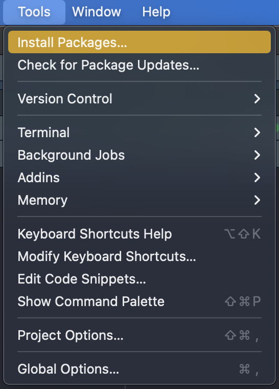{fig-align="center" width="273"}

La tercera opción es usar el botón "install" dentro de la pestaña de Packages.

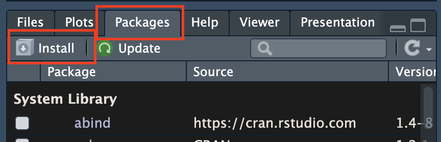

### Instalar librerías: Bioconductor

Alternativamente, podemos instalar paqueterías de Bioconductor, que es otro repositorio de paquetes diseñados para el análisis de datos genómicos, por ejemplo para hacer análisis estadísticos, anotación, acceso a bases de datos públicas, etc.

Hay muchas librerías que están tanto en CRAN como en Bioconductor, pero también hay librerías específicas para uno de ellos. Para poder instalar desde bioconductor, necesitamos primero instalar el "instalador de bioconductor":

```{r, eval=FALSE}
install.packages("BiocManager") # Esto es necesario solo 1 vez
```

### ¿Cómo podemos verificar que paquetes tenemos?

En la ventana inferior derecha, existe una pestaña que se llama "Packages" que contendra la lista de paquetes instalados en tu computadora, su descripción corta y su versión.

Tambien en esta pestaña podemos instalar paquetes dandado click en INSTALL.

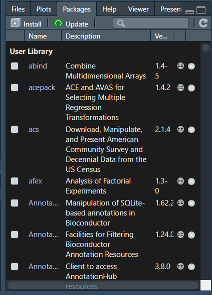{fig-align="center"}

### Eliminación de paquetes

En algunas ocasiones vamos a tener que actualizar las versiones de los paquetes, pero primero dedes eliminar la versión anterior. Dando click en el botón que contiene una `X` que esta al final de la fila en cada programa.

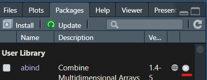{fig-align="center"}

También puedes usar codigo para eliminar el paquete:

```{r, eval=FALSE}
remove.packages("package-to-remove")
```

### Cargar paquetes en el ambiente de R

- **Opción A:** Emplear la función `library` para cargar en el ambiente el paquete.

```{r, eval=FALSE}
library(ggplot2)
```

- **Opción B:** Dando click a la *casilla que indica el paquete*. Para dejar de usarlo da de nuevo click en esa casilla para que deje de estar marcada.

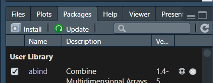{fig-align="center"}

::: callout-note
## Actividad

Copia y pega el siguiente código en tu consola dentro de Rstudio:

```{r, eval=FALSE}
install.packages("palmerpenguins")
install.packages("ggplot2")
install.packages("dplyr")
install.packages("DT")
```
:::

Debes poder ver algo como esto:

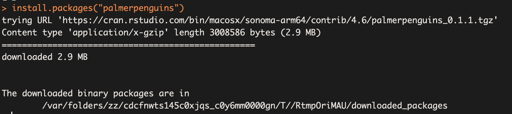

## Evitar conflictos para la instalación de paquetes en R

### Si usamos Windows debemos instalar Rtools

En **Windows** utilizamos **Rtools** para evitar problemas al instalar paquetes desde código fuente en RStudio. Selecciona la versión que se adapta a tu versión de R.

[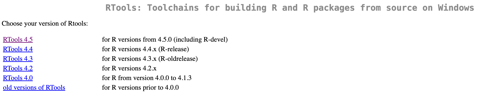{fig-align="center"}](https://cran.r-project.org/bin/windows/Rtools/)

Yo seleccioné la versión Rtools 4.5 y me aparece la siguiente página web, después di clic en donde aparece el instalador, descargue el archivo y lo ejecute.

[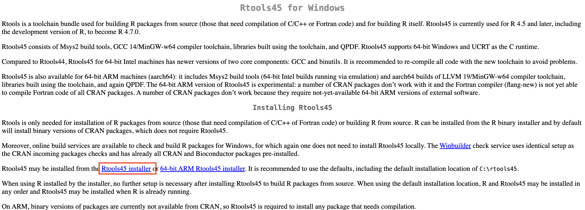](https://cran.r-project.org/bin/windows/Rtools/rtools45/rtools.html)

### Si usamos Mac/iOs debemos instalar Xcode

En **macOS**, no existe un equivalente directo a Rtools. En su lugar, se emplean las [**Xcode Command Line Tools**](https://mac.r-project.org/tools/) (que incluyen `clang` y `make`) junto con **GNU Fortran** para compilar paquetes que requieren código en C/C++ o Fortran.

[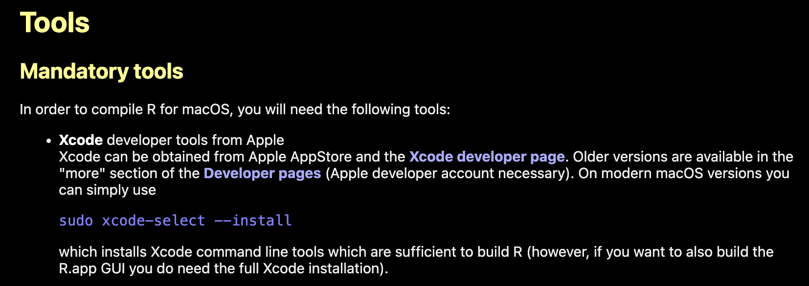](https://mac.r-project.org/tools/)

Esto significa que, si trabajan en Mac, deben asegurarse de tener instaladas estas herramientas para evitar errores al instalar ciertos paquetes de R. Abre una terminal de Bash y coloca este código:

```{bash, eval=F}
sudo xcode-select --install
```
