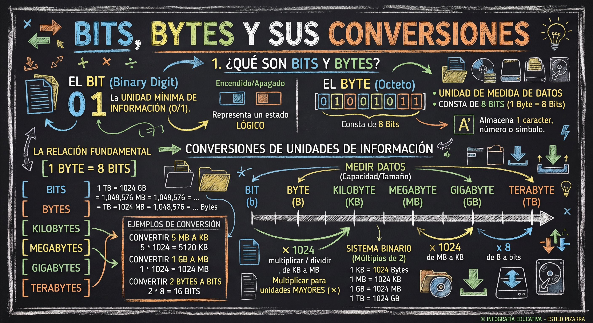
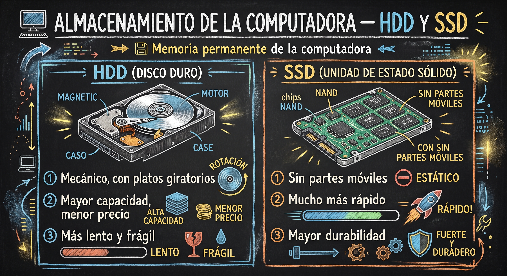
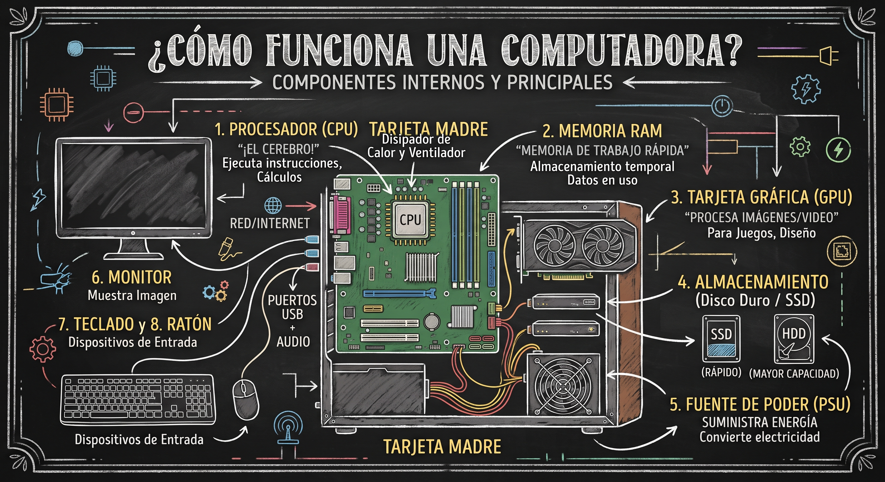

# Introducción a los Componentes de una Computadora

::: content-box-gray
**Objetivos:**

1.  Identificar los componentes internos principales y complementarios
2.  Diferenciar entre Hardware y Software
:::

## **BLOQUE 1 —** Componentes Internos Principales

#### CPU — Procesador

- 🧠 El "cerebro" de la computadora
- Ejecuta instrucciones: **fetch → decode → execute**
- Características clave:
  - Núcleos (cores): más núcleos = más tareas simultáneas
  - Velocidad en **GigaHertz** (GHz)
  - Caché L1, L2, L3
- Marcas: **Intel** (Core i3/i5/i7/i9) y **AMD** (Ryzen)
- Analogía: *"Es como el chef de un restaurante: recibe pedidos, los procesa y entrega resultados"* 👨🍳

::: callout-note
## ¿Qué es GHz?

Es la unidad que mide la **velocidad del reloj** de un procesador, es decir, **cuántas veces por segundo puede ejecutar un ciclo de instrucciones.**

```         
1 Hz   = 1 ciclo por segundo 
1 KHz  = 1,000 ciclos por segundo
1 MHz  = 1,000,000 ciclos por segundo
1 GHz  = 1,000,000,000 ciclos por segundo
                  ⬆️
         ¡MIL MILLONES de ciclos por segundo!
```

Un ciclo es el **latido del procesador**, marcado por un reloj interno llamado **Clock**
:::

#### RAM — Memoria de Acceso Aleatorio

- 📋 Memoria de trabajo **temporal**
- Almacena lo que está en uso en este momento
- Se borra al apagar la computadora
- Medida en gigabyte (**GB)** (8GB, 16GB, 32GB...)
- Tipos: DDR4, DDR5
- Analogía: *"Es el escritorio donde tienes todo lo que estás usando ahora"* 🗂️

{fig-align="center" width="658"}

#### Almacenamiento — HDD y SSD

- 💾 Memoria **permanente** de la computadora

- **HDD** (Disco Duro):

  - Mecánico, con platos giratorios
  - Mayor capacidad, menor precio
  - Más lento y frágil

- **SSD** (Unidad de Estado Sólido):

  - Sin partes móviles
  - Mucho más rápido
  - Mayor durabilidad

- Analogía: *"Es el cajón donde guardas todo aunque apagues la luz"* 🗄️

{fig-align="center" width="494"}

#### Tarjeta Madre — Motherboard

- 🔌 El "esqueleto" que conecta todo
- Contiene los **buses de datos** que comunican componentes
- Incluye: slots para RAM, CPU, GPU, almacenamiento
- Tiene el **BIOS/UEFI**: primer software que corre al encender
- Fabricantes: ASUS, MSI, Gigabyte

#### GPU — Tarjeta Gráfica

- 🎮 Procesa imágenes, video y gráficos 3D
- Tiene su propio procesador (miles de núcleos pequeños)
- Puede ser:
  - **Integrada**: dentro del CPU (uso básico)
  - **Dedicada**: tarjeta independiente (gaming, diseño, IA)
- Marcas: NVIDIA (GeForce), AMD (Radeon)
- Hoy en día: clave para **Machine Learning e IA** 🤖

#### Fuente de Poder — PSU

- ⚡ Convierte la corriente alterna (CA) en corriente directa (CD)
- Alimenta todos los componentes
- Se mide en **Watts** (500W, 750W, 1000W...)
- Certificaciones de eficiencia: 80 Plus Bronze/Gold/Platinum
- Un componente subestimado pero **crítico** para la estabilidad

## **BLOQUE 2 —**  Componentes Complementarios (Periféricos y Accesorios)

Son aquellos dispositivos que se conectan a la computadora para interactuar con ella, introducir o recibir datos, o mejorar sus funciones, pero que no impiden que el sistema interno funcione.

### Periféricos de Entrada

Permiten al usuario enviar datos o instrucciones a la computadora:

- **Teclado y Ratón (Mouse):** Los medios principales para interactuar con el sistema.
- **Micrófono y Cámara Web:** Para videollamadas, grabación de audio y conferencias.
- **Escáner / Lectores de códigos:** Para digitalizar documentos físicos.

### Periféricos de Salida

Muestran o entregan los resultados procesados por la computadora:

- **Monitor / Pantalla:** Muestra la interfaz gráfica y la información visual (*esencial para la interacción humana, aunque técnicamente el equipo puede encender sin él*).
- **Bocinas o Audífonos:** Para la reproducción de audio.
- **Impresora:** Para trasladar información digital a formato físico.

### C. Complementos Internos y Unidades de Expansión

- **Sistemas de Enfriamiento Extra (Líquido o Ventiladores adicionales):** Mantienen las temperaturas óptimas en equipos de alto rendimiento.
- **Tarjetas de Red / Wi-Fi o Bluetooth:** Añaden o mejoran la conectividad inalámbrica.
- **Lectores de discos (CD/DVD/Blu-ray):** Cada vez menos comunes, útiles para leer formatos físicos antiguos.

{fig-align="center" width="658"}

## **BLOQUE 3 —** Hardware vs Software

|  |  |  |
|------------------|---------------------------|---------------------------|
| **Característica** | **Hardware** | **Software** |
| **Definición** | Componentes físicos y materiales. | Conjunto de programas, instrucciones y datos. |
| **Tangibilidad** | Es **tangible** (se puede tocar, ver y sostener). | Es **intangible** (código digital, no se puede tocar). |
| **Función** | Ejecutar las tareas físicas y almacenar/procesar datos electrónicamente. | Dar órdenes al hardware y permitir la interacción con el usuario. |
| **Durabilidad / Desgaste** | Se desgasta con el tiempo y el uso (fallas mecánicas o térmicas). | No se desgasta físicamente, aunque puede volverse obsoleto o presentar *bugs*. |
| **Mantenimiento** | Se repara limpiando o reemplazando piezas físicas. | Se actualiza, se corrigen errores mediante parches o se reinstala. |
| **Infección por Virus** | No puede ser infectado directamente por virus informáticos. | Puede ser infectado por *malware* o virus. |
| **Ejemplos** | Procesador (CPU), Tarjeta Madre, Monitor, Teclado, Disco SSD. | Sistema Operativo (Windows, Linux), Navegador Web, Python, R, Office. |

## ¿Cómo interactúan entre sí?

El hardware y el software no pueden funcionar de manera independiente:

1.  **El Hardware necesita al Software:** Sin un sistema operativo o programas, una computadora es solo una estructura de metal y silicio sin capacidad de realizar tareas útiles.

2.  **El Software necesita al Hardware:** Las instrucciones del código no pueden ejecutarse ni procesarse si no existe un procesador, memoria o pantalla donde mostrar los resultados.
