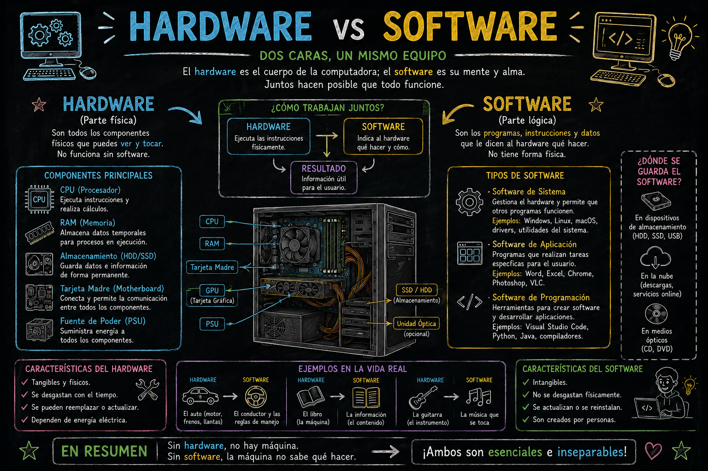
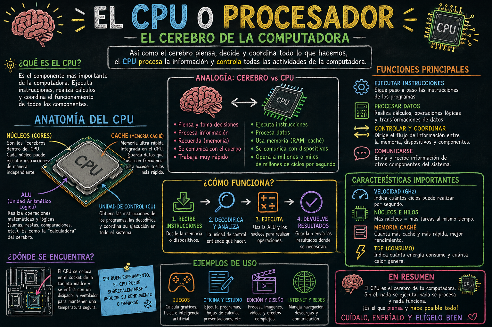
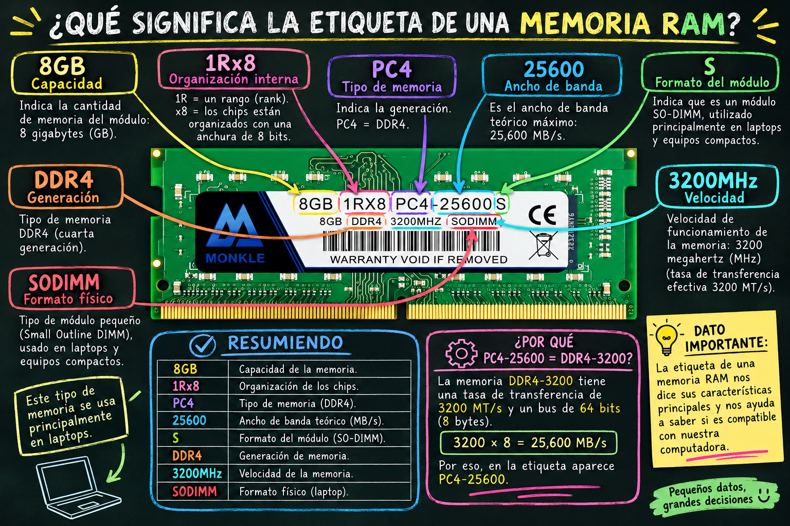
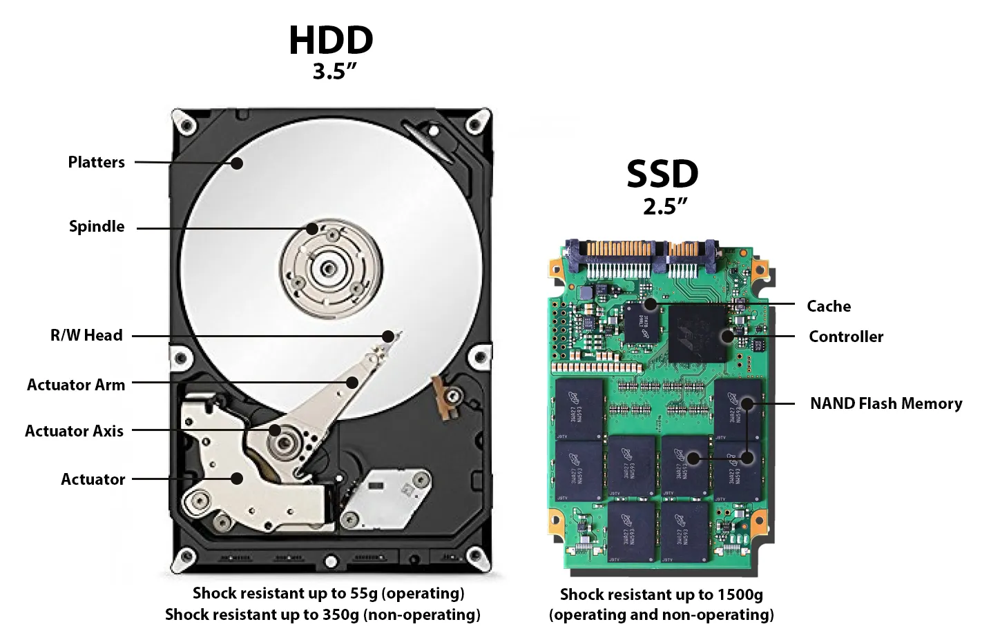
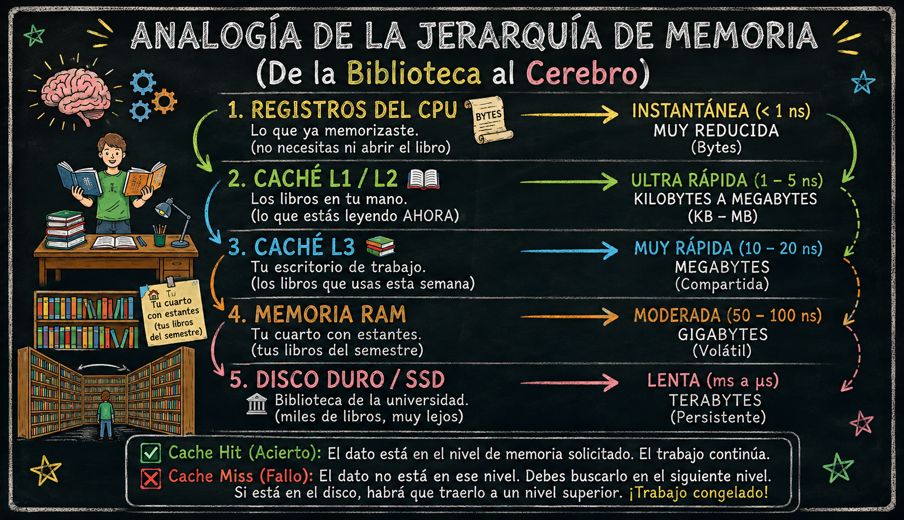
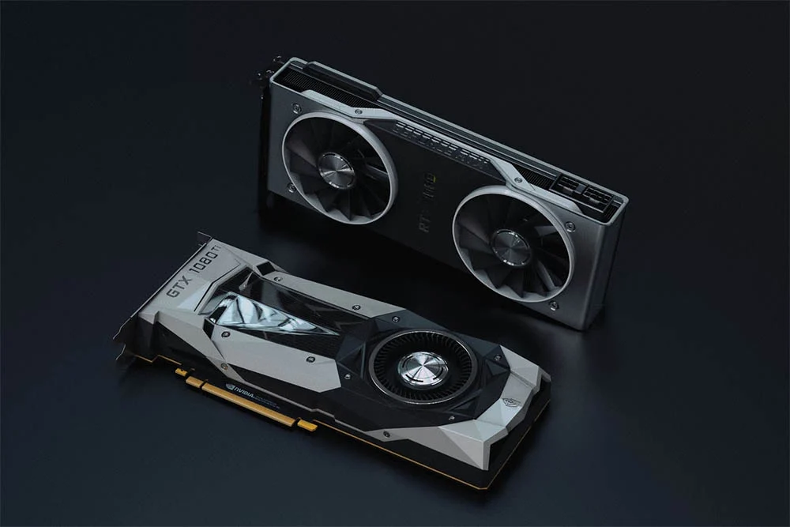
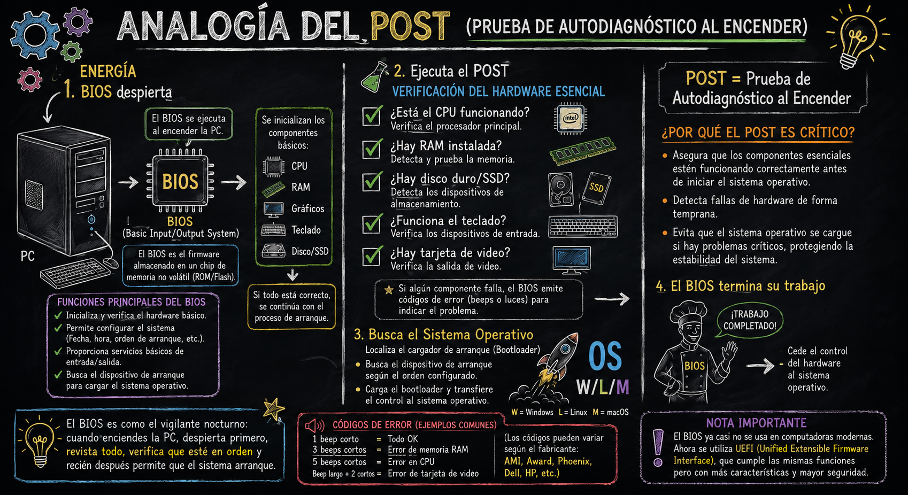
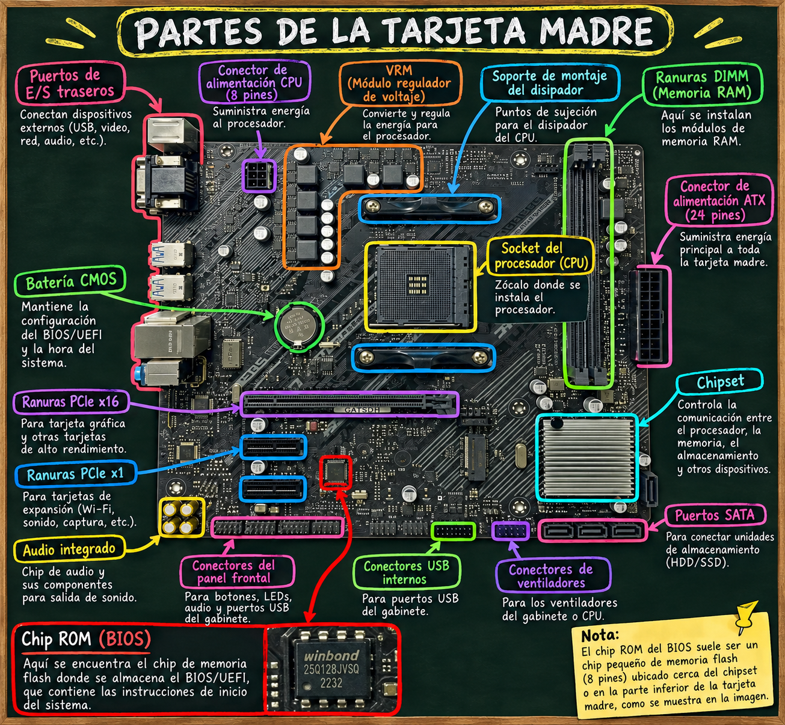
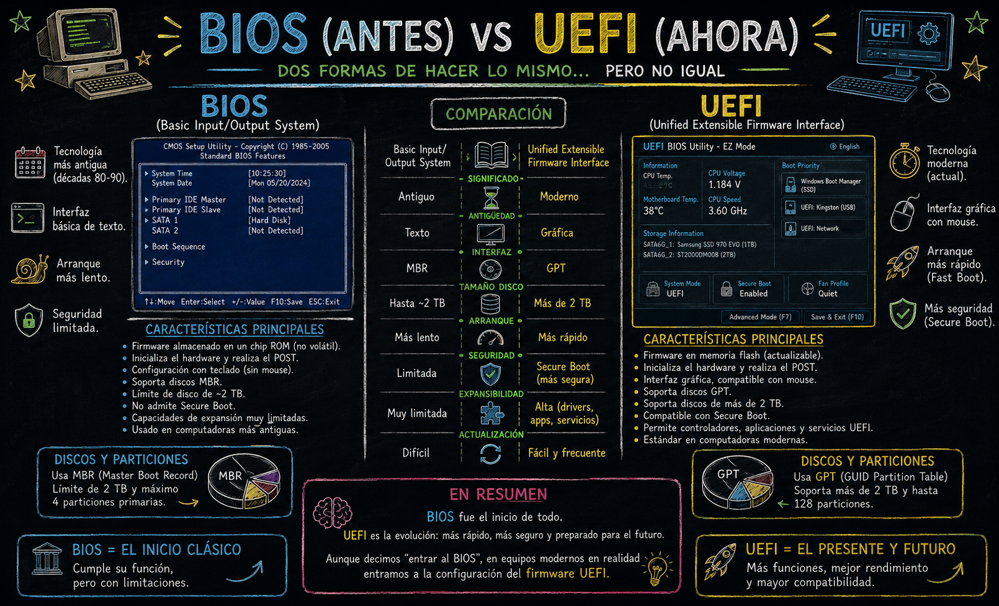
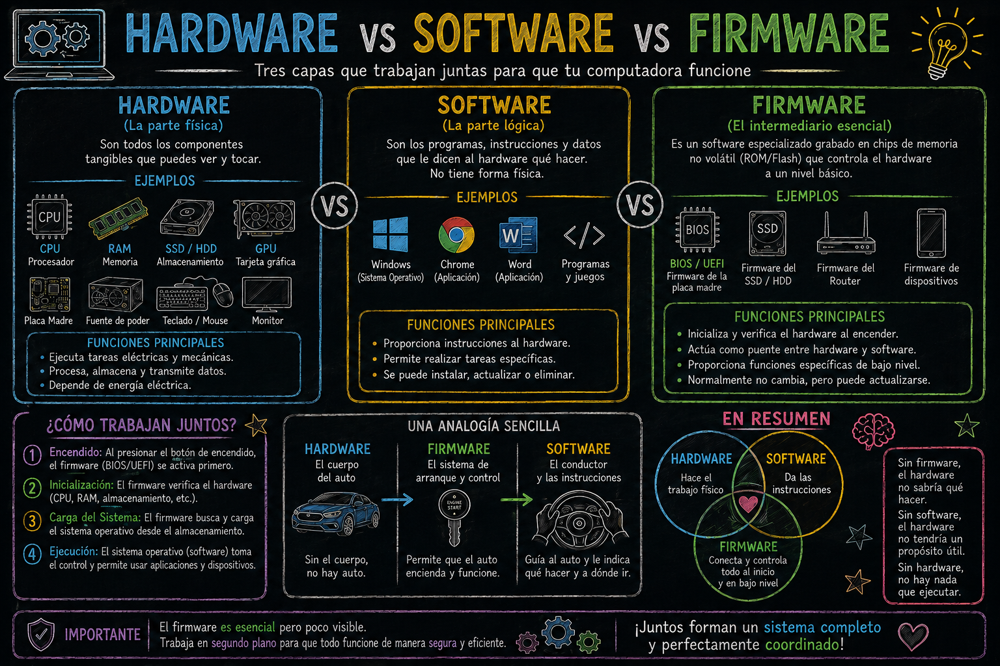

# Introducción a los Componentes de una Computadora

> **Fecha:** 01 de septiembre, 2026

::: content-box-gray
**Objetivos:**

1.  Identificar los componentes internos principales y complementarios
2.  Diferenciar entre Hardware y Software
:::

## **BLOQUE 1 —** Hardware vs Software

{fig-align="center"}

Tabla de las diferencias:

|  |  |  |
|------------------------|------------------------|------------------------|
| **Característica** | **Hardware** | **Software** |
| **Definición** | Componentes físicos y materiales. | Conjunto de programas, instrucciones y datos. |
| **Tangibilidad** | Es **tangible** (se puede tocar, ver y sostener). | Es **intangible** (código digital, no se puede tocar). |
| **Función** | Ejecutar las tareas físicas y almacenar/procesar datos electrónicamente. | Dar órdenes al hardware y permitir la interacción con el usuario. |
| **Durabilidad / Desgaste** | Se desgasta con el tiempo y el uso (fallas mecánicas o térmicas). | No se desgasta físicamente, aunque puede volverse obsoleto o presentar *bugs*. |
| **Mantenimiento** | Se repara limpiando o reemplazando piezas físicas. | Se actualiza, se corrigen errores mediante parches o se reinstala. |
| **Infección por Virus** | No puede ser infectado directamente por virus informáticos. | Puede ser infectado por *malware* o virus. |
| **Ejemplos** | Procesador (CPU), Tarjeta Madre, Monitor, Teclado, Disco SSD. | Sistema Operativo (Windows, Linux), Navegador Web, Python, R, Office. |

## ¿Cómo interactúan entre sí?

El hardware y el software no pueden funcionar de manera independiente:

1.  **El Hardware necesita al Software:** Sin un sistema operativo o programas, una computadora es solo una estructura de metal y silicio sin capacidad de realizar tareas útiles.

2.  **El Software necesita al Hardware:** Las instrucciones del código no pueden ejecutarse ni procesarse si no existe un procesador, memoria o pantalla donde mostrar los resultados.

## **BLOQUE 2 —** Componentes Internos Principales

#### CPU — Procesador

- 🧠 El "cerebro" de la computadora
- Ejecuta instrucciones: **fetch → decode → execute**
- Características clave:
  - Núcleos (cores): más núcleos = más tareas simultáneas
  - Velocidad en **GigaHertz** (GHz)
  - Memoria Caché (L1, L2, L3)
- Marcas: **Intel** (Core i3/i5/i7/i9) y **AMD** (Ryzen)
- Analogía: *"Es como el chef de un restaurante: recibe pedidos, los procesa y entrega resultados"* 👨🍳

{fig-align="center"}

::: callout-note
## ¿Qué es GHz?

Es la unidad que mide la **velocidad del reloj** de un procesador, es decir, **cuántas veces por segundo puede ejecutar un ciclo de instrucciones.**

```         
1 Hz   = 1 ciclo por segundo 
1 KHz  = 1,000 ciclos por segundo
1 MHz  = 1,000,000 ciclos por segundo
1 GHz  = 1,000,000,000 ciclos por segundo
                  ⬆️
         ¡MIL MILLONES de ciclos por segundo!
```

Un ciclo es el **latido del procesador**, marcado por un reloj interno llamado **Clock**
:::

#### RAM — Memoria de Acceso Aleatorio

[{fig-align="center" width="685"}](https://www.mercadolibre.com.mx/memoria-ram-ddr4-8gb-3200mhz-sodimm-260-pines-monkle-para-laptop/p/MLM44444062)

- 📋 Memoria de trabajo **temporal**
- Almacena lo que está en uso en este momento
- Se borra al apagar la computadora
- Medida en gigabyte (**GB)** (8GB, 16GB, 32GB...)
- Tipos: DDR4, DDR5
- Analogía: *"Es el escritorio donde tienes todo lo que estás usando ahora"* 🗂️

{fig-align="center" width="696"}

#### Almacenamiento — HDD y SSD

[{fig-align="center" width="587"}](https://medium.com/@rodbauer/hdd-vs-ssd-what-does-the-future-for-storage-hold-dc8653f16366)

> 💾 Memoria **permanente** de la computadora

- **HDD** (Disco Duro):

  - Mecánico, con platos giratorios
  - Mayor capacidad, menor precio
  - Más lento y frágil

- **SSD** (Unidad de Estado Sólido):

  - Sin partes móviles
  - Mucho más rápido
  - Mayor durabilidad

- Analogía: *"Es el cajón donde guardas todo aunque apagues la luz"* 🗄️

{fig-align="center" width="698"}

::: callout-note
## ¿Qué es la Memoria Caché?

Es una memoria **ultrarrápida** y **pequeña** que vive dentro del CPU y guarda temporalmente los datos que usa con más frecuencia, para no tener que ir a buscarlos a la RAM cada vez.

Primero entendamos **por qué existe**:

```         
Velocidad de los componentes:

🧠 CPU        →  opera a    4 GHz    (ultrarrápido)
💾 RAM        →  opera a    ~50 GHz  (rápido)
💿 SSD        →  opera a    ~500 MB/s (lento)
📀 HDD        →  opera a    ~100 MB/s (muy lento)

⚠️ El problema:
El CPU es TAN rápido que si tuviera que esperar a que la RAM le diera datos... perdería el 99% de su tiempo ESPERANDO 😴
```

> 💡 *"La caché existe para que el CPU nunca tenga que esperar"*

### **Analogía**

{fig-align="center"}

Escala de tiempo:

```         
1 segundo    =  1 s
1 milisegundo = 0.001 s        (ms) → parpadeo de un ojo
1 microsegundo = 0.000001 s    (µs) → cámara de alta velocidad
1 nanosegundo = 0.000000001 s  (ns) → velocidad del CPU ⚡
```

> 🔑 *"Mientras más cerca está la información del CPU, más rápido puede trabajar"*
:::

#### Tarjeta Madre — Motherboard

- 🔌 El "esqueleto" que conecta todo
- Contiene los **buses de datos** que comunican componentes
- Incluye: slots para RAM, CPU, GPU, almacenamiento
- Tiene el **BIOS/UEFI**: primer software que corre al encender
- Fabricantes: ASUS, MSI, Gigabyte

[](https://www.amazon.com.mx/Placa-Madre-GA15DH-Compatible-Ryzen/dp/B0GZ5RX4TF)

#### GPU (Graphics Processing Unit) - unidad de procesamiento gráfico

- Es el CHIP procesador gráfico; Solo el cerebro, el procesador en sí.

  - Ejemplo: el chip "AD102" de NVIDIA → RTX 4090.

#### Tarjeta Gráfica

- Es el PRODUCTO COMPLETO:
  - GPU (chip procesador)
  - PCB (Placa de Circuito Impreso): es donde van soldados todos los componentes
  - GRAM (Graphics Random Access Memory): módulos de memoria, también conocida como VRAM (Video RAM) → texturas
  - 🔵 Condensadores: Estabilizan y filtran la energía eléctrica
  - 🟡 Inductores: Regulan el voltaje que llega al GPU
  - 🔴 MOSFETs: Controlan el flujo de corriente
  - ⚫ Resistencias: Limitan y controlan la corriente
  - 🟢 VRM (Voltage Regulator Module): Convierte y regula el voltaje para el GPU
  - Tuberías de calor: Son tubos de cobre huecos rellenos de líquido especial
  - Ventiladores (o blower)
  - Carcasa
- 🎮 Procesa imágenes, video y gráficos 3D
- Tiene su propio procesador (miles de núcleos pequeños)
- Puede ser:
  - **Integrada**: dentro del CPU (uso básico)
  - **Dedicada**: tarjeta independiente (gaming, diseño, IA)
- Marcas: NVIDIA (GeForce), AMD (Radeon)
- Hoy en día: clave para **Machine Learning e IA** 🤖

[](https://www.pccomponentes.com/blog/como-elegir-tarjeta-grafica?srsltid=AfmBOooy3DQiJl1fueUUfqybAm1SY6TBkFWnRC-NQuIANQk9eJpnHqez)

#### Fuente de Poder — PSU

- ⚡ Convierte la corriente alterna (CA) en corriente directa (CD)
- Alimenta todos los componentes
- Se mide en **Watts** (500W, 750W, 1000W...)
- Certificaciones de eficiencia: 80 Plus Bronze/Gold/Platinum
- Un componente subestimado pero **crítico** para la estabilidad

## **BLOQUE 3 —** Componentes Complementarios (Periféricos y Accesorios)

Son aquellos dispositivos que se conectan a la computadora para interactuar con ella, introducir o recibir datos, o mejorar sus funciones, pero que no impiden que el sistema interno funcione.

### Periféricos de Entrada

Permiten al usuario enviar datos o instrucciones a la computadora:

- **Teclado y Ratón (Mouse):** Los medios principales para interactuar con el sistema.
- **Micrófono y Cámara Web:** Para videollamadas, grabación de audio y conferencias.
- **Escáner / Lectores de códigos:** Para digitalizar documentos físicos.

### Periféricos de Salida

Muestran o entregan los resultados procesados por la computadora:

- **Monitor / Pantalla:** Muestra la interfaz gráfica y la información visual (*esencial para la interacción humana, aunque técnicamente el equipo puede encender sin él*).
- **Bocinas o Audífonos:** Para la reproducción de audio.
- **Impresora:** Para trasladar información digital a formato físico.

### C. Complementos Internos y Unidades de Expansión

- **Sistemas de Enfriamiento Extra (Líquido o Ventiladores adicionales):** Mantienen las temperaturas óptimas en equipos de alto rendimiento.
- **Tarjetas de Red / Wi-Fi o Bluetooth:** Añaden o mejoran la conectividad inalámbrica.
- **Lectores de discos (CD/DVD/Blu-ray):** Cada vez menos comunes, útiles para leer formatos físicos antiguos.

{fig-align="center" width="726"}

## **BLOQUE 4 — Firmware**

Es un software permanente grabado dentro de un chip de hardware que controla cómo funciona ese dispositivo.

### ¿Qué es el BIOS?

**BIOS = Basic Input Output System** **Sistema Básico de Entrada y Salida**

> *"Es el primer programa que se ejecuta cuando enciendes tu computadora, ANTES que cualquier sistema operativo"*

#### ¿Dónde vive el BIOS?

- No está en el disco duro
- No está en la RAM
- No está en el CPU
- Vive en un chip especial de la Tarjeta Madre llamado **ROM (Read Only Memory)**

> "Al estar en **ROM**, el BIOS no se borra aunque apagues la computadora"

Su trabajo principal es **POST**:

```         
Power On Self Test  = Prueba de Autodiagnóstico al Encender
```

{fig-align="center"}

### ¿Sabías que la Motherboard tiene una pequeña batería?

Esta batería mantiene:

- ⏰ La fecha y hora
- ⚙️ La configuración del BIOS
- 🔌 Los ajustes guardados

Si se agota → la computadora pierde la hora y configuración cada vez que se apaga 😱.

{fig-align="left"}

::: callout-important
## BIOS (antes) vs UEFI (ahora)

*"El BIOS clásico fue reemplazado por UEFI en computadoras modernas"*

| Característica        | BIOS (antiguo) | UEFI (moderno)             |
|-----------------------|----------------|----------------------------|
| 📅 Año                | 1975           | 2005 - presente            |
| 🖥️ Interfaz           | Solo texto     | Gráfica con mouse          |
| 💾 Disco máximo       | 2 TB           | 9 ZB (sin límite práctico) |
| ⚡ Velocidad arranque | Lento          | Muy rápido                 |
| 🔐 Seguridad          | Básica         | Secure Boot                |
| 🖱️ Mouse              | ❌ No          | ✅ Sí                      |

{fig-align="center"}
:::

En resumen ...

{fig-align="center"}

## Referencias

- [¿Qué es una tarjeta gráfica? Características y tipos](https://www.pccomponentes.com/blog/como-elegir-tarjeta-grafica?srsltid=AfmBOooy3DQiJl1fueUUfqybAm1SY6TBkFWnRC-NQuIANQk9eJpnHqez)
- [HDD vs SSD: What Does the Future for Storage Hold?](https://medium.com/@rodbauer/hdd-vs-ssd-what-does-the-future-for-storage-hold-dc8653f16366)
