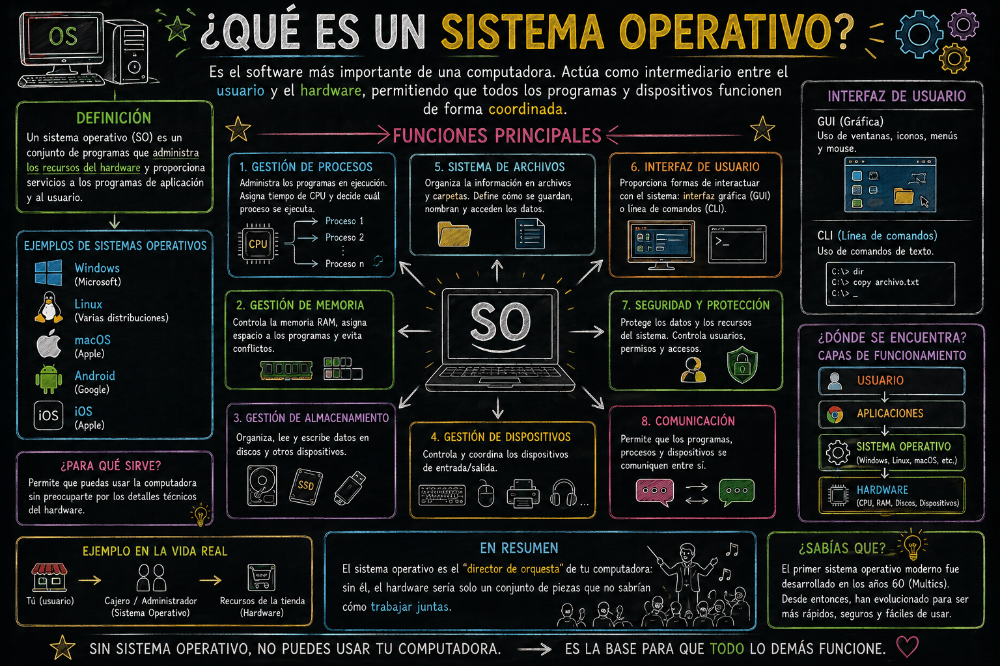
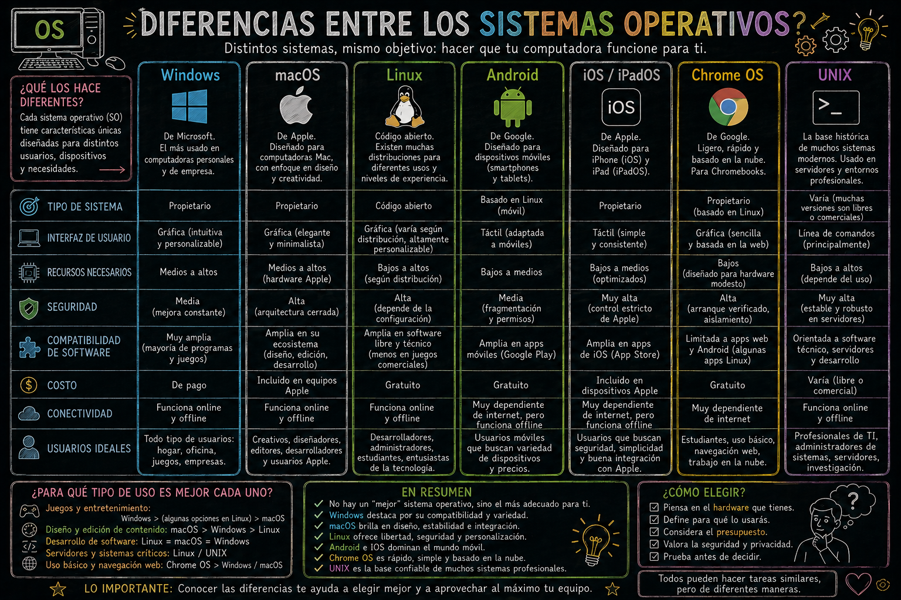
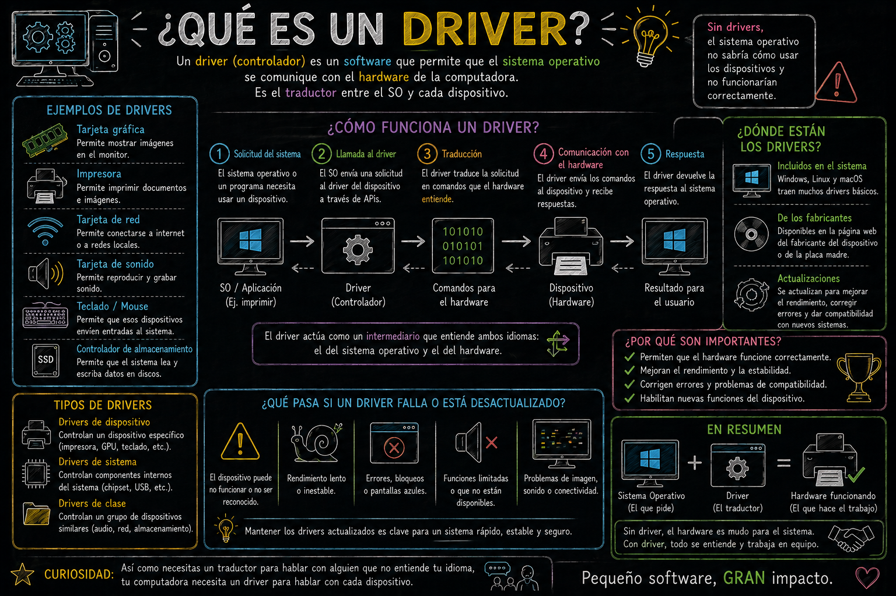
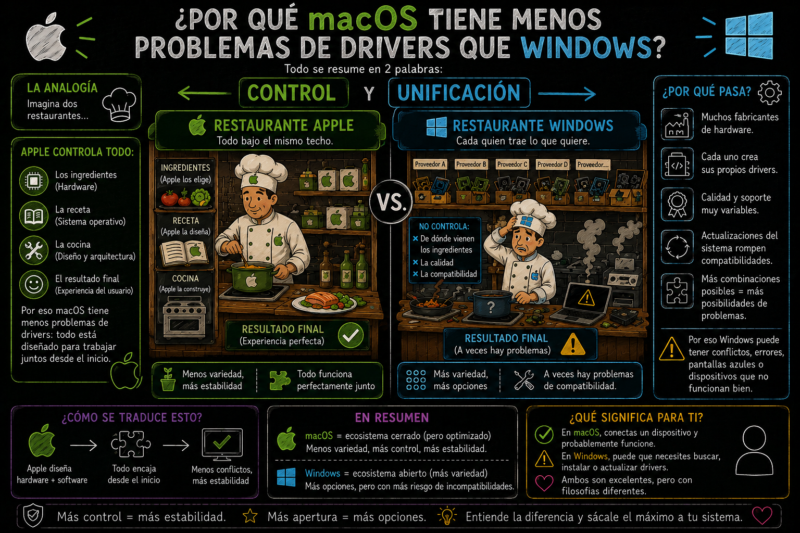
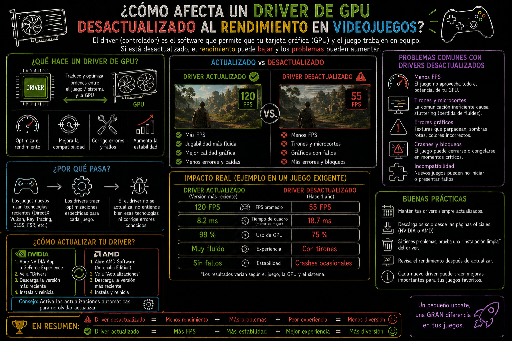

# Sistema Operativo (SO) y sus funciones

> **Fecha:** 03 de septiembre, 2026

::: content-box-gray
**Objetivos:**

1.  Comprender qué es un Sistema Operativo (SO) y cuál es su función principal en una computadora
2.  Identificar los SO más comunes en el mercado actual
:::

## ¿Qué es un Sistema Operativo (SO) / Operating System (OS)?

Es el software principal que actúa como intermediario entre el usuario, las aplicaciones y el hardware de la computadora o del teléfono.

{fig-align="center"}

## **SO actuales y sus diferencias**

{fig-align="center"}

Al final tu eliges cual usas y recuerda...

{fig-align="center"}

## ¿Qué son los drivers?

Es un software que actúa como traductor entre el Sistema Operativo y un dispositivo de hardware.

{fig-align="center"}

### **Drivers en diferentes SO**

```         
🪟 Windows
├── Muchos drivers manuales
├── Windows Update los descarga
└── A veces necesitas instalarlos tú

🍎 macOS
├── Apple controla hardware y software
├── Drivers vienen integrados
└── Casi nunca necesitas instalar uno

🐧 Linux
├── Muchos drivers en el Kernel
├── Algunos requieren instalación manual
└── Hardware muy nuevo puede tener problemas
```

## Reflexión grupal

#### *¿Por qué macOS tiene menos problemas de drivers que Windows?*

{fig-align="center"}

#### *¿Cómo afecta un driver de GPU desactualizado al rendimiento en videojuegos?*

Un driver desactualizado hace que la GPU no trabaje a su máximo potencial, causando menos FPS, errores visuales y crashes.

::: callout-note
## ¿Qué es FPS?

Es cuántas imágenes por segundo genera tu GPU en un videojuego

```         
FPS = Frames Per Second
    = Fotogramas Por Segundo

30 FPS  → Jugable pero no fluido 🐢
60 FPS  → Fluido y cómodo ✅
120 FPS → Muy fluido ⚡
240 FPS → Competitivo profesional 🏆

Más FPS = Juego más fluido y suave
Menos FPS = Juego entrecortado y lento
```
:::

{fig-align="center"}
