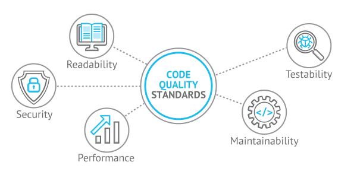

# Buenas prácticas en bioinformática

::: content-box-gray
**Objetivos:**

1.  Comprender la historia y filosofía de Linux/Unix
2.  Entender qué es GNU y su importancia en el software libre
3.  Diferenciar entre Linux, GNU y GNU/Linux
4.  Reconocer las principales versiones y distribuciones de GNU/Linux
5.  Valorar la importancia del software libre y de código abierto
6.  Aplicar este conocimiento en la selección de sistemas operativos
:::

Notas personales recabadas a partir de los tutoriales y ejemplos 😊. Espero que les funcione 💜

::: callout-note
[Presentación completa](https://eveliacoss.github.io/LCG2025_S1_Buenaspracticas_presentacion/Dia1_BuenasPracticas.html#1) empleando Rmarkdown
:::

## Materiales informativos

- [Curso de Joselyn Cristina Chávez Fuentes](https://comunidadbioinfo.github.io/cdsb2023/creaci%C3%B3n-de-vi%C3%B1etas.html)
- Me ayudo mucho este [Video](https://www.youtube.com/watch?v=7ZgZ6qUKZvE&ab_channel=DaniMedi)
- [Documentación de funciones de Andrés Arredondo Cruz](https://comunidadbioinfo.github.io/cdsb2023/documentaci%C3%B3n-de-funciones.html)

💪 Estuve muy intensa viendo su codigo. Muchas gracias por tenerlos publico.

## **Un algoritmo nos permite resolver un problema ⭐**

Un **algoritmo** es un método para resolver un problema mediante una serie de pasos **definidos, precisos** y **finitos**.

- **Definido**: si se sigue dos veces, se obtiene el mismo resultado. Es reproducible.
- **Preciso**: implica el orden de realización de cada uno de los pasos.
- **Finito**: Tiene un numero determinado de pasos, implica que tiene un fin.

> Un algoritmo podemos definirlo como un **programa o software**.

## **Para escribir un buen software necesitas:**

> Escribir **código mantenible (maintainable code), usar control de versiones (version control) y rastreadores de problemas (issue trackers), revisiones de código (code reviews), pruebas unitarias (unit testing) y automatización de tareas (task automation)**.
>
> [Wilson, *et al.* 2014. *PLOS Biology*](https://journals.plos.org/plosbiology/article?id=10.1371/journal.pbio.1001745)

En bioinformática, es fundamental garantizar el uso **ético y responsable de datos sensibles**, como los genomas humanos, respetando la privacidad y los marcos legales vigentes. Al mismo tiempo, se debe fomentar la ciencia abierta **mediante prácticas transparentes y reproducibles**, sin comprometer la integridad de la información. Estas acciones no solo fortalecen la **confianza en los resultados**, sino que también previenen errores graves que podrían derivar en la **retracción de artículos científicos**.

[{fig-align="center"}](https://devcom.com/tech-blog/code-quality-definition-how-to-improve-code-quality/)

::: callout-note
## Pasos para escribir un buen software

1.  Análisis del problema / Definir el problema

2.  Diseño del algoritmo / Diseño del programa

3.  Codificación / Escribir el código

4.  Compilación y ejecución del programa

5.  Verificación / Realizar pruebas

6.  Depuración / Detectar los errores y corregirlos

> Programacion defensiva

7.  Documentación
:::

{fig-align="center"}

## **Paso 7: Documentación**

::: callout-note
- *Título* (opcional)

- *Autor (author)*: Su nombre

- *Dia (date)*: Fecha de creación

- *Paquetes (packages)*

- *Directorio de trabajo (Working directory)*: En que carpeta se encuentra tu datos y programa.

- *Información descriptiva del programa (Description)*: ¿Para qué sirve el programa? Ej: El siguiente programa realiza la suma de dos numeros enteros a partir de la entrada del usuario y posteriormente la imprime en pantalla.

- *Usage* ¿Cómo se utiliza?

- *Argumentos (Arguments)*

  - *Información de entrada (Data Inputs)*: Ej: Solo numeros enteros (sin decimales).

  - *Información de salida (Outpus)*: Graficas, figuras, tablas, etc.
:::

{fig-align="center"}

## Puntos claves para buenas prácticas en bioinfo ⭐

1.  Escriba **programas para personas, no para computadoras** (Documenta qué hace y por qué). - Se coherente en la nomenclatura, indentación y otros aspectos del estilo.

2.  Modularidad: Divide los programas en *funciones cortas de un solo propósito.* 💻 📚

3.  **No repitas tu código**. Crea pasos reproducibles o que se repitan por si solas. ➰

4.  Planifique los errores (**Programacion defensiva**) 🚩

5.  Optimice el software sólo después de que funcione correctamente. - Si funciona no lo modifiques, simplificalo.

6.  Colaborar - Busque siempre bibliotecas de software bien mantenidas que hagan lo que necesita. 👥

::: callout-note
## Ejemplo de como realizo mis documentos 💜

Aqui les dejo el script que les doy a mis alumnos [VisualizacionDatos.R](https://github.com/EveliaCoss/RNAseq_classFEB2024/blob/main/Practica_Dia3/scripts/VisualizacionDatos.R) del curso de [Análisis de datos de RNA-Seq](https://github.com/EveliaCoss/RNAseq_classFEB2024).
:::

## Referencias

- Presentación de [Reproducibilidad de Miriam Lerma](https://miriamll.github.io/teaching_R_Rmd/Repro#1)
- Presentación [introducción a Git, GitHub y Zenodo de Miriam Lerma](https://miriamll.github.io/teaching_R_Rmd/GitGithubZenodo#1)
- [Presentación de Introducción a la Bioinformática - Heladia Salgado](https://lcg-cursos.github.io/material/introbioinfo/L2-buenas-practicas.html#1)
- [Mi próximo artículo científico en R de Florencia D´Andrea](https://flor14.github.io/rladies-jujuy/presentacion.html?panelset=compendio&panelset1=bibliograf%25C3%25ADa#3)
- [Kristie Reproducible Research](https://github.com/WhitakerLab/ReproducibleResearch)
- [Presentación de Kristie](https://figshare.com/articles/journal_contribution/Showing_your_working_a_how_to_guide_to_reproducible_research/5443201/1?file=9410686)
- [FAIR- bioinformatic](https://ifb-elixirfr.github.io/IFB-FAIR-bioinfo-training/assets/pdf/Session2020/01_introduction.pdf)
- [Unidad 1 Bioinformática e investigación reproducible](https://github.com/AliciaMstt/BioinfInvRepro2016-II/blob/master/Unidad1/Unidad1_Bioinf_e_Investigaci%C3%B3n_Reproducible.md)
- [The five pillars of computational reproducibility: bioinformatics and beyond](https://academic.oup.com/bib/article/24/6/bbad375/7326135)
- [Investigación reproducible y análisis de datos](https://open-science-training-handbook.github.io/Open-Science-Training-Handbook_ES/02OpenScienceBasics/04ReproducibleResearchAndDataAnalysis.html)
- Haydee tutorial: [Temas Selectos de Análisis Numérico y Computación Científica: Computo científico para el análisis de datos](https://haydeeperuyero.github.io/Computo_Cientifico/)
- Alejandra Medina tutorial: [Control de versiones con GitHub y RStudio](https://comunidadbioinfo.github.io/cdsb2023/control-de-versiones-con-github-y-rstudio.html)
- Wilson, et al. 2014. [Best Practices for Scientific Computing](https://journals.plos.org/plosbiology/article?id=10.1371/journal.pbio.1001745). PLOS Biology
- Evelia Coss - tutorial [Buenas practicas en R](https://github.com/EveliaCoss/Buenaspracticas_R_Mayo2024)
- Evelia Coss - [Make your CV tutorial](https://github.com/EveliaCoss/Make_yourCV)
- Markdwn Guide - [Getting Started](https://www.markdownguide.org/getting-started/)
- Allison Horst - [Imagenes](https://allisonhorst.com/allison-horst)
- [Statistical Computing using R and Python](https://srvanderplas.github.io/stat-computing-r-python/)
- [Training Materials](https://learning.nceas.ucsb.edu/2024-10-coreR/)
- [Visual Studio Code](https://damiandeluca.com.ar/como-comenzar-con-visual-studio-code-una-guia-para-principiantes)
- [Articulo reproducibilidad](https://blog.ml.cmu.edu/2020/08/31/5-reproducibility/)
