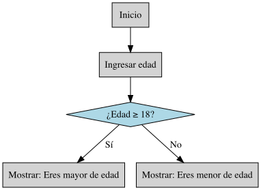
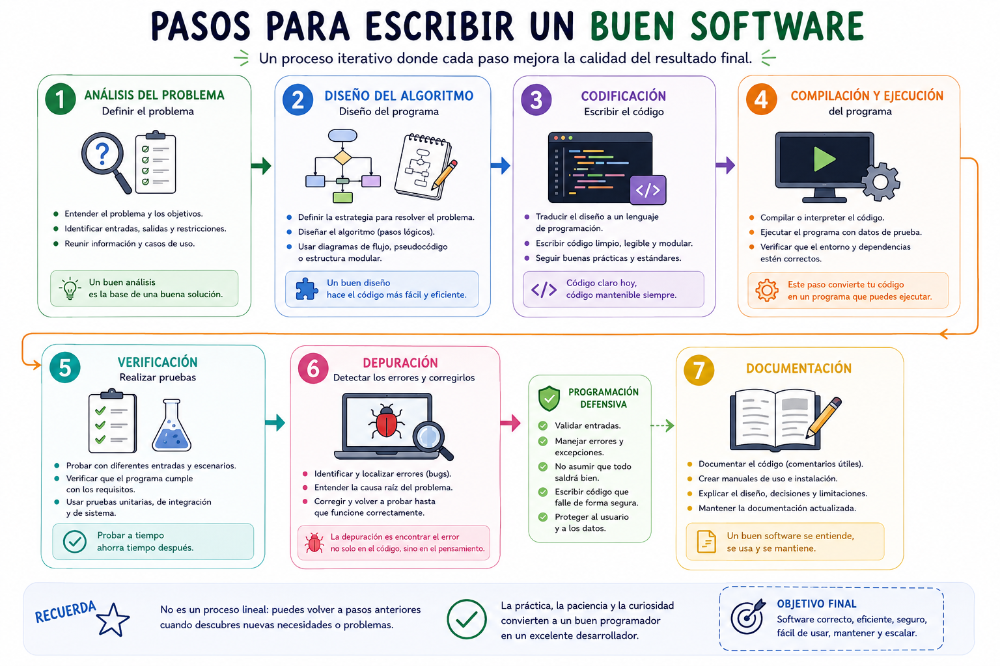
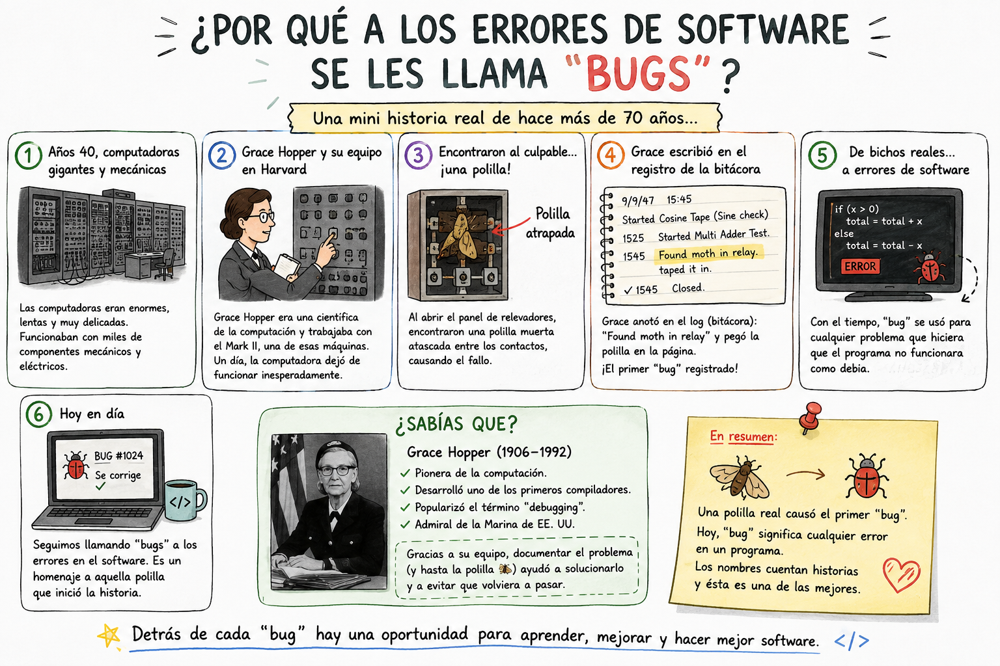
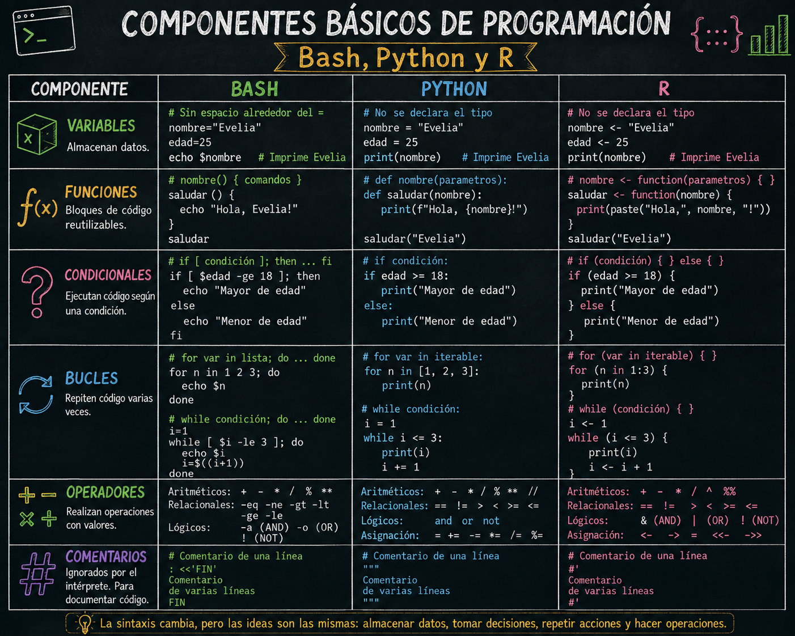
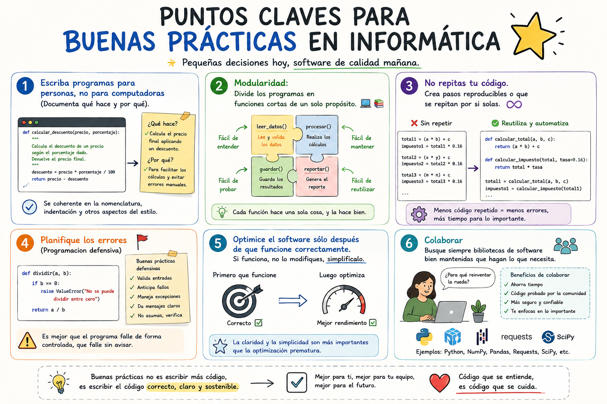

# Buenas prácticas en bioinformática

> **Fecha:** 03 de septiembre, 2026

::: content-box-gray
**Objetivos:**

1.  Conocer las buenas prácticas
2.  Valorar la importancia del software libre y de código abierto
3.  Aplicar este conocimiento en la selección de sistemas operativos
:::

Notas personales recabadas a partir de los tutoriales y ejemplos 😊. Espero que les funcione 💜

## **Un algoritmo nos permite resolver un problema ⭐**

Un algoritmo es un **conjunto de pasos lógicos y ordenados** que describe cómo resolver un problema específico. Es una secuencia de instrucciones abstractas e independientes del lenguaje de programación.

Características:

- [**Definido (Determinístico)**]{.text-blue}: Un algoritmo es **definido** si al seguirlo dos veces con los mismos datos de entrada, siempre se obtiene el **mismo resultado**. Es **reproducible** y predecible.
  - **Implicaciones:**
    - No hay ambigüedad en los pasos
    - No depende del azar o de factores externos
    - Cualquier persona que siga el algoritmo llegará al mismo resultado
- [**Preciso (Orden Específico)**]{.text-blue}: implica el orden de realización de cada uno de los pasos. No puedes cambiar el orden arbitrariamente sin afectar el resultado.
  - **Implicaciones:**
    - Cada paso debe ejecutarse en el orden correcto
    - El orden es fundamental para obtener el resultado esperado
    - Las instrucciones deben ser claras y sin ambigüedad
- [**Finito (Tiene un Fin)**]{.text-blue}: Tiene un numero determinado de pasos y siempre termina en algún momento. No puede ejecutarse indefinidamente.
  - **Implicaciones:**
    - Debe haber un punto de salida o conclusión

    - No puede entrar en bucles infinitos

    - Debe producir un resultado en tiempo finito

> - **Algoritmo** = La idea y el plan (abstracto)
> - **Programa/Software** = La implementación concreta (código ejecutable)

[](https://allisonhorst.com/allison-horst)

::: callout-important
Los algoritmos son conceptuales y puede expresarse en **lenguaje natural, pseudocódigo o diagramas de flujo.**
:::

## **🗣️ Lenguaje Natural**

### **En el contexto de algoritmos y programación**

- Utiliza **palabras comunes y cotidianas** para describir procesos o instrucciones.
- Es **intuitivo y accesible,** ideal para explicar algoritmos sin tecnicismos.
- No requiere conocimientos previos de programación.
- Puede ser **ambiguo o impreciso,** por lo que no siempre es adecuado para implementación directa.
- Se usa frecuentemente como primer paso antes de escribir pseudocódigo o código real.

::: {.callout-note icon="false"}
## Ejemplo de Lenguaje natural

El programa solicita al usuario que ingrese su edad. Luego compara ese valor con 18. Si la edad es **mayor o igual a 18**, se muestra el mensaje “Eres mayor de edad”. Si no lo es, se muestra “Eres menor de edad”.
:::

## **Pseudocódigo**

::::: columns
::: {.column width="60%"}
- El pseudocódigo permite escribir algoritmos con **sintaxis relajada**, sin seguir reglas estrictas de un lenguaje de programación.
- Organiza los **pasos lógicos** necesarios para construir un algoritmo, sin detallar estructuras de datos complejas.
- Usa un **lenguaje sencillo y legible, accesible** para personas sin experiencia técnica.
- 🔄 Los pasos escritos en pseudocódigo pueden **traducirse fácilmente** a cualquier lenguaje de programación.
:::

::: {.column width="40%"}
```         
INICIO
  DEFINIR edad COMO ENTERO
  LEER edad
  SI edad >= 18 ENTONCES
    MOSTRAR "Eres mayor de edad"
  SINO
    MOSTRAR "Eres menor de edad"
FIN
```
:::
:::::

## **Diagrama de Flujo**

```{r, echo=FALSE, message=FALSE, warning=FALSE}
library(DiagrammeR)
library(DiagrammeRsvg)
library(rsvg)

graph <- grViz("
digraph{
  graph[layout = dot, rankdir = TB]

  node [shape = box, style = filled, fillcolor = lightgray]
  A[label = 'Inicio']
  B[label = 'Ingresar edad']
  C[label = '¿Edad ≥ 18?', shape = diamond, fillcolor = lightblue]
  D[label = 'Mostrar: Eres mayor de edad']
  E[label = 'Mostrar: Eres menor de edad']

  A -> B
  B -> C
  C -> D[label = 'Sí']
  C -> E[label = 'No']
}
")

# Convertir a SVG y guardar como PNG
svg <- export_svg(graph)
rsvg_png(charToRaw(svg), file = "figures/diagrama_edad.png")
```

::::: columns
::: {.column width="60%"}
- Representa **visualmente un algoritmo mediante símbolos gráficos** (óvalos, rectángulos, rombos, etc.).
- Muestra el flujo **lógico de decisiones, procesos y entradas/salidas.**
- Facilita la *comprensión rápida* de la estructura del algoritmo.
- Ayuda a identificar errores o redundancias en la lógica.
- Es útil tanto para documentación técnica como para enseñanza.
:::

::: {.column width="40%"}

:::
:::::

## ¿Qué es un código?

Se refiere a los **scripts, programas/software o fragmentos de instrucciones escritas en lenguajes de programación** (como Python, R, Bash, entre otros) que le indica a una computadora qué tareas realizar.

Es la forma en que los humanos comunicamos con las máquinas para resolver problemas, procesar información y automatizar tareas.

::::: columns
::: {.column width="60%"}
Aplicaciones prácticas:

- Procesar y analizar datos
- Crear visualizaciones
- Resolver problemas matemáticos
- Crear herramientas y aplicaciones
- Documentar procesos
:::

::: {.column width="40%"}
{fig-align="center"}
:::
:::::

## Para escribir un buen software necesitas:

> Escribir **código mantenible (maintainable code), usar control de versiones (version control) y rastreadores de problemas (issue trackers), revisiones de código (code reviews), pruebas unitarias (unit testing) y automatización de tareas (task automation)**.
>
> [Wilson, *et al.* 2014. *PLOS Biology*](https://journals.plos.org/plosbiology/article?id=10.1371/journal.pbio.1001745)

*.*](figures/buenaspracticas_buencodigo.png){fig-align="center"}

## Pasos para escribir un buen software

{fig-align="center"}

### Mini historia de los bugs

El término "bug" (insecto en inglés) para referirse a errores en programas tiene una historia curiosa y bien documentada que se remonta a los primeros días de la computación.

En los años 1940s, las computadoras eran máquinas enormes que ocupaban habitaciones completas, como la **ENIAC** (Electronic Numerical Integrator and Computer). Estos equipos utilizaban miles de tubos de vacío, relés y componentes electrónicos que generaban mucho calor.

**El problema:** Los insectos reales (polillas (moth), cucarachas y otros bichos) eran atraídos por el calor de las máquinas y se metían dentro de ellas, causando cortocircuitos y fallos en el funcionamiento. 🦗

Cuando los operadores encontraban estos insectos dentro de la máquina, decían que había un "bug" (bicho) en el sistema. Así nació el término de forma literal.

::: callout-note
## ¿Quién fue Grace Hopper?

**Grace Brewster Murray Hopper** (1906-1992) fue una **matemática, física y pionera de la programación** estadounidense que revolucionó la forma en que escribimos software.
:::

{fig-align="center"}

::: callout-note
## ¿Qué es "Admiral"?

Es un rango militar en la Marina de los Estados Unidos. Grace Hopper alcanzó el rango de contraalmirante (Rear Admiral), uno de los más altos para una mujer en esa época.
:::

## **Lenguajes de programación Comunes**

| Lenguaje | Uso Principal | Ejemplo |
|----|----|----|
| **`Bash`** | Automatización en sistemas Unix/Linux | Scripts de sistema |
| **`Python`** | Ciencia de datos, automatización, educación | Análisis de datos, machine learning |
| **`R`** | Análisis estadístico y visualización | Gráficos científicos, estadística |
| **`JavaScript`** | Desarrollo web, aplicaciones interactivas | Sitios web dinámicos |
| **`Java`** | Aplicaciones empresariales, sistemas grandes | Software corporativo |
| **`C++`** | Sistemas de alto rendimiento | Videojuegos, software de sistema |
| **`SQL`** | Gestión de bases de datos | Consultas de datos |

### **Componentes Básicos**

| Componente        | Descripción                             |
|-------------------|-----------------------------------------|
| **Variables**     | Espacios de memoria que almacenan datos |
| **Funciones**     | Bloques de código reutilizables         |
| **Condicionales** | Decisiones lógicas (si/entonces)        |
| **Bucles**        | Repetición de acciones                  |
| **Operadores**    | Símbolos para realizar operaciones      |
| **Comentarios**   | Explicaciones para humanos              |

En este semestre veremos programación con `Bash`, `Python` y un poco de `R`. Aquí es donde entra lo que aprendimos con *pseudocódigo*, ya que nos permite comprender y trasladar ideas a través de los tres lenguajes.

{fig-align="left"}

## Plantilla para la documentación de nuestro código

::: callout-tip
## Documentación de nuestro código

- *Título* (opcional)

- *Autor (author)*: Su nombre

- *Dia (date)*: Fecha de creación

- *Paquetes (packages)*

- *Directorio de trabajo (Working directory)*: En que carpeta se encuentra tu datos y programa.

- *Información descriptiva del programa (Description)*: ¿Para qué sirve el programa? Ej: El siguiente programa realiza la suma de dos numeros enteros a partir de la entrada del usuario y posteriormente la imprime en pantalla.

- *Usage* ¿Cómo se utiliza?

- *Argumentos (Arguments)*

  - *Información de entrada (Data Inputs)*: Ej: Solo numeros enteros (sin decimales).

  - *Información de salida (Outpus)*: Graficas, figuras, tablas, etc.
:::

{fig-align="center"}

## Puntos claves para buenas prácticas en informática ⭐

{fig-align="center"}

## Referencias

- Presentación de [Reproducibilidad de Miriam Lerma](https://miriamll.github.io/teaching_R_Rmd/Repro#1)
- Presentación [introducción a Git, GitHub y Zenodo de Miriam Lerma](https://miriamll.github.io/teaching_R_Rmd/GitGithubZenodo#1)
- [Presentación de Introducción a la Bioinformática - Heladia Salgado](https://lcg-cursos.github.io/material/introbioinfo/L2-buenas-practicas.html#1)
- [Mi próximo artículo científico en R de Florencia D´Andrea](https://flor14.github.io/rladies-jujuy/presentacion.html?panelset=compendio&panelset1=bibliograf%25C3%25ADa#3)
- [Kristie Reproducible Research](https://github.com/WhitakerLab/ReproducibleResearch)
- [Presentación de Kristie](https://figshare.com/articles/journal_contribution/Showing_your_working_a_how_to_guide_to_reproducible_research/5443201/1?file=9410686)
- [FAIR- bioinformatic](https://ifb-elixirfr.github.io/IFB-FAIR-bioinfo-training/assets/pdf/Session2020/01_introduction.pdf)
- [Unidad 1 Bioinformática e investigación reproducible](https://github.com/AliciaMstt/BioinfInvRepro2016-II/blob/master/Unidad1/Unidad1_Bioinf_e_Investigaci%C3%B3n_Reproducible.md)
- [The five pillars of computational reproducibility: bioinformatics and beyond](https://academic.oup.com/bib/article/24/6/bbad375/7326135)
- [Investigación reproducible y análisis de datos](https://open-science-training-handbook.github.io/Open-Science-Training-Handbook_ES/02OpenScienceBasics/04ReproducibleResearchAndDataAnalysis.html)
- Haydee tutorial: [Temas Selectos de Análisis Numérico y Computación Científica: Computo científico para el análisis de datos](https://haydeeperuyero.github.io/Computo_Cientifico/)
- Alejandra Medina tutorial: [Control de versiones con GitHub y RStudio](https://comunidadbioinfo.github.io/cdsb2023/control-de-versiones-con-github-y-rstudio.html)
- Wilson, et al. 2014. [Best Practices for Scientific Computing](https://journals.plos.org/plosbiology/article?id=10.1371/journal.pbio.1001745). PLOS Biology
- Evelia Coss - tutorial [Buenas practicas en R](https://github.com/EveliaCoss/Buenaspracticas_R_Mayo2024)
- Evelia Coss - [Make your CV tutorial](https://github.com/EveliaCoss/Make_yourCV)
- Markdwn Guide - [Getting Started](https://www.markdownguide.org/getting-started/)
- Allison Horst - [Imagenes](https://allisonhorst.com/allison-horst)
- [Statistical Computing using R and Python](https://srvanderplas.github.io/stat-computing-r-python/)
- [Training Materials](https://learning.nceas.ucsb.edu/2024-10-coreR/)
- [Visual Studio Code](https://damiandeluca.com.ar/como-comenzar-con-visual-studio-code-una-guia-para-principiantes)
- [Articulo reproducibilidad](https://blog.ml.cmu.edu/2020/08/31/5-reproducibility/)
- [Curso de Joselyn Cristina Chávez Fuentes](https://comunidadbioinfo.github.io/cdsb2023/creaci%C3%B3n-de-vi%C3%B1etas.html)
- Me ayudo mucho este [Video](https://www.youtube.com/watch?v=7ZgZ6qUKZvE&ab_channel=DaniMedi)
- [Documentación de funciones de Andrés Arredondo Cruz](https://comunidadbioinfo.github.io/cdsb2023/documentaci%C3%B3n-de-funciones.html)
