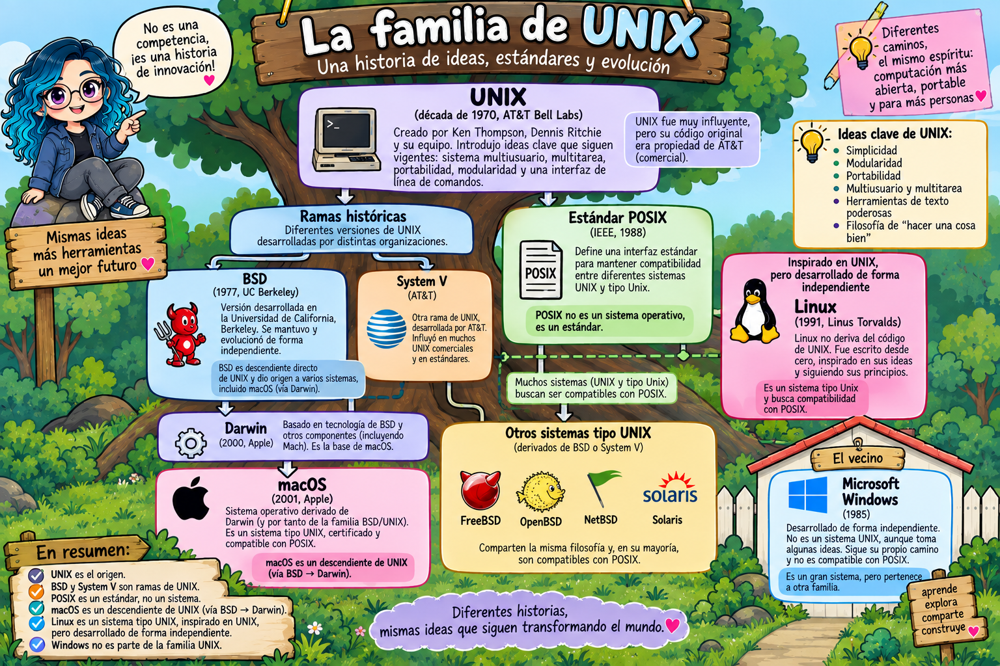
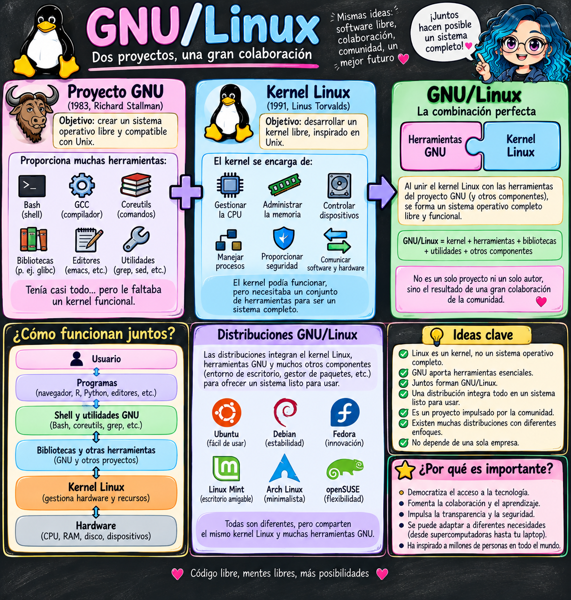
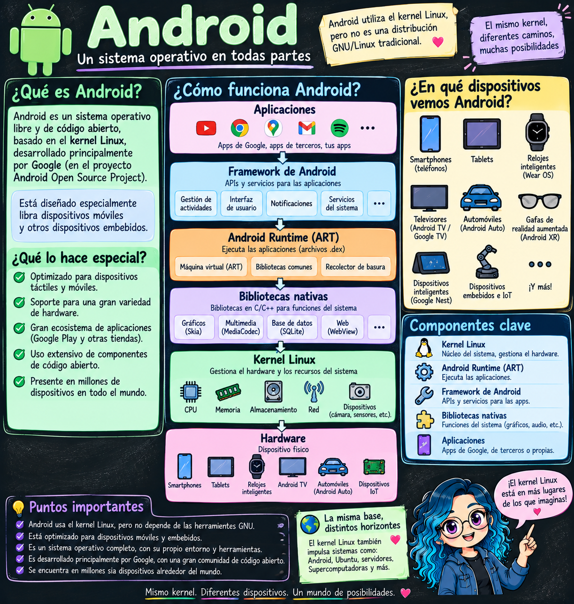
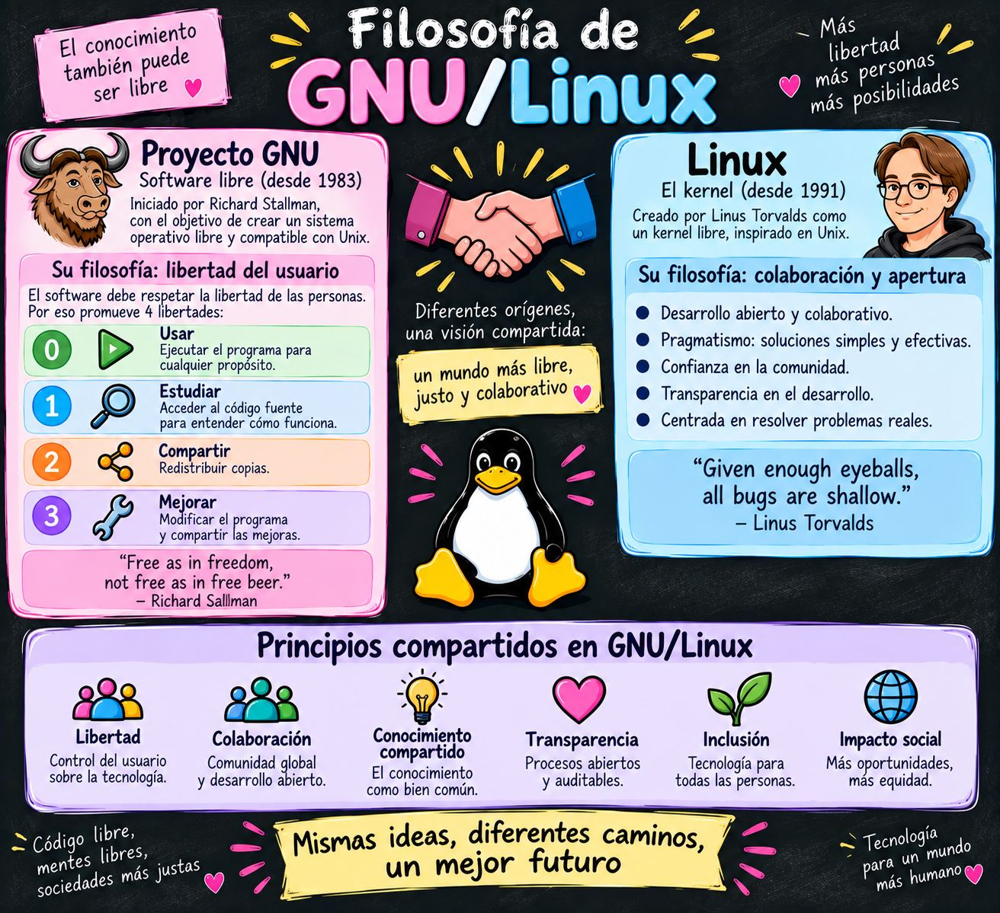
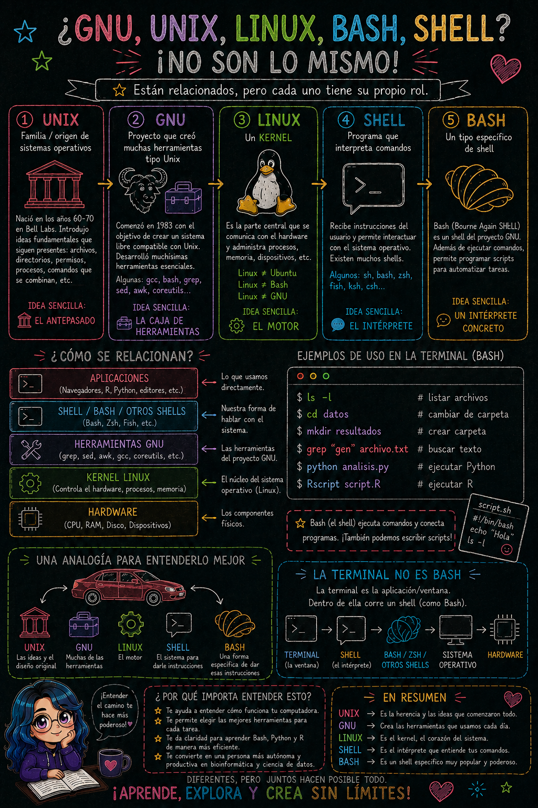

# Introducción a Linux/Unix

> **Fecha:** 17 de septiembre, 2026

::: content-box-gray
**Objetivos:**

1.  Comprender la historia y filosofía de Linux/Unix
2.  Entender qué es GNU y su importancia en el software libre
3.  Diferenciar entre Linux, GNU y GNU/Linux
4.  Reconocer las principales versiones y distribuciones de GNU/Linux
5.  Valorar la importancia del software libre y de código abierto
6.  Aplicar este conocimiento en la selección de sistemas operativos
:::

## ¿Qué es UNIX?

- Sistema operativo (SO) creado por **Ken Thompson y Dennis Ritchie** de la empresa *Bell Laboratories* de AT&T en 1969.
- Es uno de los sistemas operativos **más influyentes en la historia** de la computación y ha servido como base para muchos sistemas operativos modernos.

### **Características principales de Unix:**

- **Portabilidad**: Fue diseñado para funcionar en diferentes tipos de hardware, lo que permitió su adopción generalizada.
- **Modularidad**: Sigue la filosofía "hacer una cosa y hacerla bien", donde cada programa tiene una función específica.
- **Multitarea y multiusuario**: Permite que múltiples usuarios trabajen simultáneamente en el mismo sistema, y que múltiples procesos se ejecuten al mismo tiempo.
- **Interfaz de línea de comandos (CLI,** *Command-Line Interface***)**: Utiliza un shell (intérprete de comandos) para que los usuarios interactúen con el sistema.
- **Seguridad**: Implementa un sistema de permisos y usuarios para proteger los archivos y recursos del sistema.

{fig-align="center"}

# 🌿 UNIX comienza a tener descendientes

Con el tiempo aparecieron distintas versiones de UNIX.

**🌱 Surgen dos rama:**

- Una de las ramas importantes fue [**System V**](https://es.wikipedia.org/wiki/System_V), desarrollada por AT&T.

Pero otra rama tendría una historia especialmente interesante.

- **En 1977 - Aparece BSD:** En la Universidad de California, Berkeley, investigadores comenzaron a trabajar con UNIX y desarrollaron [**BSD (Berkeley Software Distribution, Berkeley Unix)**](https://en.wikipedia.org/wiki/Berkeley_Software_Distribution).

📖 **1988 — POSIX pone reglas comunes**

- Con tantos sistemas diferentes, era necesario establecer estándares.
- **POSIX no es un sistema operativo.**
- Es un conjunto de estándares que define interfaces y comportamientos comunes.
- Su objetivo es facilitar la **compatibilidad entre sistemas tipo Unix**.

> “Si seguimos ciertas interfaces y comportamientos comunes, será más fácil que programas y herramientas funcionen en diferentes sistemas.”

{alt="Imagen creada con ChatGPT." fig-align="center"}

::: callout-note
**macOs** es considerado el **hijo directo**; mientras **Linux** es el **hijo** **adoptado**; y **Windows** es el **vecino** con otra familia construyendo su propia casa.\
\
Aquí hay más contexto: **macOS** puede verse como un descendiente más directo porque su base, **Darwin**, incorpora código y tecnología de la familia **BSD**, y BSD sí desciende históricamente de UNIX. En cambio, **Linux fue escrito desde cero por Linus Torvalds**: no deriva del código fuente de UNIX, aunque fue diseñado siguiendo muchos de sus conceptos y convenciones. Por eso se le llama **Unix-like**.
:::

## GNU/Linux

::::: columns
::: {.column width="60%"}
- En 1983 **Richard Stallman** lideró la iniciativa [GNU](https://www.gnu.org/) (GNU's Not Unix), SO compatible con UNIX de libre distribución y acceso sin restricciones al código fuente.

- En 1991 **Linus Torvalds** creó su propio [kernel](https://linuxjourney.com/lesson/kernel-overview) (Linux), que es la parte del SO que permite la comunicación con los componentes de Hardware. Este **kernel** fue distribuido de forma libre y gratuita.

- Linux decía algo así:

  > 🐧 “No nací de tu código (UNIX), pero me gustan muchas de tus ideas.”
:::

::: {.column width="40%"}
{fig-align="right"}
:::
:::::

::: callout-note
Un **kernel** es el **núcleo del sistema operativo**. Es el software que actúa como intermediario entre los programas y el hardware de la computadora.

El kernel se encarga principalmente de **administrar los recursos de la computadora**: decide qué procesos utilizan el CPU y cuándo, administra la memoria RAM, permite acceder a discos y otros dispositivos, controla procesos y facilita que los programas se comuniquen con el hardware.
:::

Ambos proyectos se juntaron y se creó **GNU/Linux ...**

{alt="Imagen generada con Gemini." fig-align="center"}

### Pero hay un matiz importante

No fue que Linus dijera en 1991: **«voy a crear GNU/Linux»**.

Linux era su propio proyecto. La comunidad comenzó a combinar el **kernel Linux con el software del proyecto GNU** y otros componentes para construir sistemas completos.

De ahí surgieron muy pronto distribuciones de Linux y posteriormente distribuciones conocidas como Debian, Red Hat, Ubuntu, etc.

Y esto explica algo que suele confundir mucho:

**Linux ≠ GNU ≠ GNU/Linux**

Además, Linux **no está obligado a utilizar GNU**. El mejor ejemplo es **Android**: utiliza el **kernel Linux**, pero no es una distribución GNU/Linux convencional.

[{fig-align="center"}](Imagen creada con ChatGPT.)

::: callout-note
Entonces decir **“Linux es un sistema operativo”** es común en el lenguaje cotidiano, pero técnicamente, cuando hablamos específicamente de **Linux**, estamos hablando del **kernel**. Cuando alguien dice “uso Linux”, normalmente quiere decir que utiliza **una distribución basada en el kernel Linux**, como Ubuntu, Debian o Fedora.
:::

## Ubuntu no es LINUX

- Una de las distribuciones de GNU/Linux más populares.
- Combina: kernel Linux + herramientas GNU + bibliotecas + gestor de paquetes + software + entorno de escritorio + muchos otros componentes.
- Está basada en [Debian](https://www.debian.org/) y fue desarrollada por la empresa [*Canonical*](https://canonical.com/)
- Facilidad de uso e instalación.
- Interfaz de usuario amigable.

{fig-align="center" width="205"}

::: {.callout-caution icon="false"}
**🐧 Linux = kernel**\

**🟠 Ubuntu =** sistema operativo que usa el kernel Linux + GNU + muchos otros componentes.\

**🤖 Android =** otro sistema operativo que también usa el kernel Linux, pero construye un entorno diferente alrededor de él.
:::

## Filosofía "Software Libre y Código abierto"

- El [software libre](https://www.gnu.org/philosophy/free-sw.html) se refiere a las libertades mencionadas, no al precio.
- ["open source"](https://opensource.org/) vs ["free software"](https://www.gnu.org/philosophy/free-sw.html).

|   | 🕊️ Free Software | 💻 Open Source |
|---------------------|--------------------------|--------------------------|
| Traducción | Software libre | Código abierto |
| Énfasis | **Libertad del usuario** | **Modelo de desarrollo y acceso al código** |
| Pregunta central | “¿Qué libertades tengo?” | “¿Cómo podemos desarrollar y mejorar este software?” |
| Movimiento asociado | [Free Software Foundation](https://www.fsf.org/) | [Open Source Initiative](https://opensource.org/) |
| Figura histórica | Richard Stallman | Eric Raymond, Bruce Perens y otros |
| Código fuente disponible | ✅ | ✅ |
| Modificar | ✅ | ✅ según licencia |
| Redistribuir | ✅ | ✅ según licencia |
| Motivación característica | Ética y libertad | Colaboración, calidad, transparencia, desarrollo |

## 🐧 ¿Y GNU/Linux dónde queda?

- Los usuarios son libres de **ejecutar, copiar, distribuir, estudiar, cambiar y mejorar** el software.
- El kernel Linux, por ejemplo, utiliza la licencia **GPLv2**, por lo que cumple criterios tanto de **software libre como de código abierto**. Muchas herramientas GNU también son ambas cosas.

{alt="Imagen creada con Gemini." fig-align="center"}

## Shell = Intérprete de línea de comandos

- **Shell** es la categoría general. Es un programa que interpreta comandos **(CLI)** y permite la comunicación entre el usuario y el SO.

- La mayoría de distribuciones de Linux tienen por defecto [*bash*](https://www.gnu.org/software/bash/) ("Bourne Again SHell") como *shell*. Hay [otros tipos de shell](https://www.educba.com/types-of-shells-in-linux/) como `sh, csh, tcsh, ksh, zsh`, entre otras.

- Shell es la categoría/interfaz; No es una lenguaje de programación.

### Bash / Bash Shell

- Lenguaje de programación; más específicamente un **lenguaje de programación/scripting y un shell.**
- Bash es un intérprete de comandos que te permite realizar tareas de forma rápida y sencilla, además de automatizarlas mediante scripts.

{fig-align="center" width="363"}

## Tabla comparativa de lo que usaremos

|   | `Git Bash` (Windows) | `Bash` (Linux) | `Zsh (Z Shell)` (macOS) |
|----|----|----|----|
| ¿Qué es? | Bash adaptado para Windows | Bash ejecutándose de forma nativa | Otro shell compatible en gran parte con Bash |
| Sistema | Windows | Linux | macOS |
| Shell | `bash` | `bash` | `zsh` |
| Entorno Unix real | ❌ No completamente | ✅ Sí | ✅ Sí, macOS es Unix |
| `grep`, `sed`, `cut`, `sort`… | ✅ incluidos por Git for Windows | ✅ herramientas GNU normalmente | ✅ herramientas Unix/BSD |
| Rutas | `/c/Users/Evelia/` | `/home/evelia/` | `/Users/evelia/` |
| Configuración típica | `~/.bashrc` | `~/.bashrc` | `~/.zshrc` |
| Compatibilidad entre comandos básicos | Muy alta | — | Muy alta |

En resumen ...

{fig-align="center"}

## Material suplementario

Si quieren aprender temas más sobre UNIX, GNU/Linux, bash, emulador de terminal y otros tema, pueden explorar los siguientes recursos, que son de acceso libre:

- Kross, S. (2017). *The unix workbench*. Leanpub. <https://leanpub.com/unix>
- Ross, A. (2019). *The Ultimate Linux Newbie Guide*. <https://linuxnewbieguide.org/>
- Shotts, W. (2019). *The Linux command line: a complete introduction*. No Starch Press. <http://www.linuxcommand.org/tlcl.php/index.php>
- Linux Journey. (2020). Linux Journey. <https://linuxjourney.com/>
- GNU. (2020). GNU. <https://www.gnu.org/>
- [GNU/Linux para bioinformatica](https://rsg-ecuador.github.io/unix.bioinfo.rsgecuador/content/Curso_basico/01_Unix_GNU-Linux/1_Conceptos_Unix_GNU_Linux.html)
- [The Story of Unix, POSIX, Linux, macOS, and Windows](https://medium.com/@rajamanii/the-story-of-unix-posix-linux-macos-and-windows-f8252c091be0)
