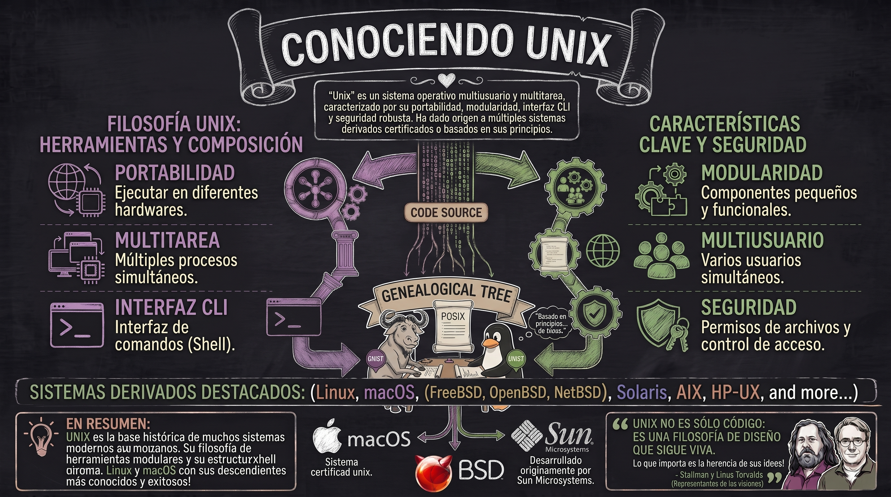
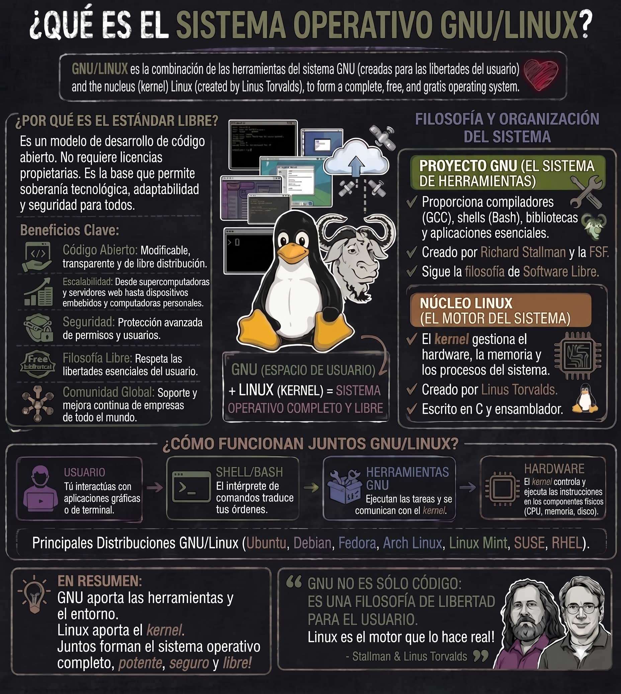
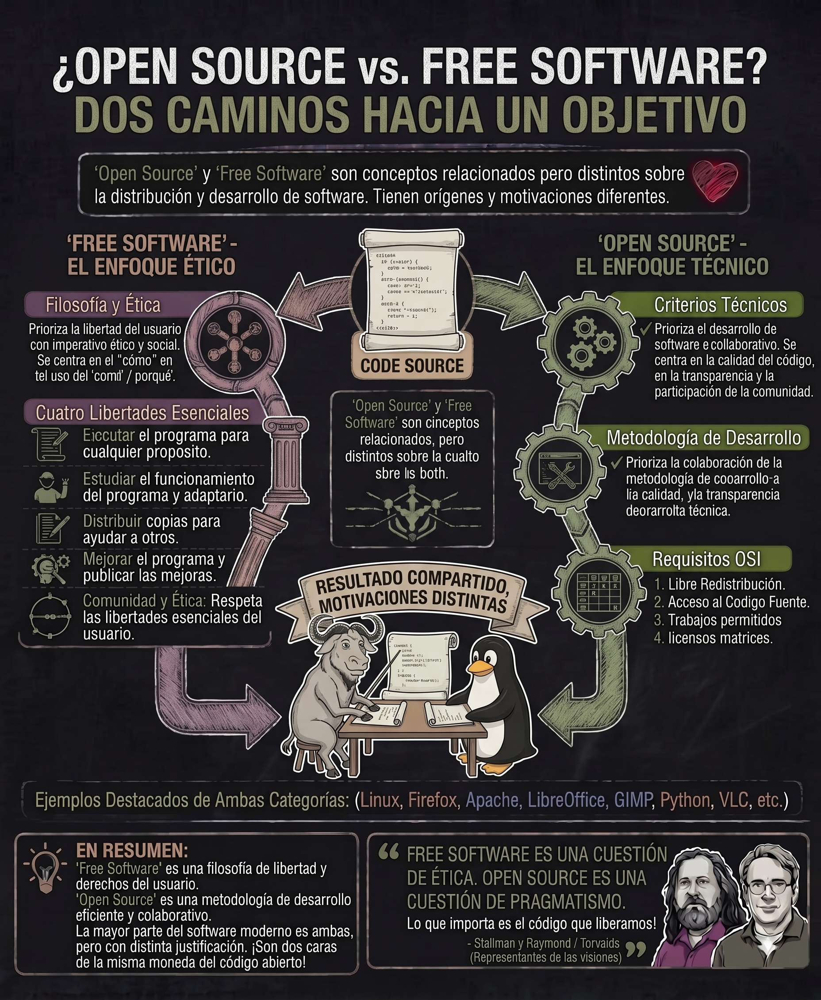

# Introducción a Linux/Unix

::: content-box-gray
**Objetivos:**

1.  Comprender la historia y filosofía de Linux/Unix
2.  Entender qué es GNU y su importancia en el software libre
3.  Diferenciar entre Linux, GNU y GNU/Linux
4.  Reconocer las principales versiones y distribuciones de GNU/Linux
5.  Valorar la importancia del software libre y de código abierto
6.  Aplicar este conocimiento en la selección de sistemas operativos
:::

## ¿Qué es UNIX?

- Sistema operativo (SO) creado por **Ken Thompson y Dennis Ritchie** de la empresa *Bell Laboratories* de AT&T en 1969.
- Es uno de los sistemas operativos **más influyentes en la historia** de la computación y ha servido como base para muchos sistemas operativos modernos.

### **Características principales de Unix:**

- **Portabilidad**: Fue diseñado para funcionar en diferentes tipos de hardware, lo que permitió su adopción generalizada.
- **Modularidad**: Sigue la filosofía "hacer una cosa y hacerla bien", donde cada programa tiene una función específica.
- **Multitarea y multiusuario**: Permite que múltiples usuarios trabajen simultáneamente en el mismo sistema, y que múltiples procesos se ejecuten al mismo tiempo.
- **Interfaz de línea de comandos (CLI)**: Utiliza un shell (intérprete de comandos) para que los usuarios interactúen con el sistema.
- **Seguridad**: Implementa un sistema de permisos y usuarios para proteger los archivos y recursos del sistema.

{fig-align="center"}

## GNU/Linux

::::: columns
::: {.column width="60%"}
- En 1983 **Richard Stallman** lideró la iniciativa [GNU](https://www.gnu.org/) (GNU's Not Unix), SO compatible con UNIX de libre distribución y acceso sin restricciones al código fuente.
- En 1991 **Linus Torvalds** creó su propio [kernel](https://linuxjourney.com/lesson/kernel-overview) (Linux), que es la parte del SO que permite la comunicación con los componentes de Hardware. Este kernel fue distribuido de forma libre y gratuita.
- Ambos proyectos se juntaron y se creó **GNU/Linux**
:::

::: {.column width="40%"}
{fig-align="right"}
:::
:::::

En resumen ...

{fig-align="center"}

## Filosofía GNU/Linux

- Los usuarios son libres de **ejecutar, copiar, distribuir, estudiar, cambiar y mejorar** el software.
- El [software libre](https://www.gnu.org/philosophy/free-sw.html) se refiere a las libertades mencionadas, no al precio.
- ["open source"](https://opensource.org/) vs ["free software"](https://www.gnu.org/philosophy/free-sw.html).

{fig-align="center"}

## Ubuntu

- Una de las distribuciones de GNU/Linux más populares.
- Está basada en [Debian](https://www.debian.org/) y fue desarrollada por la empresa [*Canonical*](https://canonical.com/)
- Facilidad de uso e instalación.
- Interfaz de usuario amigable.

{fig-align="center" width="205"}

## Shell / Bash / Bash Shell

- La [*shell*](https://en.wikipedia.org/wiki/Unix_shell) es el programa que provee una **interfaz de línea de comandos (CLI)**, que permite la comunicación entre el usuario y el SO.
- La mayoría de distribuciones de Linux tienen por defecto [*bash*](https://www.gnu.org/software/bash/) ("Bourne Again SHell") como *shell*. Hay [otros tipos de shell](https://www.educba.com/types-of-shells-in-linux/) como `sh, csh, tcsh, ksh, zsh`, entre otras.

{fig-align="center" width="363"}

Bash es un intérprete de comandos que te da el poder de hacer tareas simples rápidamente.

## Material suplementario

Si quieren aprender temas más sobre UNIX, GNU/Linux, bash, emulador de terminal y otros tema, pueden explorar los siguientes recursos, que son de acceso libre:

- Kross, S. (2017). *The unix workbench*. Leanpub. <https://leanpub.com/unix>
- Ross, A. (2019). *The Ultimate Linux Newbie Guide*. <https://linuxnewbieguide.org/>
- Shotts, W. (2019). *The Linux command line: a complete introduction*. No Starch Press. <http://www.linuxcommand.org/tlcl.php/index.php>
- Linux Journey. (2020). Linux Journey. <https://linuxjourney.com/>
- GNU. (2020). GNU. <https://www.gnu.org/>
- [GNU/Linux para bioinformatica](https://rsg-ecuador.github.io/unix.bioinfo.rsgecuador/content/Curso_basico/01_Unix_GNU-Linux/1_Conceptos_Unix_GNU_Linux.html)
