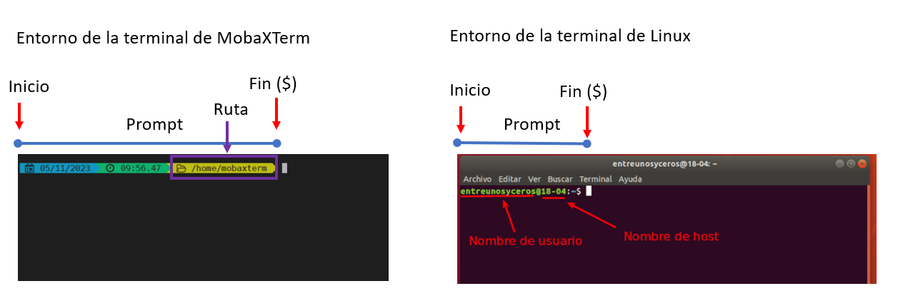
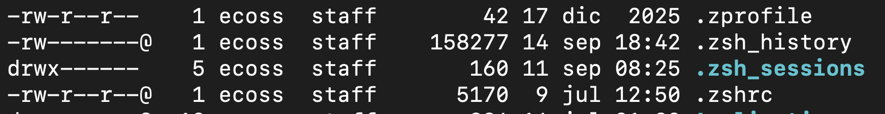
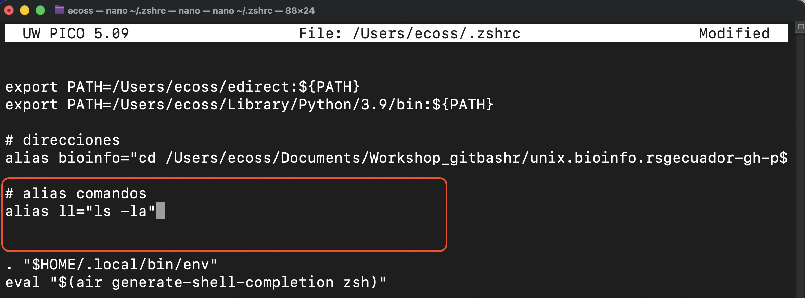
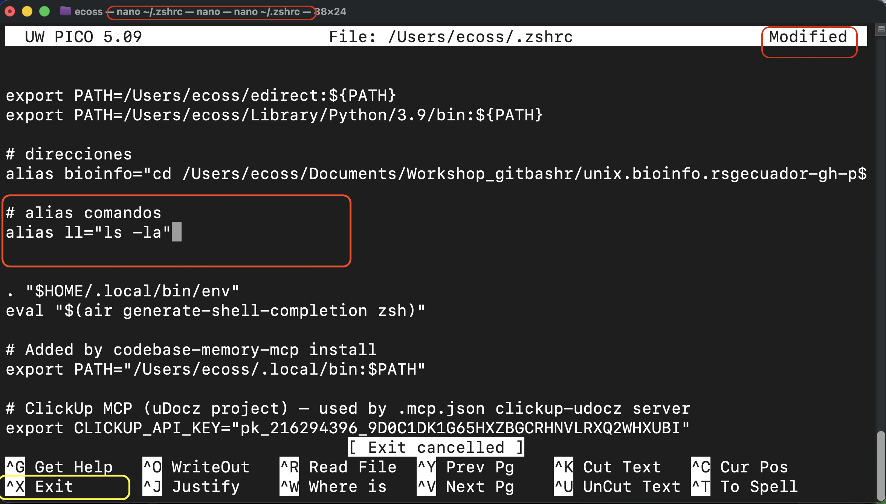
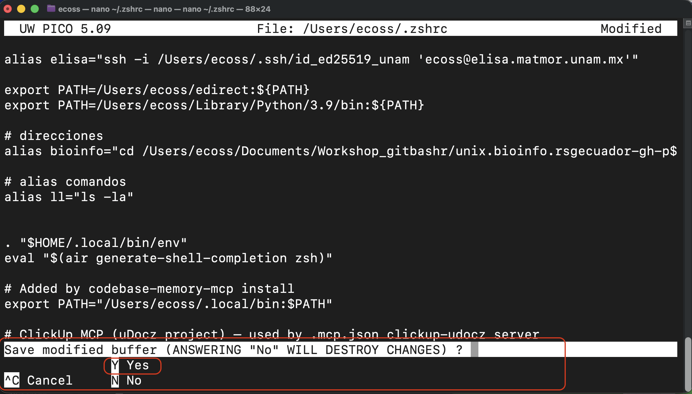
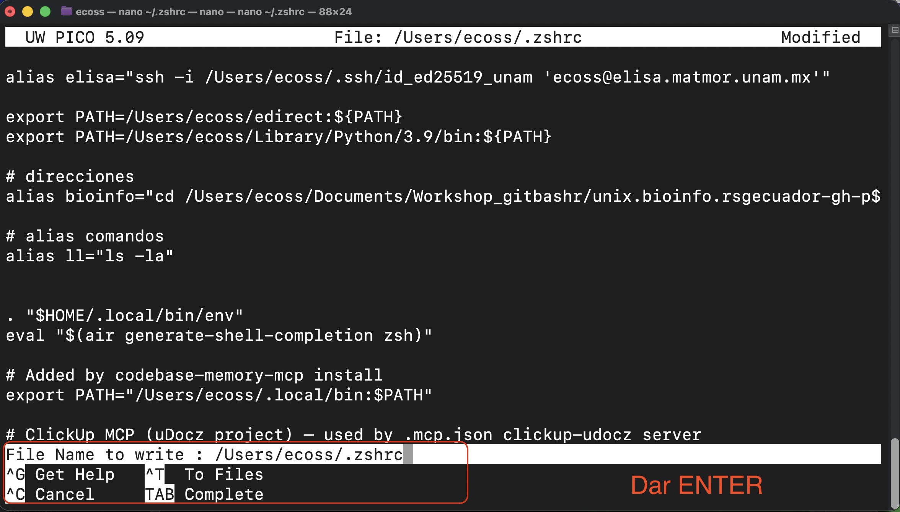
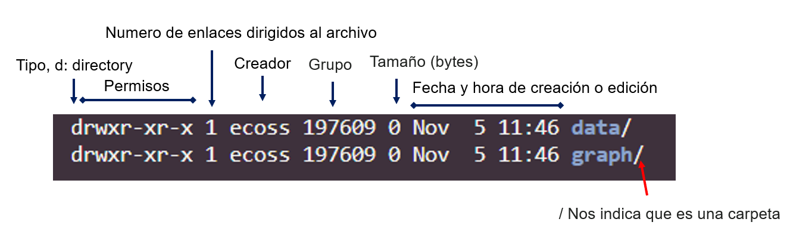
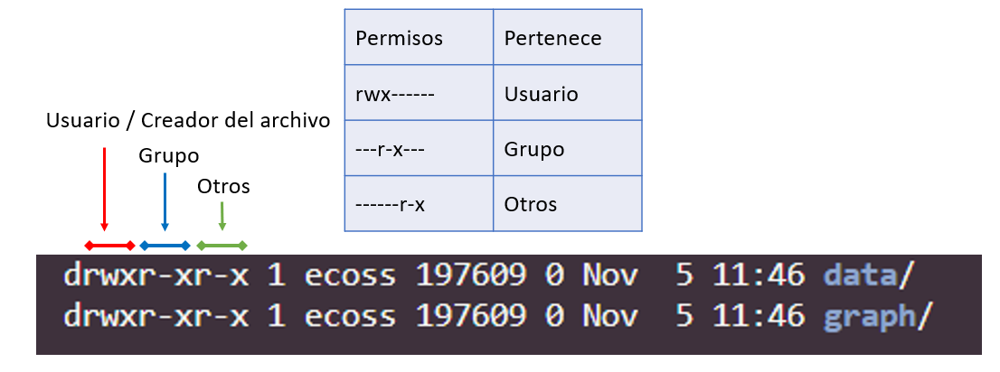

# Mis primeros pasos en Bash

> **Fecha:** 17 de septiembre, 2026

## Entorno de Bash



El signo `$` es un **prompt**, que nos muestra que la terminal está esperando una entrada; tu terminal puede usar un carácter diferente como prompt y puede agregar información antes de él. Al teclear comandos, ya sea a partir de estas lecciones o de otras fuentes, no escribas el prompt (*\$*), sólo los comandos que le siguen.

## Entorno de zsh en macOs

{fig-align="center"}

::: callout-note
## Decoración de terminal

Puedes decorar tu terminal con [oh my zsh](https://ohmyz.sh/) si tienes macOS.
:::

## Preparación del directorio de trabajo

- Ruta / Camino absoluto

  ``` {.bash code-copy="true" eval="false"}
  cd /home/usuario/data/
  ```

- Ruta / Camino relativo

  ``` {.bash code-copy="true" eval="false"}
  cd ../ # Ir a la carpeta anterior
  ```

::: callout-note
**NOTA 1:** Si das `cd` y no indicas una ruta absoluta, te llevara al Directorio Raiz (\~).

**NOTA 2:** Puedes usar la tecla TAB para completar el nombre de la carpeta. En caso de que tengas más de dos carpetas que inicien igual, tendrás que terminar de completar el nombre.
:::

## Conocer mi dirección / ubicación

Averiguemos dónde estamos, ejecutando el comando `pwd` (que significa "imprime directorio de trabajo" - "print working directory"). En cualquier momento, nuestro **directorio actual** es nuestro directorio predeterminado, es decir, el directorio que la computadora supone queremos ejecutar comandos a menos que especifiquemos explícitamente otra cosa. En este caso la respuesta de la computadora es `/Users/nelle`, el cual es el directorio de inicio de Nelle, también conocido como su directorio **home**:

``` {.bash code-copy="true" eval="false"}
pwd # /c/Users/ecoss
```

En la computadora de Evelia, el sistema de archivos se ve así:

[{fig-align="center"}](https://swcarpentry.github.io/shell-novice-es/02-filedir.html)

En la parte superior está el **directorio raíz** o **root** que contiene todo lo demás. Nos referimos a este directorio usando un caracter de barra `/` por si solo; esta es la barra al inicio de `/Users/ecoss`.

Dentro de ese directorio hay otros directorios: `bin` (que es donde se almacenan algunos programas preinstalados), `data` (para archivos de datos diversos), `Users` (donde se encuentran los directorios personales de los usuarios), `tmp` (para archivos temporales que no necesitan ser almacenados a largo plazo), etcétera.

::: callout-note
## Ejercicio 1

A partir de `/Users/ecoss/data/`, ¿Cuál de los siguientes comandos podría Evelia usar para navegar a su directorio de inicio, que es `/Users/ecoss`?

1.  `cd .`

2.  `cd /`

3.  `cd /home/ecoss`

4.  `cd ../..`

5.  `cd ~`

6.  `cd home`

7.  `cd ~/data/..`

8.  `cd`

9.  `cd ..`

    ::: {.callout-tip collapse="true" icon="false"}
    ## Solución

    1.  No: `.` significa el directorio actual.

    2.  No: `/` significa el directorio raíz.

    3.  No: El directorio **home** de Evelia es `/Users/ecoss`.

    4.  No: sube dos niveles, es decir termina en `/Users`.

    5.  Sí: `~` significa el directorio **home** del usuario, en este caso `/Users/amanda`.

    6.  No: esto navegaría a un directorio `home` en el directorio actual, si existe.

    7.  Sí: innecesariamente complicado, pero correcto.

    8.  Sí: un atajo para volver al directorio **home** del usuario.

    9.  Sí: sube un nivel.
    :::
:::

Ejemplo de rutas:

{fig-align="center"}

## Comandos propios de Bash = *builtins*

Un **builtin** (*comando interno*) es un comando que **forma parte del propio shell**. En Bash, significa que Bash puede ejecutarlo directamente, sin tener que buscar un programa externo dentro de las carpetas de `/bin` o `/usr/bin`.

| Builtin | ¿Qué hace? |  Argumentos |
|---------------|----------------------------|------------------------------|
| `cd` | Cambia de directorio | `cd /home/usuario/data/` |
| `pwd` | Muestra el directorio actual\* | `pwd` |
| `echo` | Imprime texto\* | `echo "Hello world"` |
| `read` | Lee datos del usuario | `read nombre` |
| `export` | Exporta variables | `export CURSO="Bash"` |
| `alias` | Crea alias | `alias ll="ls -la"` |
| `history` | Muestra el historial | `history` |
| `source` | Ejecuta comandos de un archivo en el shell actual | `source ~/.zshrc` |
| `type` | Indica qué tipo de comando es | `type cd` |
| `help` | Ayuda de los builtins de Bash | `help cd` |

\* `pwd` y `echo` son casos interesantes porque Bash tiene versiones builtin, aunque también pueden existir ejecutables externos con esos nombres.

Coloca en la terminal lo siguiente y Bash les dirá que son *shell builtins*.

``` bash
type cd
type read
type echo
```

> Bash puede interpretar lo que escribes y, dependiendo del comando, **ejecutarlo él mismo o buscar un programa externo** dentro de las carpetas de `/bin` o `/usr/bin`.

## Comandos externos

| Comandos | Información | Argumentos |
|----------------|------------------------|----------------------------|
| `ssh` | Conexión a servidores | `ssh usuario@servidor.mx` |
| `ls` | Observar el contenido de los archivos en una carpeta | `ls directorio/` |
| `mkdir` | Crear un nuevo directorio | `mkdir data` |
| `rmdir` | Eliminar el directorio | `rmkdir -rf data` |
| `nano` / `vim` | Editores de texto plano | nano Archivo.txt / vim Archivo.txt |
| `cp` | Copiar archivos | `cp Archivo1.txt /home/usuario/data/` |
| `mv` | Mover un archivo o carpeta / renombrar archivo o capeta |  |
| `chmod` | Cambiar permisos del usuario | `chmod 777 data/` |
| `rsync` | Descargar o subir archivos |  |
| `scp` | Descargar o subir archivos |  |
| `cat` | Visualizar contenido de un archivo. Escribe el contenido del archivo de manera secuencial a la salida estándar, a la ventana de Terminal. |  |
| `less` | Leer contenido de un archivo sin interrumpir la pantalla de Terminal. Similar a `Vim` pero sin opción para escribir. **Se sale del modo visualización con** q. |  |
| `find` | Busca archivos en un directorio específico. |  |
| `head` | Visualizar primeras líneas de un archivo. |  |
| `tail` | Visualizar últimas líneas de un archivo. |  |
| `which` | Indica el directorio donde se encuentra un particular comando o programa que se haya podido encontrar usando los directorios guardados en la variable de estado `PATH`. | `which bash` |

::: callout-note
## Ayuda de funciones

Puedes consultar mas información usando `man ls`
:::

## ¿Cómo encuentra Bash los programas externos?

Contamos con una variable llamada `$PATH`. Siendo la lista de lugares donde Bash busca programas ejecutables.

En la terminal escriban y ejecuten:

``` bash
echo $PATH
```

Eso conecta directamente con la filosofía Unix de **herramientas pequeñas que hacen tareas específicas y pueden combinarse**.

> **🐚 Bash no “contiene” todos los comandos que usamos. Algunos son internos (*builtins*) y otros son programas externos que Bash busca y ejecuta.**

## Vamos a crear un alias

El archivo de configuración personal (Windows y linux: `~/.bashrc`; macOs = `~/.zshrc`) guarda instrucciones que permiten decidir **cómo queremos que se comporte y se vea nuestro shell** cada vez que iniciamos una sesión interactiva.

1.  Dentro del **HOME**, vamos a ejecutar el siguiente comando para ver los archivos ocultos en listas:

``` bash
ls -la
```

{fig-align="center"}

Cada uno de estos archivos contiene información importante para nuestro sistema:

| Archivo | ¿Qué es? | Ejemplo de lo que contiene |
|---------------|-----------------------------|-----------------------------|
| `~/.zprofile` | 🚀 **Configuración al iniciar sesión.** Se lee al iniciar una sesión de Zsh tipo *login*. | Variables de entorno, `$PATH` |
| `~/.zshrc` | ⚙️ **Configuración de Zsh interactivo.** Personaliza cómo trabajas en la terminal. | Alias, prompt, plugins, funciones, `$PATH` |
| `~/.zsh_history` | 🕒 **Historial de comandos.** Guarda los comandos que has ejecutado. | `cd`, `ls`, `grep`, `git status` |

2.  Vamos a abrir nuestro archivo de configuración personal (Windows y linux: `~/.bashrc`; macOs = `~/.zshrc`) con el editor de texto `nano`.

**Para Windows/Linux usar `~/.bashrc`**

Si no aparece el archivo `~/.bashrc` en Windows, vas a tener que crearlo con:

``` bash
nano ~/.bashrc
```

**Para macOS**

``` bash
nano ~/.zshrc
```

::: callout-note
En Git Bash para Windows, `~/.bashrc` puede no existir inicialmente. Esto no significa que Bash esté mal instalado; simplemente podemos crearlo si lo necesitamos.
:::

3.  Cuando el archivo este abierto vamos a buscar un renglón hasta abajo que este libre. No vamos a cambiar nada arriba.

``` bash
alias ll="ls -la"
```

Tu archivo debe verse como este:

{fig-align="center"}

4.  Para guardar el archivo y salir debes dar **Ctrl+X.**

{fig-align="center"}

5.  Después aparecerá un mensaje para confirma si quieres guardar los cambios y tecleamos Y. Con esto estaremos confirmando el cambio en el archivo.

{fig-align="center"}

6.  Para salir de ediciones da ENTER.

{fig-align="center"}

7.  Vamos a cargar el archivo de configuración personalmente con el comando `source:`

**En Windows y Linux:**

``` bash
source ~/.bashrc
```

**En macOs:**

``` bash
source ~/.zshrc
```

8.  Ahora vamos a probar nuestro nuevo alias en la terminal. Copia y ejecuta:

``` bash
ll
```

Verás que hace lo mismo que `ls -la.`

## Consultar información sobre archivos y directorios

### **Información contenida**

Cada columna en la salida anterior tiene un significado:

[](https://eveliacoss.github.io/RNAseq_classFEB2024/Presentaciones/Dia1_AspectosGenerales.html#74)

### **Permisos**

Cada usuario tiene permisos diferentes cuando crea un archivo. Los permisos pueden modificarse con `chmod`.

Los caracteres atribuidos a los permisos son:

- `r` : escritura (Read)

- `w` : lectura (Write)

- `x` : ejecución (eXecute)

En el siguiente ejemplo, el usuario cuenta con todos los permisos activos, mientras que el grupo y otros tienen solo permisos de lectura y ejecución.

[](https://eveliacoss.github.io/RNAseq_classFEB2024/Presentaciones/Dia1_AspectosGenerales.html#75)

## **`chmod`:** Cambiar permisos

La representación octal de chmod es muy sencilla

- `r` = Lectura tiene el valor de 4

- `w` = Escritura tiene el valor de 2

- `x` = Ejecución tiene el valor de 1

| Permisos | Valor | Significado                    |
|:--------:|:-----:|:-------------------------------|
|   rwx    |   7   | Lectura, escritura y ejecución |
|   rw-    |   6   | Lectura, escritura             |
|   r-x    |   5   | Lectura y ejecución            |
|   r--    |   4   | Lectura                        |
|   -wx    |   3   | Escritura y ejecución          |
|   -w-    |   2   | Escritura                      |
|   --x    |   1   | Ejecución                      |
|   ---    |   0   | Sin permisos                   |

Por lo tanto:

| Forma larga              | Forma Octal |
|:-------------------------|-------------|
| `chmod u=rwx,g=rwx,o=rx` | `chmod 775` |
| `chmod u=rwx,g=rx,o=`    | `chmod 760` |
| `chmod u=rw,g=r,o=r`     | `chmod 644` |
| `chmod u=rw,g=r,o=`      | `chmod 640` |
| `chmod u=rw,go=`         | `chmod 600` |
| `chmod u=rwx,go=`        | `chmod 700` |

## Comprimir y descomprimir archivos

Los archivos pueden contener diversos tipos de extensiones, dependiendo del objetivo será necesario descomprimirlos y en otros dejarlos comprimidos para no abarcar tanto espacio en tu espacio de trabajo. 

| Tipo de archivo | Comprimir | Descomprimir |
|------------------------|------------------------|------------------------|
| Carpeta.tar | `tar -cvf carpeta.tar /dir/a/comprimir/carpeta` | `tar -xvf carpeta.tar` |
| Carpeta.tar.gz | `tar -czvf carpeta.tar.gz /carpeta/a/empaquetar/carpeta` | `tar -zxvf carpeta.tar.gz` |
| Carpeta.gz | `gzip -9 carpeta.gz carpeta/a/empaquetar/carpeta` | `gunzip -kd carpeta.gz` |
| Carpeta.zip | `zip -r carpeta.zip carpeta` | `unzip carpeta.zip` |

::: callout-note
## Ejercicio 2

1.  Crea una carpeta llamada `respaldo`.

``` bash
mkdir respaldo
```

2.  Crea dentro de ella los archivos uno.txt, dos.txt y tres.txt. Usa el comando

``` bash
touch respaldo/uno.txt respaldo/dos.txt respaldo/tres.txt
```

3.  Configura los tres archivos con permisos `rw-r-----`.

Recuerda que:

- rw- = 6
- r-- = 4
- --- = 0

``` bash
chmod 640 respaldo/*.txt
```

Y comprueba que si se cambiaron los permisos con `l`s -l respaldo\`.

3.  Comprime la carpeta completa en un archivo llamado `respaldo.zip`

``` bash
zip -r respaldo.zip respaldo/
```

La opción:

- `-r` → comprime de forma recursiva la carpeta y su contenido

4.  Elimina la carpeta `respaldo` (la que no esta comprimida).

``` bash
rm -r respaldo
```

5.  Comprueba que la carpeta ya no existe.

``` bash
ls
```

La carpeta respaldo ya no deberá aparecer, pero sí: `respaldo.zip`.

6.  Recupera la carpeta utilizando `respaldo.zip`. Es decir, descomprime la carpeta `respaldo.zip`.

``` bash
unzip respaldo.zip
```

7.  Comprueba que los tres archivos fueron recuperados.

``` bash
ls respaldo
```

8.  Revisa sus permisos.

``` bash
ls -l respaldo
```
:::

## Material suplementario

- Software Carpentry. [La terminal de Unix](https://swcarpentry.github.io/shell-novice-es/02-filedir.html)
- RSG Ecuador.[GNU/Linux para bioinfomatica](https://rsg-ecuador.github.io/unix.bioinfo.rsgecuador/content/Curso_avanzado/02_Bash/1_bash.html)
- [Introduction to the Unix Shell for Transcriptomics](https://github.com/raynamharris/Shell_Intro_for_Transcriptomics/tree/master)Tutorial.
