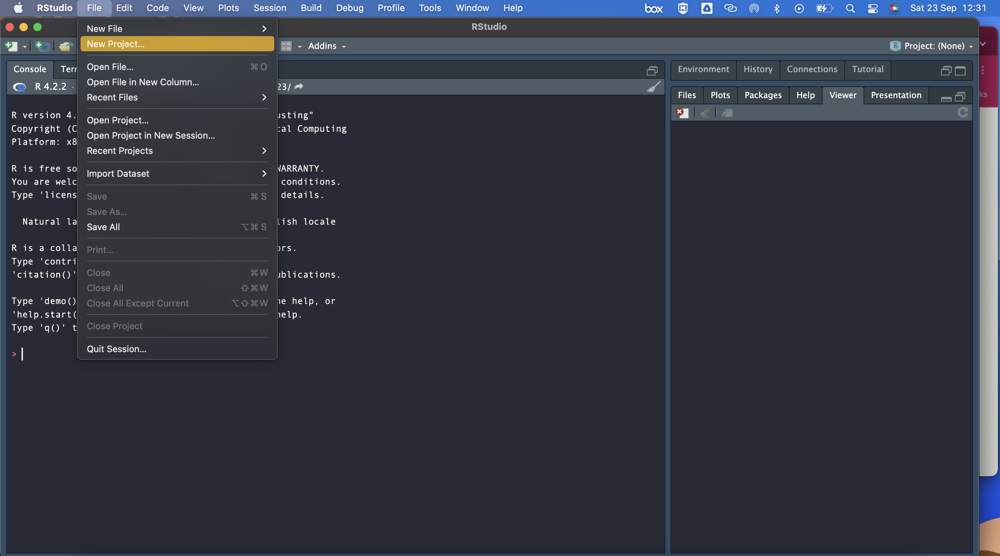
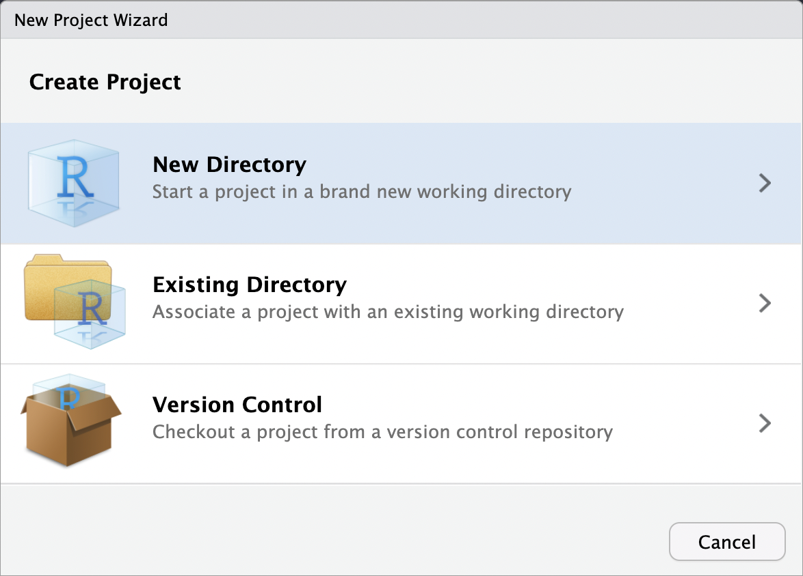
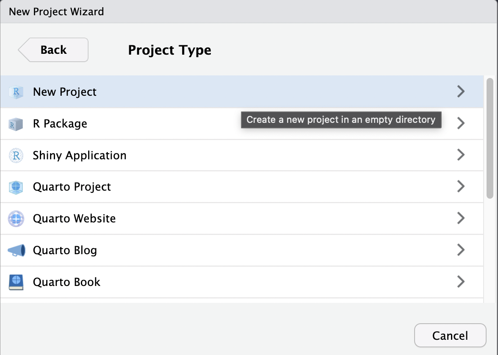
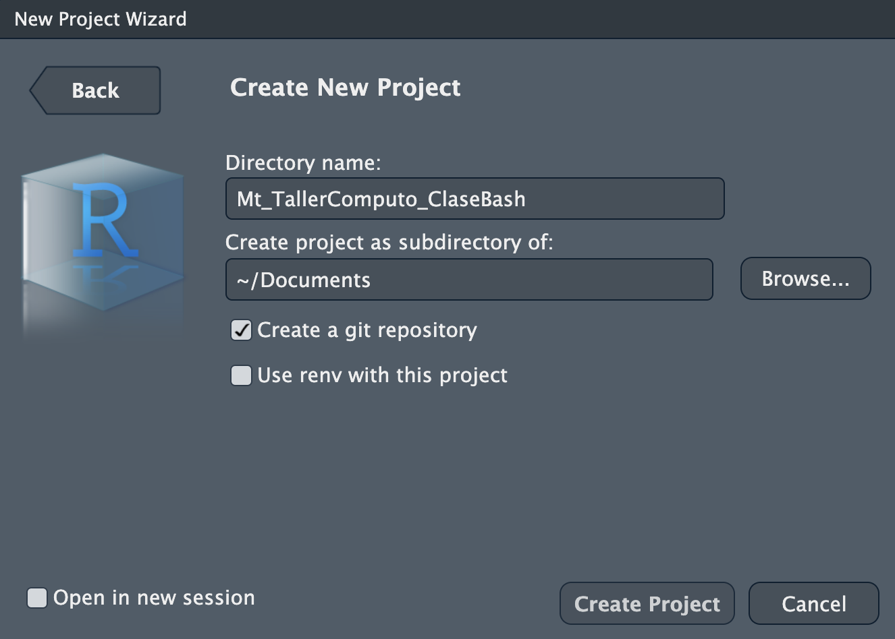
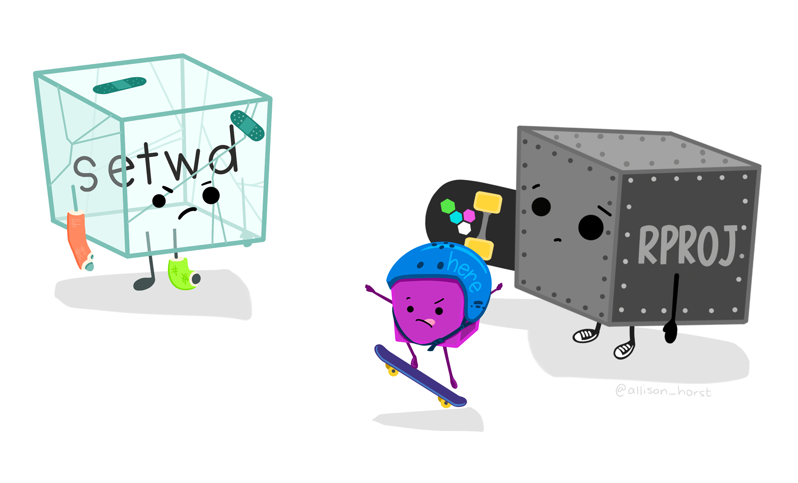
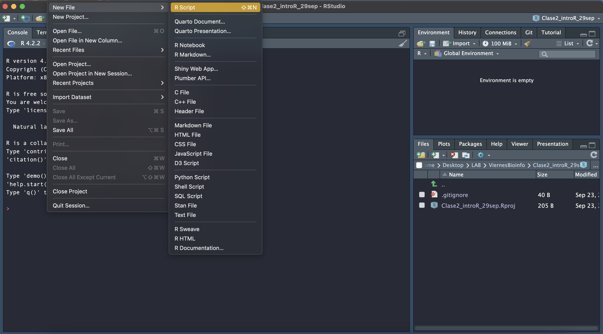
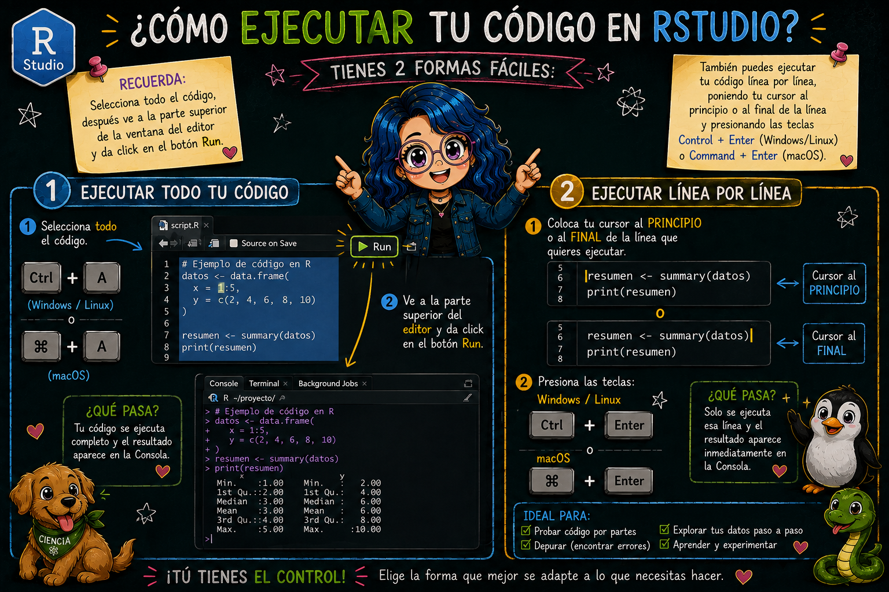
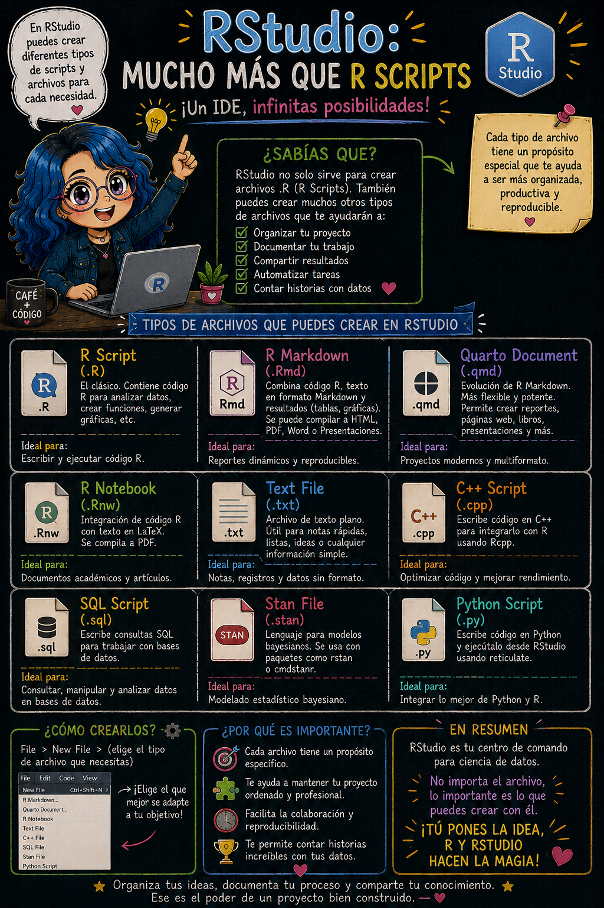

# Crear un R Project

> **Fecha:** 22 de septiembre, 2026

Al comenzar a trabajar con R y RStudio, ya sea para crear un programa para un proyecto, crear una aplicación, presentación, blog, paquete, etc, es recomendado crear un **R project**.

## ¿Qué es un R Project y por qué usarlo?

- **Carpeta de trabajo dedicada**: al crear un R Project, RStudio genera automáticamente una carpeta que contiene todos los archivos y configuraciones necesarias para tu proyecto.

- **Organización**: te permite mantener en un solo lugar tus scripts, datos, variables y documentos relacionados.

- **Reproducibilidad**: facilita que cualquier persona (incluido tú en el futuro) pueda abrir el proyecto y trabajar con el mismo entorno.

- **Integración con Git/GitHub**: al tener el mismo nombre que tu repositorio, se asegura una sincronización más clara y ordenada entre tu proyecto local y el repositorio remoto.

## **¿Cómo iniciamos un R project?**

1.  Vayamos en la parte superior al menú **Archivos \> Nuevo Proyecto**.



2.  Seleccionamos la opción de **Nuevo directorio**.



3.  Seleccionamos el tipo de projecto que vamos a iniciar, en nuestro caso **Nuevo proyecto**.



4.  Nombramos el folder que crearemos y seleccionamos en dónde queremos que se almacene.



**¡Felicidades, acabas de crear un R project!** Si vamos al folder en donde creamos nuestro proyecto, podemos observar que se creó un archivo con terminación **Rproj**, este es un archivo que contiene la configuración específica para nuestro proyecto.

[{fig-align="center" width="477"}](https://allisonhorst.com/git-github)

### Directorio de trabajo

Este archivo (**Rproj**) también establece como **directorio de trabajo** el folder en donde iniciamos el proyecto (puedes comprobarlo desde la consola de RStudio, escribiendo el comando `getwd()`). Esto es muy conveniente puesto que así podemos asegurarnos de que vamos a acceder a los archivos que estén exclusivamente en nuestro entorno de trabajo.

Coloca en la consola dentro de Rstudio:

```{r}
getwd()
```

## Crear un Rscript

Para comenzar a trabajar en un proyecto, necesitamos crear un archivo para escribir nuestro programa. Entra en **Archivo \> Nuevo Archivo**.

Podemos ver que tenemos distintas opciones de archivos que podemos crear, en este caso vamos a crear nuestro primer **Rscript**.



### **¿Qué es un Rscript?**

Es simplemente un archivo de texto con las instrucciones de nuestro algoritmo escritas en el lenguaje de R. También contiene nuestros comentarios escritos con `#`.

Intenta escribir tu primer Rscript en el **editor**, copiando el siguiente algoritmo para realizar una suma:

```{r}
a <- 2
b <- 3
suma = a + b
suma
```

## **¿Cómo ejecutamos el código?**

Selecciona todo el código, después ve a la parte superior de la ventana del **editor** y da click en el botón **Run**. También pueden ejecutar tu código línea por línea, poniendo tu cursor al principio o al final de la linea y presionando las teclas **Control + Enter** o **Command + Enter**.

{fig-align="center"}

## Hay más que solo Rscripts

{fig-align="center"}
