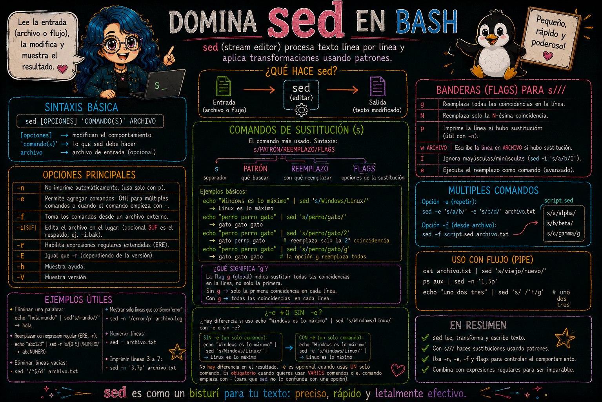
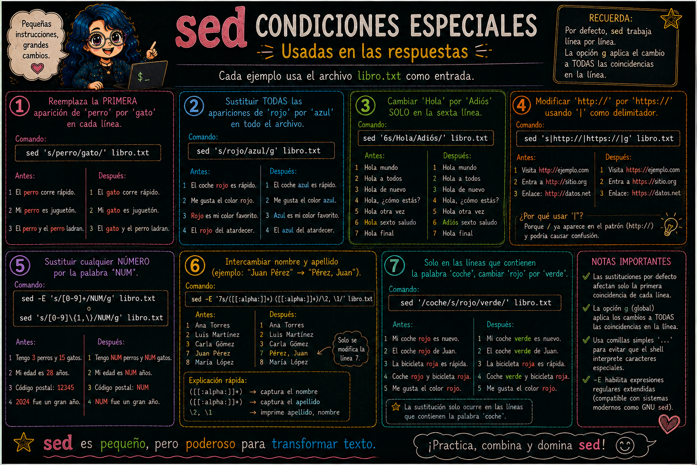

# Edición de archivos con el editor de flujo `sed`

> **Fecha:** 24 de septiembre, 2026

`sed` (stream editor) es un **editor de flujo**, una potente herramienta de tratamiento de texto para el sistema operativo UNIX que acepta como entrada un archivo, lo lee y modifica línea a línea de acuerdo a un script. `sed` permite manipular flujos de datos, como por ejemplo cortar líneas, buscar y reemplazar texto (con soporte de **expresiones regulares**), entre otras cosas.

Algunas de las operaciones más primordiales de sed son el cambio de saltos de líneas, la sustitución de espacios por comas o tabulaciones, la deleción o adición de strings, etc.

La sintaxis general de la orden `sed` es:

``` {.bash code-copy="true" eval="false"}
sed [-n] [-e'script'] [-f archivo] archivo1 archivo2 ...
```

donde:

::: {.callout-note icon="false"}
## Explicación

- `-n` indica que se suprima la salida estándar.
- `-e` indica que se ejecute el script que viene a continuación.
- `-f` indica que las órdenes se tomarán de un archivo.
:::

#### Ejemplo de sustitución con `sed`

Sustituciones `s///` de palabras: `s/esto/aquello/`

``` {.bash code-copy="true" eval="false"}
echo "Windows es lo máximo" | sed 's/Windows/Linux/'
```

En el ejemplo anterior, la modificación se hace solamente en la primer instancia que el comando encuentra. Pero esto no nos funciona si tenemos 400 repeticiones de Windows que queremos cambiar a Linux. Para que funcione debemos hacer un cambio de la siquiente manera:

``` {.bash code-copy="true" eval="false"}
echo "Windows es un sistema operativo ampliamente utilizado." > archivo.txt
cat archivo.txt
sed 's/Windows/Linux/g' archivo.txt
```

Esta letra **g** que agregamos, indica hacer las sustituciones de manera **global**, es decir en todas las ocurrencias o repeticiones dentro de un archivo.

{fig-align="center"}

:::: {.callout-note icon="false"}
## Ejercicio 8: Práctica de sustituciones

1.  Verifica que te encuentres en la carpeta con el comando: `pwd`
2.  Cámbiate de carpeta si es necesario con el comando `cd`
3.  Descarga el archivo `libro.txt` de mi Github.
4.  Explora este archivo con `cat libro.txt` ó `less libro.txt` ó `head libro.txt`
5.  Sustituye la palabra "perro" de cada una de las filas por la palabra "gato" y una vez hecho el cambio redirige el resultado a un archivo llamado "`libro_gato.txt`".
6.  Corrobora tus resultados y discute posibles soluciones alternas.

Como pudiste darte cuenta, el archivo está separado por tabulaciones entre columna y columna. Si quisieras además, cambiar el formato del archivo de separación por tabulaciones a separación por comas, ¿qué pasos extra agregarías a tu código? Discute qué hace cada parte del código.

::: {.callout-tip collapse="true" icon="false"}
## Solución

``` bash
sed 's/perro/gato/g' libro.txt >> libro_gato.txt
```
:::
::::

{fig-align="center"}

:::: {.callout-note icon="false"}
## Ejercicio 9: Más sobre `sed`

Seguiremos usando el contenido del archivo `libro.txt` para revisar las siguientes sustituciones:

1.  Reemplaza la primera aparición de `perro` por `gato` en cada línea.
2.  Sustituir todas las apariciones de `rojo` por `azul` en todo el archivo.
3.  Cambiar `Hola` por `Adiós` solo en la sexta línea.
4.  Modificar `http://` por `https://` usando `|` como delimitador.
5.  Sustituir cualquier número por la palabra `NUM`. NOTA: En **sed clásico (POSIX básico)**, el `+` no es reconocido como cuantificador a menos que uses la opción `-E` (o `-r` en GNU sed).
6.  Intercambiar nombre y apellido (ejemplo: "Juan Pérez" → "Pérez, Juan").
7.  Solo en las líneas que contienen la palabra `coche`, cambiar `rojo` por `verde.`

::: {.callout-tip collapse="true" icon="false"}
## Solución

``` bash
1. sed 's/perro/gato/' libro.txt
2. sed 's/rojo/azul/g' libro.txt
3. sed '6s/Hola/Adiós/' libro.txt
4. sed 's|http://|https://|g' libro.txt
5. sed -E 's/[0-9]+/NUM/g' libro.txt o sed 's/[0-9]\{1,\}/NUM/g' libro.txt # La sintaxis \{n,m\} indica cuántas veces debe repetirse el patrón anterior.
6. sed -E '7s/([[:alpha:]]+) ([[:alpha:]]+)/\2, \1/' libro.txt 
7. sed '/coche/s/rojo/verde/' libro.txt
```
:::
::::


### Referencias

- [RegEx](https://www.rexegg.com/regex-quickstart.php)
- [Wikipedia: Expresiones Regulares](https://es.wikipedia.org/wiki/Expresi%C3%B3n_regular)
- [YouTube: Expresiones regulares con Notepad++](https://www.youtube.com/watch?v=OIxDMnBp-2g)
