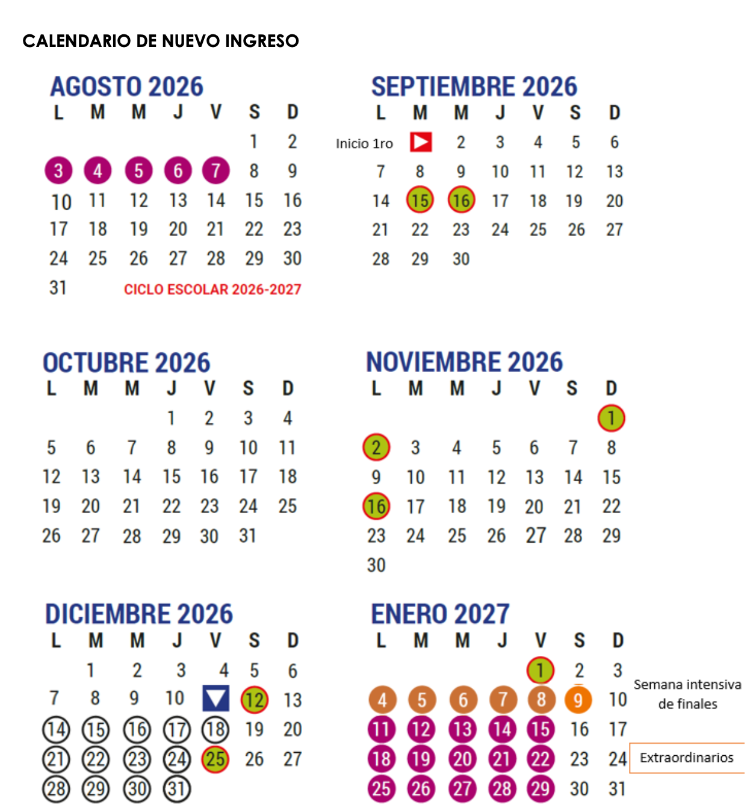

# Sistema de evaluación + DOC

> **Fecha:** 01 de septiembre, 2026

¡ No tendremos un examen final !

## **Distribución de calificación**

```         
Tareas Individuales:        20-25%
Trabajos en Equipo:         20-25%
Quizzes:                    15-20%
Puntos Extras (Top 3):      +1 punto máximo por alumno (no es transferible)
Proyecto Final Integrador:  35-40%
─────────────────────────────────
TOTAL:                      100%
```

#### Calendario

{fig-align="center"}

#### SISTEMA DE PUNTOS EXTRAS - TOP 3 KAHOOT

**Estructura:**

- Duración: 10 minutos
- Formato: Preguntas de opción múltiple
- Temas: Conceptos vistos en la semana anterior
- Frecuencia: Cada martes

**Requisitos:**

- Estar en el top 3 (primeros 3 lugares) en Kahoot
- Acumular 10 veces en el top 3 = +1 punto extra
- El punto NO no es transferible (no se pueden pasar a otro estudiante)
- Máximo +1 punto extra por persona

## References

- [Plan de estudio de la materia](https://docs.google.com/document/d/17rDksWqGWQqDFUMFqzgVF_BXnBDP3KMUrysgxIPGv9U/edit?usp=sharing)
