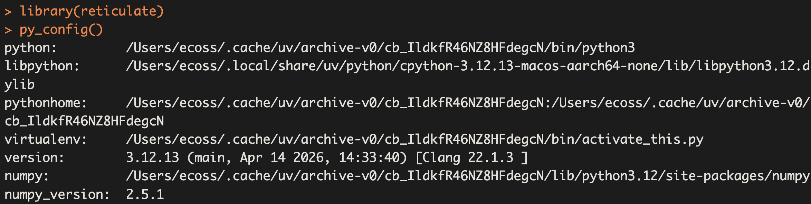
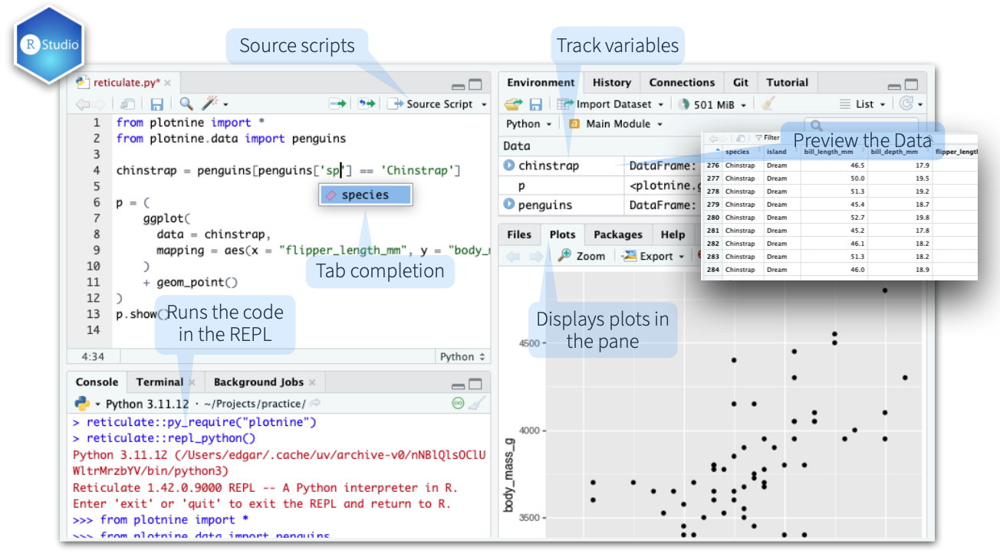

# Instalación de Python y reticulate en Rstudio

> **Fecha:** 08 de septiembre, 2026

## Windows - Python

- Descargar desde [python.org](https://www.python.org/downloads/windows/) o instalar vía Microsoft Store.

- Durante la instalación, marcar la opción **“Add Python to PATH”**.

- Alternativa recomendada: usar `reticulate::install_miniconda()` desde RStudio para crear un entorno aislado.

- Verificar instalación:

``` bash
python --version
pip --version
```

## macOS - Python

- **Opción Homebrew** (más sencilla y actualizada):

  En la terminal de `Bash`:

  ```         
  brew install python
  python3 --version # Python 3.12.13
  ```

- **Opción instalador oficial**: descargar el `.pkg` desde [python.org](https://www.python.org/downloads/mac-osx/).

- Importante: no usar el Python que viene con macOS en `/usr/bin/python3`, ya que es antiguo y reservado para el sistema.

- Tras instalar, agregar al **PATH** si es necesario. En la terminal de `Bash`:

  ```         
  export PATH="/usr/local/bin:$PATH" # NO corras esto
  ```

## Linux - Python

- **Debian/Ubuntu**:

  bash

  ```         
  sudo apt update
  sudo apt install python3 python3-pip
  ```

- **Fedora/RHEL**:

  ```         
  sudo dnf install python3 python3-pip
  ```

- **Recomendación avanzada**: usar pyenv para manejar múltiples versiones sin tocar el Python del sistema.

  ```         
  curl https://pyenv.run | bash
  pyenv install 3.12.3
  pyenv global 3.12.3
  ```

## Integración con RStudio con Reticulate

1.  Instalar el paquete `reticulate` en R, coloca en la consola el siguiente código:

```{r, eval=FALSE}
install.packages("reticulate")
```

2.  En la terminal de Bash busca la ubicación de Python3

``` bash
which python3
```

En mi caso se encuentra en: `/Users/ecoss/.cache/uv/archive-v0/cb_IldkfR46NZ8HFdegcN/bin/python3`

3.  Configurar la versión de Python en RStudio: Menú: **Tools \> Global Options \> Python** → pega la ubicación que obtuviste.
4.  Reinicia la Sesión de Rstudio y revisa la configuración:

```{r}
library(reticulate)
py_config()
```

En la consola debe aparecerte algo así:

{fig-align="center"}

Visualización del uso de Python en Rstudio con Reticulate.

[{fig-align="center"}](https://rstudio.github.io/cheatsheets/html/reticulate.html)

## Referencias

- [Guía de reticulate](https://rstudio.github.io/cheatsheets/html/reticulate.html)
- [Usar Python con R con reticulate : : GUÍA RÁPIDA](https://rstudio.github.io/cheatsheets/translations/spanish/reticulate_es.pdf)
