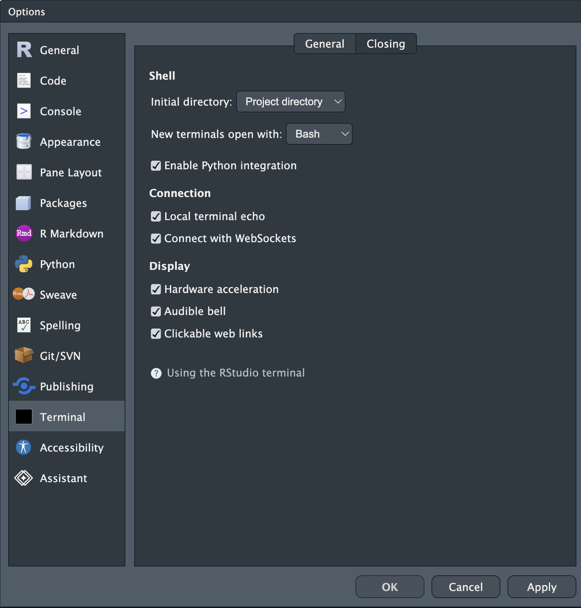
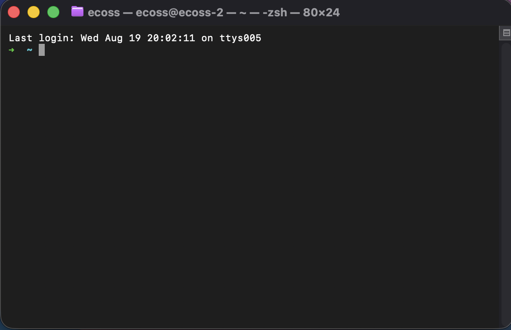
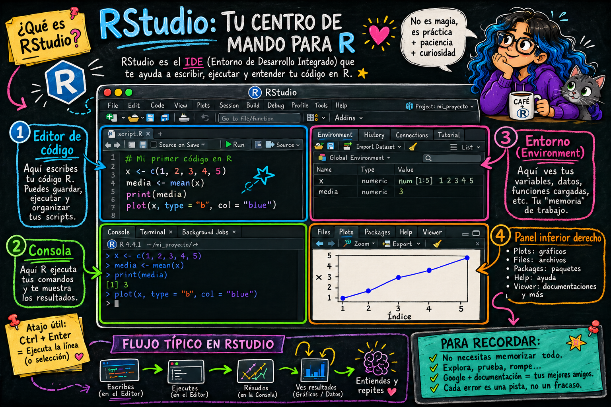

# Integración de Bash en la terminal de Rstudio

> **Fecha:** 08 de septiembre, 2026

En RStudio puedes abrir una terminal desde el menú: **Tools → Global options → Terminal →** Elegir en **New terminals open with → BASH**

### **Windows - Terminal Rstudio**

- Por defecto, RStudio abre **PowerShell** o **Command Prompt (cmd.exe)**.

- Si instalaste **Git for Windows**, también se instala **Git Bash**.

- En ese caso, RStudio detecta Git Bash y lo ofrece como opción en la terminal.

- Puedes configurar qué shell usar en: **Tools → Global Options → Terminal → New terminals open with…** Allí eliges *Git Bash*.

👉 Con Git Bash tendrás un entorno más parecido a Linux/macOS, ideal para enseñar comandos Bash.

### **macOS - Terminal Rstudio**

- La terminal de RStudio abre el shell por defecto del sistema.
- En RStudio **no necesitas instalar nada extra**: Bash ya viene incluido en macOS.

{fig-align="center"}

### **Linux - Terminal Rstudio**

- Igual que en macOS, la terminal abre el shell por defecto del sistema.
- Normalmente es **bash**, aunque algunas distribuciones usan **zsh**.

{fig-align="center"}
