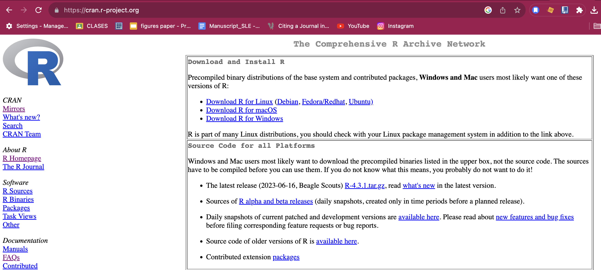
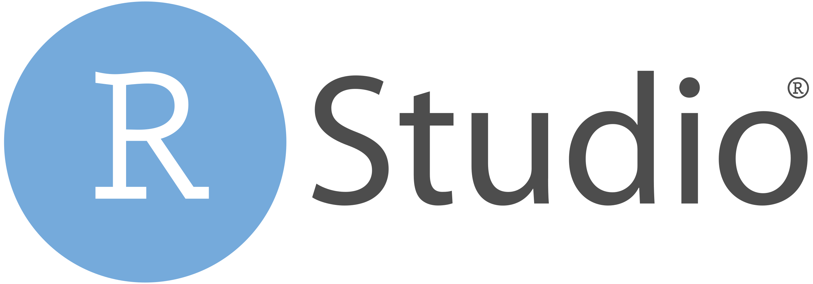
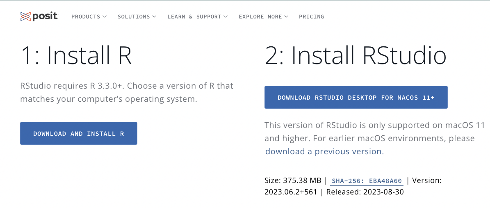
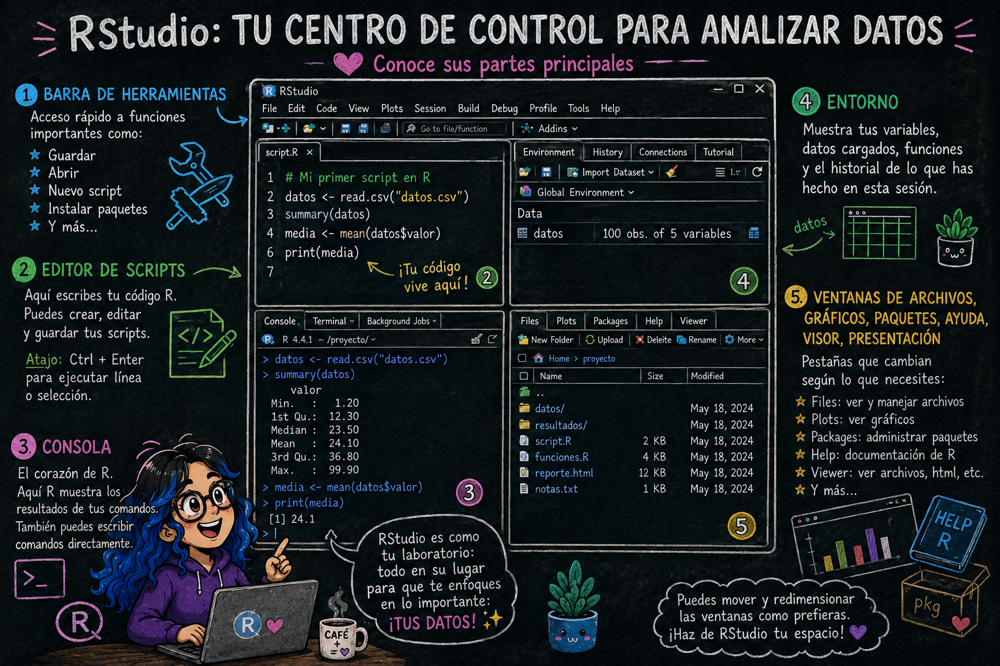
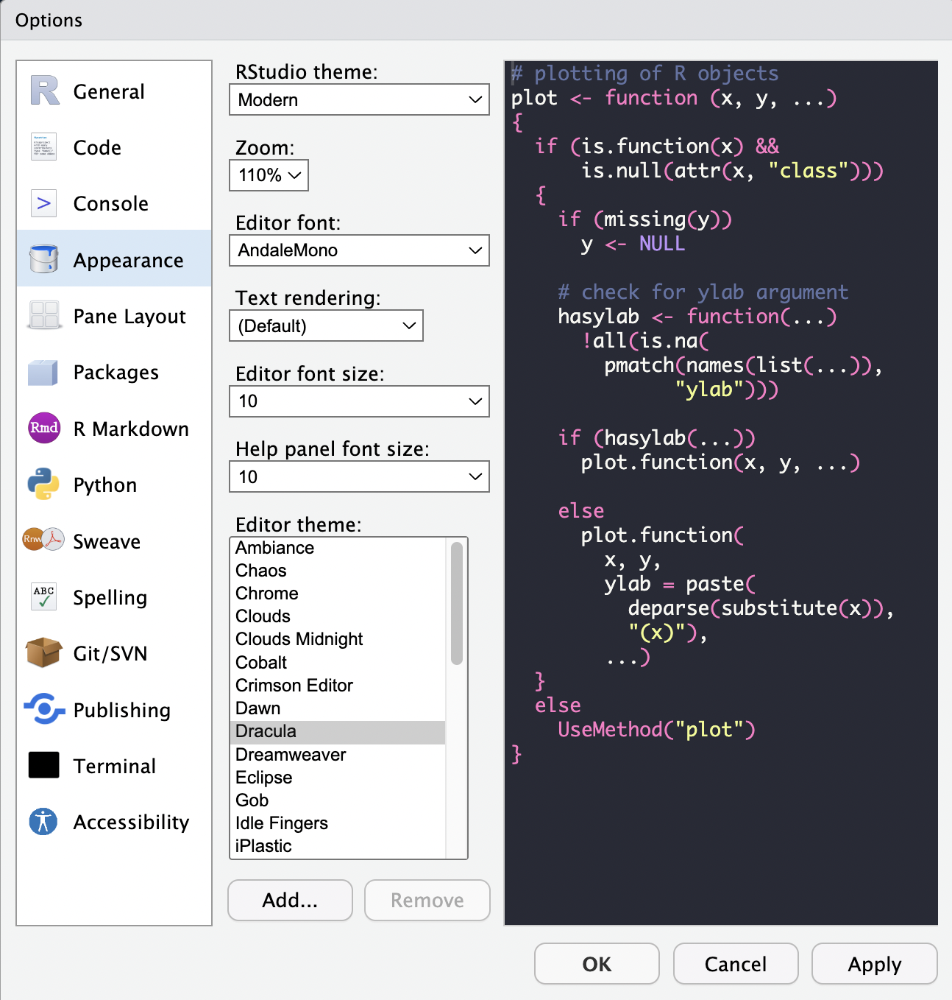

# Introducción a R y Rstudio

> **Fecha:** 08 de septiembre, 2026

## ¿Qué es R?

R es un entorno de desarrollo de software libre y lenguaje de programación.

::::: columns
::: {.column width="60%"}
**¿Por qué utilizar R?**

Es ampliamente utilizado para la *computación estadística, gráfica, y de machine learning*. Ofrece una amplia variedad de **funciones estadísticas** (modelos lineales y no lineales, pruebas estadísticas clásicas, análisis de series de tiempo, clasificación, agrupamiento, etc.), y para realizar gráficas.

Además, existen numerosas librerías que nos pemiten realizar análisis y más gráficas, incluyendo para análisis de datos genómicos.
:::

::: {.column width="40%"}
{fig-align="right" width="253"}
:::
:::::

## ¿Cómo instalamos R?

Para installar R, debemos de entrar a la página de [CRAN](https://cran.r-project.org/) "The Comprehensive R Archive Network". Al installar R, descargamos también \~ 25 paqueterías/librerías.

**CRAN** es una red en la que se archivan todas las versiones de R base, así como todos los paquetes para R que han pasado por un proceso de revisión riguroso, realizado por el CRAN Team.

## ¿Qué es RStudio?

RStudio es un **entorno de desarrollo integrado (IDE)** para R. Un IDE es una aplicación que ayuda a los programadores a *desarrollar código de una manera eficiente*. Nos proporciona una interfaz para poder editar código fuente, herramientas de ambiente, visualización, terminal y consola.

**RStudio Desktop** es una aplicación que se utiliza ampliamente para desarrollar programas en R, pero también podemos accesar al IDE de RStudio a través con [RStudio Server](https://posit.co/download/rstudio-server/), a través de un navegador web.

## ¿Cómo descargamos RStudio?

Podemos descargar RStudio desde [esta página](https://posit.co/download/rstudio-desktop/). Ya realizamos el paso 1: Install R.

En el paso 2: Install R studio, nos debería detectar el sistema operativo, descarguemos la versión recomendada en el botón **azul** y sigamos las instrucciones de instalación.

## Las partes de RStudio

{fig-align="center"}

## Cambiando el aspecto de RStudio

Podemos cambiar la forma en que se ve la aplicación desde **Editar \> Preferencias \> Apariencia**, escogemos el tema que nos guste y damos click en **Aplicar** y luego **OK**

{fig-align="center"}
