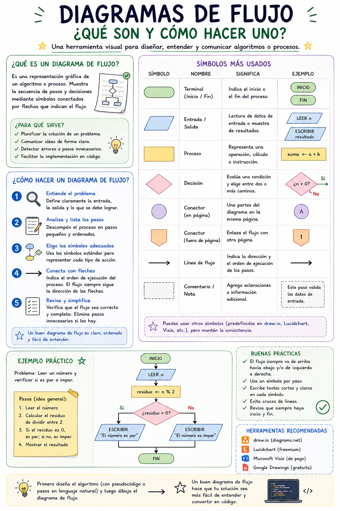
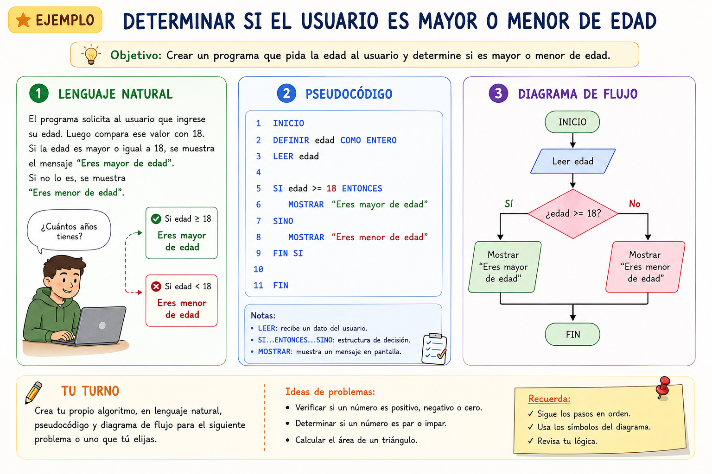

# **📚** **Actividad 1 en equipo -** Mi primer algoritmo

> **Fecha:** 03 de septiembre, 2026

## **Actividad en equipo: Instrucciones para los Estudiantes 📝**

En equipos de **3 estudiantes** van a analizar un problema cotidiano y lo van a documentar en lenguaje natural, pseudocódigo y diagrama de flujo. La entrega **será en hoja a mano**, y de manera opcional podrán utilizar colores para resaltar y organizar la información. Sube una foto en la[ tarea asiganda en Google classroom](https://classroom.google.com/c/ODcwNTg4NjExNzQ5/a/ODc1MjcyNDQwNjk0/details).

**\
Opciones sugeridas:**

1.  🍕 **Pedir comida a domicilio**
    - Desde entrar al sitio web hasta recibir la comida
2.  🚗 **Estacionar un auto en un estacionamiento**
    - Desde que llegas hasta que estacionas correctamente
3.  📚 **Buscar y reservar un libro en la biblioteca**
    - Desde que entras hasta que lo tienes en tus manos
4.  💳 **Retirar dinero de un cajero automático**
    - Desde que insertas la tarjeta hasta que obtienes el dinero
5.  🧺 **Lavar ropa en una lavadora**
    - Desde que separas la ropa hasta que está lista para secar
6.  🎮 **Jugar un videojuego desde el inicio**
    - Desde que enciendes la consola hasta que empiezas a jugar
7.  📱 **Descargar una aplicación en tu teléfono**
    - Desde que abres la tienda de aplicaciones hasta que la usas
8.  🎬 **Ver una película en una plataforma de streaming**
    - Desde que abres la aplicación hasta que la película está reproduciéndose
9.  ✈️ **Comprar un boleto de avión en línea**
    - Desde que buscas el vuelo hasta que recibes la confirmación
10. 🏥 **Agendar una cita médica por teléfono**
    - Desde que llamas hasta que tienes la cita confirmada

### **Paso a Paso:**

1.  **Escribe el problema** en lenguaje natural.
2.  Escribe el **objetivo** del programa.
3.  **Identifica los pasos principales** que debe seguir el algoritmo.
4.  **Escribe el pseudocódigo** con estructura clara y lógica.
5.  **Dibuja el diagrama de flujo** usando los símbolos correctos:
    - Óvalo: Inicio/Fin
    - Rectángulo: Proceso
    - Rombo: Decisión
    - Paralelogramo: Entrada/Salida
    - Flechas: Flujo
6.  **Verifica la coherencia** entre los tres elementos.
7.  **Revisa casos especiales** (errores, valores límite).
8.  Prepárate para explicar tu ejemplo en **5 minutos por equipo**.

