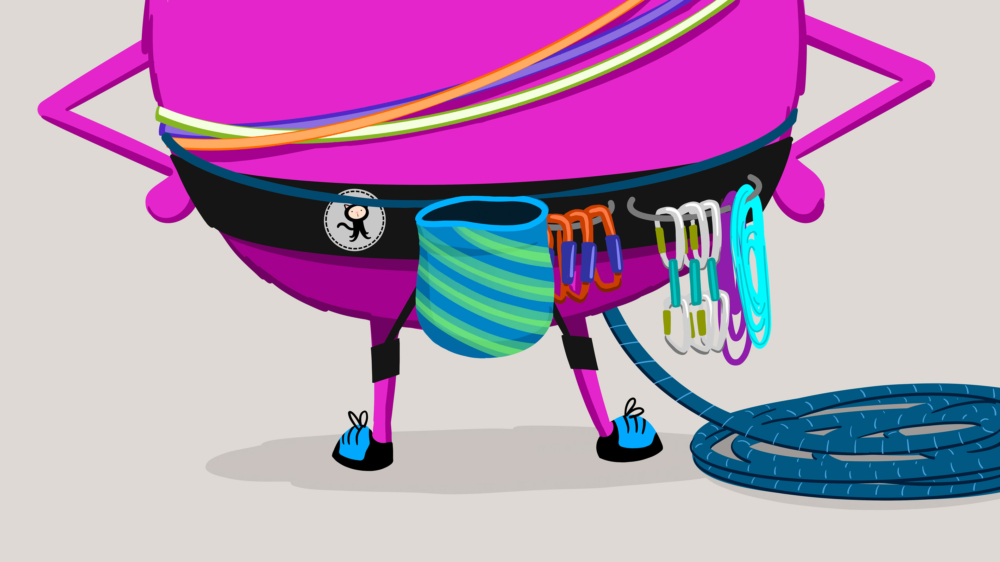
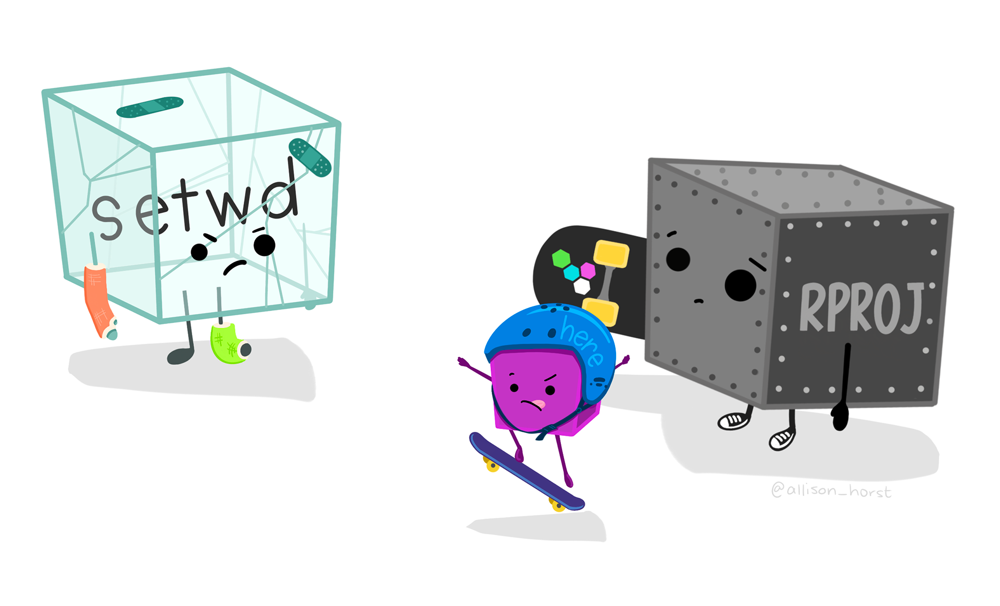
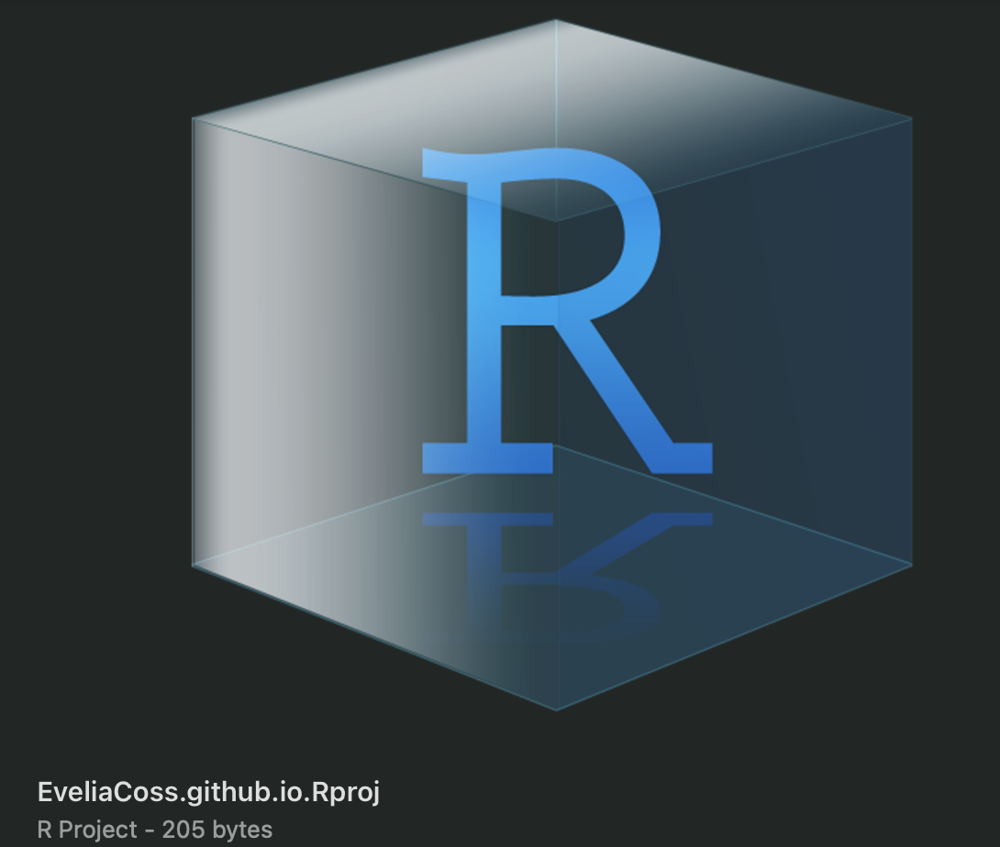
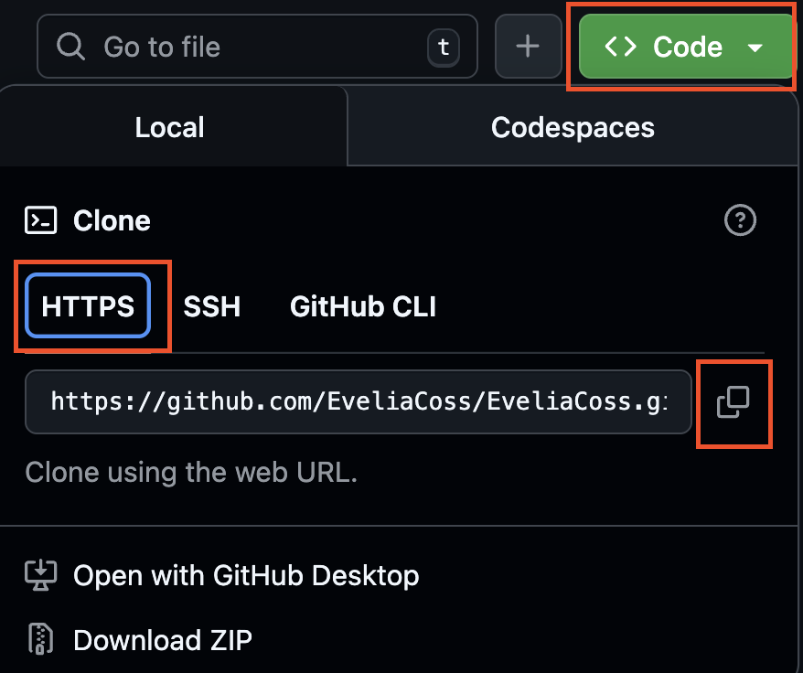
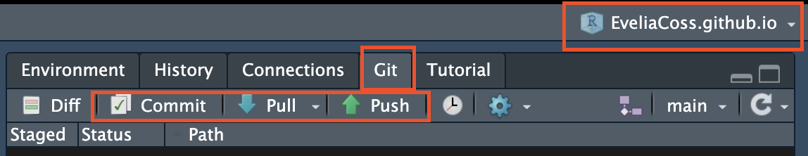
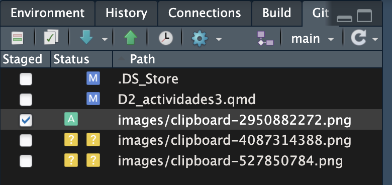
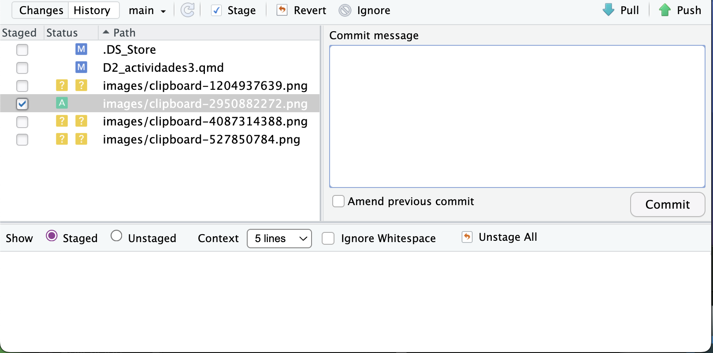
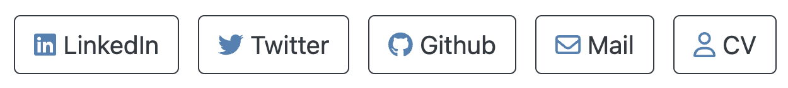

# **📚** Actividad 3: Página web con Rmarkdown

**Fecha:** 19 de febrero, 2026

{fig-align="center"}

Imagen tomada de: [Allison Horst](https://allisonhorst.com/git-github)

### ¿Qué es un RProject y por qué usarlo?

- **Carpeta de trabajo dedicada**: al crear un RProject, RStudio genera automáticamente una carpeta que contiene todos los archivos y configuraciones necesarias para tu proyecto.

- **Organización**: te permite mantener en un solo lugar tus scripts, datos, variables y documentos relacionados.

- **Reproducibilidad**: facilita que cualquier persona (incluido tú en el futuro) pueda abrir el proyecto y trabajar con el mismo entorno.

- **Integración con Git/GitHub**: al tener el mismo nombre que tu repositorio, se asegura una sincronización más clara y ordenada entre tu proyecto local y el repositorio remoto.



Imagen tomada de: [Allison Horst](https://allisonhorst.com/git-github)

# **📚** Actividades 3A, 3B y 3C

[](https://allisonhorst.com/horst-hill-collaborations)

Imagen tomada de: [Allison Horst](https://allisonhorst.com/horst-hill-collaborations)

::: callout-note
## 📕 Actividad 3A: Crear un Rproject para el repositorio de GitHub

1.  Da clic en **File/New project.**
2.  Coloca el mismo nombre del repositorio que creamos en GitHub, debe llamadarse **usuario.github.io,** en mi ejemplo sería: **EveliaCoss.github.io.**
3.  Checar que tengamos una carpeta con este nombre y un Rproject como el que se muestra acontinuación.
:::

{fig-align="center" width="253"}

::: callout-note
## 📗 Actividad 3B: Obtener plantilla para la página web

1.  Descarga el archivo [index.Rmd](https://github.com/EveliaCoss/EveliaCoss.github.io/blob/main/index.Rmd) de mi GitHub, y colocalo dentro de la misma carpeta que dice **usuario.github.io**.
2.  Abre el `.Rproj.`
3.  Abre el archivo [index.Rmd](https://github.com/EveliaCoss/EveliaCoss.github.io/blob/main/index.Rmd) dentro de tu Rproject.
:::

::: callout-note
## 📘 Actividad 3C: Vincular tu RProject con el repositorio de GitHub

1.  Inicializa Git en tu Rproject desde la **terminal**.

``` bash
git init
```

2.  Conectar con GitHub. Reemplaza `usuario/nombre-repo` con tu repositorio real.

``` bash
git remote add origin https://github.com/usuario/nombre-repo.git
```

El link puedes obtenerlo dando clic en el código verde que dice **CODE \> HTTPS \> copiar**.

{fig-align="center"}

3.  Realiza el primer commit, agregando toda la información de la Rproject

```         
git add .
git commit -m "Primer commit"
git push -u origin main
```

4.  Verifica los cambios en el GitHub. Después de hacer *push*, tu proyecto debería aparecer en GitHub con todos los archivos.
:::

## Otra manera de realizar commits en R

Cuando vinculas tu proyecto de R (`.Rproj`) con GitHub y habilitas Git, aparece una nueva pestaña llamada **Git** en la parte superior derecha de RStudio. Desde ahí puedes manejar tus cambios sin necesidad de usar la terminal.



### Flujo típico de trabajo

1.  **Detectar cambios**

    - Cada vez que modificas un archivo, RStudio lo marca en la pestaña *Git*.
    - Verás íconos que indican si el archivo fue **modificado (M), agregado (A) o eliminado (D)**.



2.  **Seleccionar archivos para el commit**

    - Marca las casillas de los archivos que quieres incluir en el commit.
    - Esto equivale a `git add` en la terminal.

3.  **Escribir el mensaje de commit**

    - En el cuadro de texto escribe un mensaje claro y descriptivo, por ejemplo: *"Corrijo error en función de normalización"*
    - El mensaje debe explicar **qué cambiaste y por qué**.

4.  **Hacer el commit**

    - Haz clic en el botón *Commit*.
    - Esto guarda los cambios en tu historial local de Git.



5.  **Sincronizar con GitHub**

    - Usa los botones *Push* (subir cambios al repositorio remoto) y *Pull* (traer cambios del remoto).

    - Normalmente, después de un commit local, harás *Push* para que tus cambios aparezcan en GitHub.

# 📙 Actividad 3D: Ediciones paso a paso en el YAML

Instalar los paquetes:

```{r, eval=FALSE}
install.packages("postcards")
install.packages("fontawesome")
```

Vamos a modificar paso a paso el YAML encontrado este archivo [index.Rmd](https://github.com/EveliaCoss/EveliaCoss.github.io/blob/main/index.Rmd).

1.  Modifica tu nombre y agrega tu fotografía.

```         
---
title: "Evelia Coss" # <- Cambia por tu nombre
image: "yo_azul.jpg" # <- Coloca tu foto, recuerda checar la extensión del archivo
```

Esta siguiente parte configura los botones que aparecen en tu página web, los que ves aquí:



Los **botones** se componen de 3 cosas:

- `url`: la dirección web que apunta a la red social o página deseada.
- `label`**(etiqueta)**: el texto visible del botón, que puede incluir tanto el nombre como el ícono.
- ícono: un símbolo gráfico proveniente de [**Font Awesome**](https://fontawesome.com/), renderizado en R mediante el paquete `fontawesome`.

De esta forma, el botón combina funcionalidad (el enlace), legibilidad (la etiqueta) y diseño visual (el ícono), ofreciendo una experiencia más atractiva y clara para el usuario.

2.  Ahora, modifica el `url` agregando tu información:

```         
links:
  - label: '`r fontawesome::fa(name = "linkedin", fill = "steelblue")` LinkedIn'
    url: "https://www.linkedin.com/in/evelia-lorena-coss-navarrete-562226229/"
  - label: '`r fontawesome::fa(name = "twitter", fill = "steelblue")` Twitter'
    url: "https://twitter.com/EveliaCoss/"
  - label: '`r fontawesome::fa(name = "github", fill = "steelblue")` Github'
    url: "https://github.com/EveliaCoss/"
  - label: '`r fontawesome::fa(name = "envelope", fill = "steelblue")` Mail'
    url: "mailto:ecoss@liigh.unam.mx"
  - label: '`r fontawesome::fa(name = "user", fill = "steelblue")` CV'
    url: "https://eveliacoss.github.io/CV/cv_ECoss.html"
```

::: callout-note
Si quieres buscar otro ícono puedes buscarlo directamente en la página web [Font Awesome](https://fontawesome.com/). Solo si aparece podriamos agregarlo.
:::

3.  Modificar el **estilo** del postcards entrando al sitio web de [postcards](https://github.com/seankross/postcards).

Cambia el nombre de `jolla` por otro.

```         
output:
  postcards::jolla
---  
```

::: callout-caution
El estilo `onofre` tiene problemas para renderizarse bien.
:::

4.  Da clic en Knit o en la bolita de estambre.
5.  Guarda los cambios en GitHub a través de Rstudio.
6.  Visualiza tu pagina web en línea, en mi casi es desde: <https://eveliacoss.github.io/>


Imagen tomada de: [Allison Horst](https://allisonhorst.com/horst-hill-collaborations)

## Referencias

- [Allison Horst](https://allisonhorst.com/horst-hill-collaborations)
- <https://github.com/EveliaCoss/EveliaCoss.github.io>
- [postcards](https://github.com/seankross/postcards)
