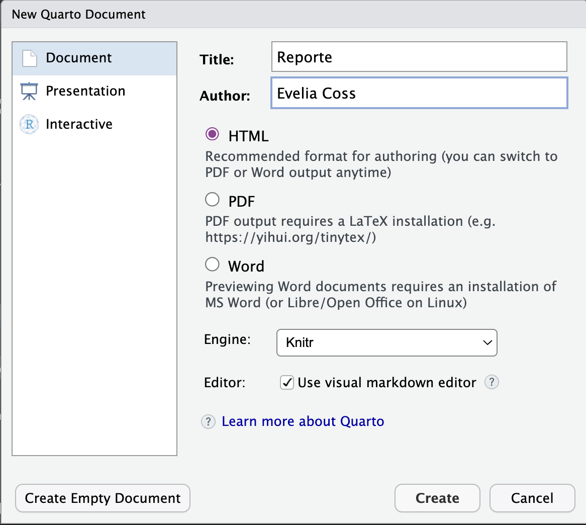
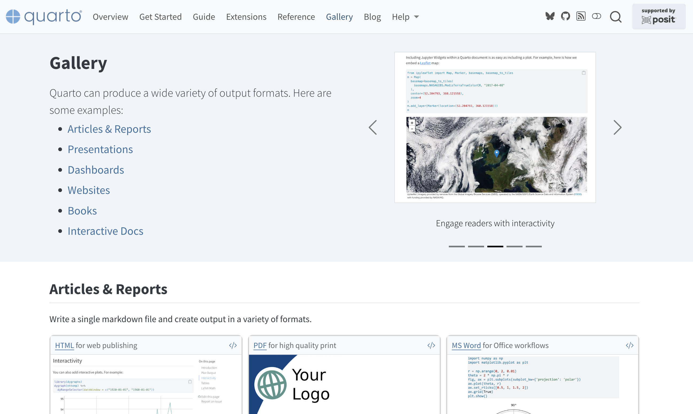
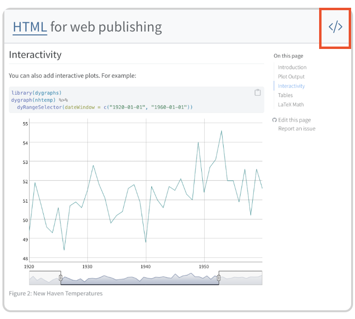
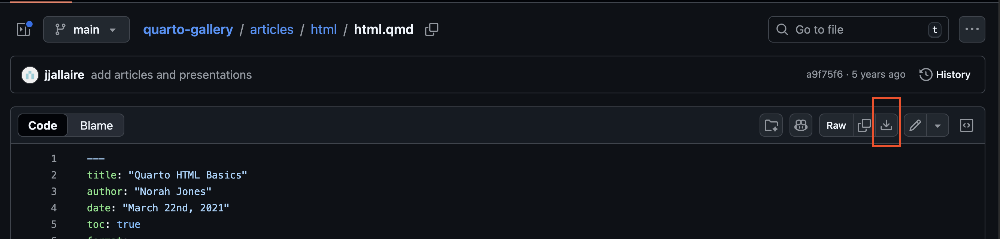

# **📚** Actividad 4 y 5

**Fecha:** 19 de febrero, 2026

## **📚** Actividad 4: Crear un documento de Quarto con formato de salida html

Para crear un documento nuevo, ve a **Archivos/File** \> **Nuevo archivo** \> **Documento de Quarto.**

Para este tipo de archivos vamos a usar la información del [YAML para HTML](https://quarto.org/docs/reference/formats/html.html).

## **📚** Actividad 5: Explorar la galleria de Quarto y elegir un diseño

1.  Visita la [galeria de Quarto](https://quarto.org/docs/gallery/).
2.  Ve al apartado de [Articles & Reports](https://quarto.org/docs/gallery/#articles-reports)**.**

3.  Selecciona un diseño y da clic en el botón "\</\>".

4.  Descarga el archivo desde GitHub y abrelo en Rstudio.

::: callout-note
Aquí les dejo mi ejemplo editado, ya que el ejemplo que descargaremos tendrá algunos errores en su sintaxis.
:::

## Referencias

- [Tutorial: Hello, Quarto](https://quarto.org/docs/get-started/hello/rstudio.html)
